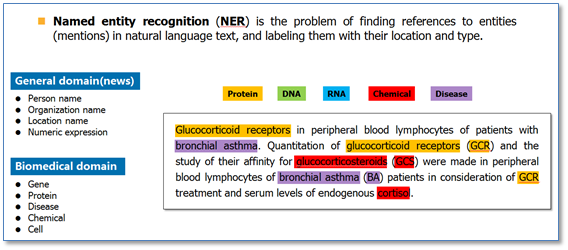

# README

# *N-list*

*****
# 朴素贝叶斯 Naive Bayes

**朴素贝叶斯**是指仅依据每个类别出现的概率进行预测分类，这是基于概率理论的一种分类算法。该算法依据于贝叶斯公式。

> 朴素贝叶斯解决分类问题的思路是：依据类别中各个特征出现的概率，将待分类项归在所有特征出现概率最大的那一类。

### 朴素贝叶斯的特性

使用朴素贝叶斯的前提条件是：待分类的特征同等重要，相互之间没有关联。

优点：  

+ 学习和预测效率高，有稳定的分类效率，且易于实现； 

+ 在数据较少的情况下仍然有效，可以处理多分类问题；

+ 只要变量独立这个条件成立，朴素贝叶斯分类器性能最优；

+ 该方法与其他分类方法相比具有最小的误差率。

   
缺点：

+ 分类效果不是很高；

+ 特征独立性假设会使朴素贝叶斯变得简单，但是会牺牲一定的分类准确率；

+ 实际中难以满足独立条件假设；

+ 如果分类变量的类别没有在训练数据集总被观察到，会无法进行预测。

### 应用场景及实践

朴素贝叶斯通常有两种实现方式:  

> 一种基于伯努利模型，一种基于多项式模型。
  
朴素贝叶斯的应用主要有：
   
> 1）实时预测； 
2）多类预测；
3）文本分类/垃圾邮件过滤/情感分析； 
4）推荐系统。 

### 朴素贝叶斯的思路

朴素贝叶斯法要做的是计算出 *x* 归属于哪一个类别 *y* ，过程如下：

   1 |  设 *x* = { a1 , a2 , ... , am } 为一个待分类项，每一个 *a* 为  *x* 的特征属性。  
    
   2 |  要进行归类的类别是集合 *C* ={ y1 , y2 , ... , yn }。

   3 |  算出 *x* 归于 *yk* 的概率: *P* ( y1 | x ),  *P* ( y2 | x ) , ... , *P* ( yn | x )。  
    
   4 |  如果 *P* ( yk | x )= *max* { *P* ( y1 | x ), *P* ( y2 | x  ),..., *P* (yn | x )}，那么 *x* 被归类在  *yk* 中。
   
##### 相关词 ：朴素贝叶斯分类器
 
### 参考来源：
 
 【1】 https://github.com/endymecy/spark-ml-source-analysis/blob/master/分类和回归/朴素贝叶斯/nb.md
 
 【2】 https://zh.wikipedia.org/wiki/朴素贝叶斯分类器

****
	    
#  朴素贝叶斯分类器 Naive Bayes Classifer 

**朴素贝叶斯分类器**( NBC )，是依据朴素贝叶斯进行分类的一种条件概率分类器。（详见朴素贝叶斯）。

###  NBC特点

朴素贝叶斯是一种构建分类器的简单方法。该分类器模型会给问题实例分配用特征值表示的类标签，类标签取自有限集合。它不是训练这种分类器的单一算法，而是一系列基于相同原理的算法：所有朴素贝叶斯分类器都假定样本每个特征与其他特征都不相关。

对于某些类型的概率模型，在监督式学习的样本集中能获取得非常好的分类效果。在许多实际应用中，朴素贝叶斯模型参数估计使用最大似然估计方法；换而言之，在不用到贝叶斯概率或者任何贝叶斯模型的情况下，朴素贝叶斯模型也能奏效。

朴素贝叶斯分类器的一个优势在于只需要根据少量的训练数据估计出必要的参数（变量的均值和方差）。由于变量独立假设，只需要估计各个变量的方法，而不需要确定整个协方差矩阵。

##### 相关词：朴素贝叶斯，分类器。

### 参考来源：
【1】  https://wizardforcel.gitbooks.io/dm-algo-top10/content/naive-bayes.html

【2】  https://zh.wikipedia.org/wiki/朴素贝叶斯分类器

*****

# 命名实体识别 Named Entity Recognition  

**命名实体识别**（ NER ）也称作“专名识别”，是指计算机将文本中的命名实体识别出来的过程。它是一个基本的 NLP（自然语言处理）任务。

### NER实现方法

命名实体识别的实现方法可以分成两种：一种是基于规则的方法，另一种是基于统计的方法。

命名实体识别是否成功的判断依据体现在两个方面：实体的边界是否正确；实体的类型是否标注正确。

### NER 的应用

命名实体识别是信息提取、问答系统、句法分析、机器翻译等应用领域的重要基础工具，是结构化信息提取的重要步骤。

### 参考来源

【1】  https://blog.csdn.net/cuixianpeng/article/details/18084807

【2】  http://www.cnblogs.com/robert-dlut/p/6847401.html     

*****

# 纳什均衡 Nash Equilibrium

**纳什均衡**或叫纳什平衡,又称为非合作博弈均衡，是博弈论的一个重要策略组合，以经济学家约翰·纳什命名。

### 纳什均衡的意义

纳什均衡是博弈论中一个著名的经济学术语：

指的是在一个策略组合上，当其他人都不改变策略时，没有人会改变自己的策略，该策略组合称为一个纳什均衡。它保证了同一时间内每个参与者的策略是对其他参与人策略的最优反应。

纳什均衡是一种博弈结果，它有两个前提：参与者独立、互不沟通；预测其他人策略，并以此为基础选择自己的最优解。

### 人工智能与纳什均衡

对于“不完美信息”博弈，改进人工智能的算法，让其应用均衡博弈，通过平衡风险与收益来决定下一步，以达到纳什均衡中的完美状态。 
   
掌握纳什均衡的人工智能在现实生活中大有用武之地，如德州扑克之类的游戏，另外如金融交易、拍卖、政治和商业谈判、军事或网络安全策略以及规划医疗方案等。

凡是需要基于“不完美信息”作出战略决策时，运用纳什均衡都有可能给出最优解。

### 参考来源

【1】  https://blog.csdn.net/xbinworld/article/details/50932559

【2】  https://zh.wikipedia.org/wiki/納什均衡點

*****
 	  
# 自然语言生成 Natural Language Generation  

**自然语言生成** ( NLG ) 是研究让计算机具有人一样的表达和写作的功能的技术。即能够根据一些关键信息及其在机器内部的表达形式，*经过一个规划过程，*来自动生成一段高质量的自然语言文本。

###  NLG 和其他词的联系

自然语言生成是**自然语言处理**的一部分，是指从知识库或逻辑形式等等机器表述系统去生成自然语言。可以说是一种将资料转换成自然语言表述的翻译器。    
自然语言生成可以视为**自然语言理解**的反向：自然语言理解系统须要厘清输入句的意涵，从而产生机器表述语言；自然语言生成系统需要决定如何把概念转化成语言。

### NLG 的实现模型
   
1) 明确的语言模型（例如文法）；
   
2) 运用根据真人所写的文本分析而成的统计模型。

### NLG 的实现方法

- 具体步骤，由戴尔与瑞特所提出的典型操作如下：

1. 决定内容：决定在文本里置入哪些资讯。用上一节花粉预报软件为例，是否要明确提到东南部花粉级数为7。

2. 架构文件：所传达资讯的整体组织。例如决定先描述高花粉量地区，再提及低花粉量地区。

3. 聚集语句：合并类似的句子，让文本更可读、更自然。例如合并下两个句子“星期五花粉等级已从昨天的中级到今天的高级”和“全国大部分地区的花粉等级在6到7”成为“星期五花粉等级已从昨天的中级到今天的高级，全国大部分地区的数值在6到7。”

4. 选择字词：选用表达概念的文字。例如决定要用“中等”还是“中级”。

5. 指涉语生成：产生能辨认物体或地区的指涉语。例如用“北方岛屿和苏格兰东北角”指涉苏格兰的某个地区。这个任务也包括决定代名词以及其它的照应语。

6. 实现文本：根据语法学、构词学、正写法的规则产生实际的文本。

##### 相关词：自然语言处理，自然语言生成

### 参考来源：

【1】  https://zh.wikipedia.org/wiki/自然语言生成

*****

   
# 自然语言理解 Natural Language Understanding	

**自然语言理解**（ NLU ）是通过语法、语义、语用的分析，获取自然语言的语义表示（ semantic representation )的技术，是**自然语言处理**的重要步骤。

自然语言理解的语义获取体现在三个方面：    
• 分布语义（ Distributional semantics ）。
   
• 框架语义（ Frame semantics ）。   

• 模型论语义（ Model-theoretic semantics ）。

###自然语言理解的难点：

自然语言的多义性、上下文有关性、模糊性、非系统性和环境密切相关性、涉及的知识面广等原因。

###自然语言理解的应用：
1.人机交谈：人可以通过自然语言与计算机进行交谈； 

2.回答问题：计算机能正确地回答用自然语言输入的有关问题；  

3.文摘生成：机器能产生输入文本的摘要；  
 
4.机器释义：机器能用不同的词语和句型来复述输入的自然语言信息；
  
5.机器翻译：机器能把一种语言翻译成另外一种语言。

### 参考来源：

【1】  http://ccckmit.wikidot.com/nlp

【2】  https://zh.wikipedia.org/wiki/自然语言理解

*****
    
# 自然语言处理 Natural Language Processing  

**自然语言处理**（ NLP ）是一门交叉学科，涉及到人工智能、语言学、计算机等学科。它探讨的是让计算机去处理自然语言的问题。 
   
自然语言处理基于大数据、知识图谱、机器学习、语言学等技术和资源，以实现计算机对自然语言的交互过程。 
   
自然语言处理根据自然语言的输入和输出分为两个技术领域：
    
- 计算机将自然语言作为输入对应于**自然语言理解**；   
- 计算机输出自然语言对应于**自然语言生成**。

#### NLP难点

NLP目前的难点集中在：歧义性、鲁棒性、知识依赖、语境理解等。

#### 实现NLP的方法

1）规则方法。

2）统计方法。

3）深度学习。

#### NLP的主要应用范畴：

* 文本朗读（ Text to speech ）/语音合成（ Speech synthesis ）。

* 语音识别（ Speech recognition ）。
* 中文自动分词（ Chinese word segmentation ）。
* 词性标注（ Part-of-speech tagging ）。
* 句法分析（ Parsing ）。
* 自然语言生成（ Natural language generation ）。
* 文本分类（ Text categorization ）。
* 问答系统（ Question answering ）。
* 机器翻译（ Machine translation ）。 
* 自动摘要（ Automatic summarization ）。
* 文字蕴涵（ Textual entailment ）。
* 信息检索（ Information retrieval ）。
* 信息抽取（ Information extraction ）。
* 文字校对（ Text-proofing ）。

#### NLP的发展趋势

第一，传统的基于句法-语义规则的理性主义方法受到质疑，随着语料库建设和语料库语言学的崛起，大规模真实文本的处理成为自然语言处理的主要战略目标。

第二，统计数学方法越来越受到重视，自然语言处理中越来越多地使用机器自动学习的方法来获取语言知识。

第三，浅层处理与深层处理并重，统计与规则方法并重，形成混合式的系统。

第四，自然语言处理中越来越重视词汇的作用，出现了强烈的“词汇主义”的倾向。词汇知识库的建造成为了普遍关注的问题。

##### 相关词： NLG ，NLU 。

### 参考来源：

【1】  https://blog.csdn.net/ZLJ925/article/details/79000149

【2】  https://zh.wikipedia.org/wiki/自然语言处理

*****

# 负类 Negative Class

**负类**是指在二元分类中和正类相对的类别。

二元分类问题中，因变量可能属于的两个类分别称为负类（ negative class ）和正类（ postiive class ），则可以写为因变量 y ∈ { 0 , 1 } ，其中 0 表示负向类， 1 表示正向类。

有些地方也会称做负例。

正类就是我们要找的目标，负类是另外一种可能性。例如，医疗测试中的负类可能是「非肿瘤」，电子邮件分类器中的负类可能是「非垃圾邮件」。

##### 父级词：二分类问题  
##### 相关词：正类

### 参考来源：

【1】 https://juejin.im/entry/59f12e07518825489732f082

*****
  
# 负相关法 Negative Correlation

**负相关**是指两列变量变动方向相反，一列变量变化时，另一列变量反而随着前一变量呈现相反趋势的变化。  

相关程度可以用相关系数 r 表示， -1 ≤ r < 1 ， r 的绝对值越大，表示变量之间的相关程度越高， r 为负数时，表示一个变量的增加可能引起另一个变量的减少，此时就是负相关。

与此相对应的是词正相关法。是指两个变量变动方向相同，即一个变量由大到小或由小到大变化时，另一个变量亦由大到小或由小到大变化。

##### 相关词：正相关法

### 参考来源：

【1】  https://baike.baidu.com/item/负相关

***** 
   	
# 负对数似然 Negative Log Likelihood

**负对数似然**是一种用于解决分类问题的流行的损失函数，可用于测量两种概率分布（通常是真实标签和预测标签）之间的相似性。

负对数似然是似然函数的一种自然对数形式，取负号是为了让最大似然值和最小损失对应起来。是在最大似然估计及相关领域中常见的一种函数形式。

在机器学习中，习惯用优化算法求最小值，所以会用到是负对数似然：

这样的形式下概率总是小等于 1 ，所以 NLL 的值总是大于0，更加直观。这是在分类问题中常用的一种损失函数，并且能轻易拓展到多分类问题。

#### 负对数似然和似然估计

在参数估计中有一类方法叫做“最大似然估计”，因为涉及到的估计函数往往是是指数型族，取对数后不影响它的单调性但会让计算过程变得简单，所以就采用了似然函数的对数，称“对数似然函数”。

根据涉及的模型不同,对数函数会不尽相同,比如负对数似然。但是原理是一样的,都是从因变量的密度函数的到来,并涉及到对随机干扰项分布的假设.

##### 父级词：对数似然函数

### 参考来源：

【1】  http://book.51cto.com/art/201710/555106.html

【2】  https://blog.csdn.net/Chloezhao/article/details/53644252

*****
    
# 近邻成分分析 Neighbourhood Component Analysis  

**近邻成分分析**（ NCA ）是一种与 KNN（K近邻）相关联的距离测度学习方法，属于监督式学习方法。最早是 2004 年由 Goldberger 等人提出。

近邻成分分析是根据一种给定的距离度量算法对样本数据进行度量，实现对多元变量数据进行分类。在功能上其和 k 近邻算法的目的相同，是直接利用随机近邻的概念确定与测试样本临近且有标签的训练样本。该方法常用来解决模型选择的问题。

##### 相关词：K 近邻

### 参考来源：

【1】  https://blog.csdn.net/chlele0105/article/details/13006443

【2】  https://zh.wikipedia.org/wiki/邻里成分分析

*****
   
# 神经机器翻译 Netural Machine Translation

**神经机器翻译**（ NMT ）是基于纯神经网络的一种机器翻译框架。它采用神经网络以端对端方式实现源语言到目标语言的翻译。

神经机器翻译和统计机器翻译在基本思想上是一致的，本质都是求解概率问题。只是二者的实现方法不同，统计机器翻译要依赖于大量数据模型。

### NMT 发展面临的问题：

1) 词汇表受限问题。

2) 源语言翻译覆盖问题。

3) 翻译不忠实问题。

### NMT 发展的趋势

- 罕见词问题。

- 单语言数据使用。 
- 多语言翻译/多语言 NMT 。
- 记忆机制。
- 语言融合。
- 覆盖问题。
- 训练过程。
- 先验知识融合。
- 多模态翻译。

### 参考来源
【1】  https://www.jiqizhixin.com/articles/2017-08-22-6

【2】  http://polarlion.github.io/nmt/2016/04/29/dl-for-mt.html

*****
	   
# 神经图灵机 Neural Turing Machine	

**神经图灵机**是一种依据于神经网络的图灵机，它是从图灵机中获得灵感，能够实现微分功能的机器算法。它包括一个神经网络控制器（ controller ）、和外部存储器（ memory ）。

NTM 是在一个很高的层面上构建神经计算模型，作为图灵机的实现。来执行一些计算机可以解决得很好而机器学习模型并不能很好地解决的任务。

计算机/图灵机的计算是绝对的，要么是 0 要么是 1 ，计算机在非此即彼的逻辑或者整数中运作。神经图灵机会使用实数，或平滑的模拟函数。

##### 相关词：图灵机，神经网络。

### 参考来源

【1】  https://www.jianshu.com/p/94dabe29a43b

*****
	    
# 牛顿法 Newton's Method

**牛顿法**又称为牛顿-拉弗森方法（ Newton-Raphson method ），它是一种在实数域和复数域上近似求解方程的方法。是利用函数 f ( x ) 的泰勒级数的前面几项来寻找方程  f ( y ) = 0 的根。

### 牛顿法思想

牛顿法的基本思想是利用迭代点处的一阶导数(梯度)和二阶导数( Hessen矩阵 )对目标函数进行二次函数近似，然后把二次模型的极小点作为新的迭代点，并不断重复这一过程，直至求得满足精度的近似极小值。  

### 牛顿法特点

牛顿法是利用求极小点的方式，然后进行迭代，直至找到满足精度的解。

牛顿法的速度相当快，而且能高度逼近最优值。  

### 牛顿法迭代的步骤

利用迭代算法解决问题，需要做好以下三个方面的工作：

一、确定迭代变量

在可以用迭代算法解决的问题中，至少存在一个可直接或间接地不断由旧值递推出新值的变量，这个变量就是迭代变量。

二、建立迭代关系式

所谓迭代关系式，指如何从变量的前一个值推出其下一个值的公式（或关系）。迭代关系式的建立是解决迭代问题的关键，通常可以使用递推或倒推的方法来完成。

三、对迭代过程进行控制.

不能让迭代过程无休止地执行下去。迭代过程的控制通常可分为两种情况：一种是所需的迭代次数是个确定的值，可以计算出来；另一种是所需的迭代次数无法确定。

对于前一种情况，可以构建一个固定次数的循环来实现对迭代过程的控制；对于后一种情况，需要进一步分析得出可用来结束迭代过程的条件。

### 牛顿法分类

牛顿法分为基本的牛顿法和全局牛顿法。

### 参考来源

【1】  https://zh.wikipedia.org/wiki/牛顿法

【2】  https://baike.baidu.com/item/牛顿迭代法

*****	
   
# 国际神经信息处理系统会议 NIPS

**国际神经信息处理系统会议**（**NIPS**），是每年12月份，由 NIPS基金会主办的机器学习和神经计算领域的顶级会议。

NIPS 除了包括机器学习和计算神经科学外，还涵盖了认知科学、心理学、计算机视觉、统计语言学、和信息理论等领域。

在中国计算机学会的国际学术会议排名中， NIPS 被定为人工智能领域的 A 类会议。

#### NIPS最近几年的举办地

- 2014年和2015年：蒙特利尔，魁北克，加拿大。

- 2016年：巴塞罗那，西班牙。
- 2017年：长滩，加利福尼亚州，美国。
- 2018年：蒙特利尔，魁北克，加拿大。
- 2019年：温哥华，不列颠哥伦比亚省，加拿大。

### 参考来源：

【1】 https://en.wikipedia.org/wiki/Conference_on_Neural_Information_Processing_Systems

*****
	   
# 没有免费的午餐 No Free Lunch Theorem

**没有免费的午餐**（ NFL 定理)是指没有一个学习算法可以在所有领域都产生最准确的学习器。也即针对某一域的问题，所有算法的期望性能是相同的。

### NFL的具体描述

1）对所有可能的的目标函数求平均，得到的所有学习算法的“非训练集误差”的期望值相同;

2）对任意固定的训练集，对所有的目标函数求平均，得到的所有学习算法的“非训练集误差”的期望值也相同;

3）对所有的先验知识求平均，得到的所有学习算法的的“非训练集误差”的期望值也相同;

4）对任意固定的训练集，对所有的先验知识求平均，得到的所有学习算法的的“非训练集误差”的期望值也相同;

NFL 定理可以进一步的引出一个普适的“守恒率”--对每一个可行的学习算法来说，它们的性能对所有可能的目标函数的求和结果确切地为零。

### 参考来源

【1】  https://baike.baidu.com/item/没有免费午餐定理

*****
    
# 噪音对比估计 Noise-Contrastive Estimation

**噪音对比估计**（ NCE ）是一种统计模型估计方法，由 Gutmann 和Hyv¨arinen 提出，用来解决神经网络的复杂计算问题，在图像处理和自然语言处理应用广泛。

### NCE 的思想

将真实的样本和一批“噪声样本”进行对比，从中发现真实样本的规律出来。 即“通过比较而学习”，将概率生成问题转化为二分类问题。

即把真实样本和从简单分布随机采样的错误样本进行对比，试图找到真实样本与错误样本的差异。

### NCE 的特点

NCE 的做法就是将复杂问题转化为二分类问题，将真实样本判为 1 ，从另一个分布采样的样本判为 0 。

NCE 能在没法直接完成归一化因子（也叫配分函数）的计算时，直接去估算出概率分布的参数。

##### 相关词：二分类问题。

### 参考来源：

【1】  https://www.jiqizhixin.com/articles/2018-06-20-9

【2】  http://barwe.top/statistics/2018-07-16/20180716203931/

***** 
    
# 列名属性 Nominal Attribute

**列名属性**是指数据存在‘与名称相关’的特征，相应的值是一些符号或事物的名称。

列名属性的值代表某种类别，编码或状态，因此列名属性又被看作是分类的( categorical )。这些值不必具有有意义的序。在计算机科学中，这些值也被看做是枚举的( enumeration )。
 
在列名属性上，数学运算是没有意义的。在定义域上呈现有限个取值，比如{西瓜，哈密瓜，木瓜}。

*****
	   
# 非凸优化 Non-Convex Optimization

**非凸优化**是机器学习和信号处理领域的一种方法。指的是针对非凸问题，不使用松弛处理而直接解决引起目标或直接优化非凸公式的方法。

非凸优化常用的技术包括简单高效的基元（ primitives ），如投影梯度下降、交替最小化、期望最大化算法、随机优化及其变体。这些方法在实践中有速度快的特点，深度学习以及小部分传统机器学习问题涉及非凸优化处理。

### 非凸优化问题转化为凸优化问题

1）修改目标函数，使之转化为凸函数；

2）抛弃一些约束条件，使新的可行域为凸集并且包含原可行域。

### 参考来源

【1】  https://blog.csdn.net/kebu12345678/article/details/54926287

*****	
  
# 非线性模型 Nonlinear Model

**非线性模型**是指自变量和依变量间存在非线性关系的数学表达式。相对于线性模型而言，其依变量与自变量间不能在坐标空间表示为线性对应关系。

### 线性模型和非线性模型区别

线性模型可以是用曲线拟合样本，但是分类的决策边界一定是直线的，例如 logistics 模型。

区分是否为线性模型，主要是看一个乘法式子中自变量 x 前的系数 w ,如果 w 只影响一个 x ，那么此模型为线性模型。或者判断决策边界是否是线性的。

### 参考来源

【1】  https://blog.csdn.net/wbcnb/article/details/78306970

*****	
  
# 非度量距离 Non-Metric Distance

**非度量距离**是指不满足直递性的参数间的距离。

直递性是指，对于三个对象 a , b, c , 满足 a 到 c 的距离加上 c 到 b 的距离大于等于 a 直接到b的距离;

通常我们是基于某种形式的距离来定义相似度度量的，距离越大，则相似度越小。

### 非度量距离与距离计算

对于距离函数 ，若它是一个“距离度量”，则需满足以下一些基本性质：

- 非负性：两点之间距离不为负;
- 同一性：两个点只有在样本空间上重合才可能距离为零；
- 对称性：a到b的距离等于b到a的距离;
- 直递性：a到c的距离加上c到b的距离大于等于a直接到b的距离;

在连续属性上，它们之间的距离一般通过“闵科夫斯基距离”来计算。

在离散属性上，对有序取值，可以同样用“闵科夫斯基距离”来计算，但当取值为无序时，如 { 苹果, 香蕉, 桃子 }，使用 VDM（Value Difference Metric）来计算。

> VDMp (a, b)代表的是在属性 u 上，取值为 a 和 b 的样本在不同簇上分布比例的差值的 p 次方。它是通过分布比例的不同来对属性上的相似度来进行近似的。

非度量距离的距离计算，需要基于数据样本来确定合适的距离计算式。

##### 父级词：距离
##### 子级词：直递性

### 参考来源：

【1】  https://www.jianshu.com/p/499b2f32a662

*****
  
# 非负矩阵分解 Nonnegative Matrix Factor

**非负矩阵分解**( NMF ），是所有元素均满足非负约束下的一种矩阵分解方法。它最早由 Lee 和 Seung 于 1999 年在 Nature 杂志上提出。

### NMF的数学定义

对于任意给定的一个非负矩阵 **V** ，NMF 算法能够寻找到一个非负矩阵 **W** 和一个非负矩阵 **H** ，使得满足 **V** = **W** x **H** ，从而将一个非负矩阵分解为两个非负矩阵的乘积。

### NMF的解法

有很多方法可以求 W 和 H ，其中 Lee 和 Seung 的倍增更新法因为实现简单，最为通用。

此外有些算法是基于交替非负最小二乘法：在每一步中，首先固定 H 并通过非负最小二乘法求解法得到 W ，然后固定 W 同理求出 H 。

求解 W 或 H 的方法可以相同或不同，因为可以对 W 或 H 进行规范化（以防止过拟合）。

具体求解方法包括：投影梯度下降方法（ the projected gradient descent methods ），有效集法（ the active set method ） 和  the block principal pivoting method 。

### NMF优缺点
- 优点：

1. 处理大规模数据更快更便捷；
2. 实现简便性、分解形式和分解结果上的可解释性，占用存储空间少。

- 缺点：

1. NMF中只用一层表示隐变量，无法处理复杂学习问题；
2. NMF只约束了W和H的非负性（这是唯一先验，只要求满足这个），而没有考虑到对于该先验，H内部元素间的相关性。

### NMF的应用领域：

- 图像分析    
- 文本聚类/数据挖掘  
- 语音处理          
- 机器人控制  
- 生物医学工程   
- 化学工程  
- 信号处理
- 模式识别   
- 计算机视觉

### 参考来源：

【1】  https://blog.csdn.net/qq_26225295/article/details/51211529

【2】  https://lijiancheng0614.github.io/2015/08/13/2015_08_13_NMF/

*****

# 范数 Norm

**范数**是数学中一种基本的函数。常常被用来度量某个向量空间（或矩阵）中的向量的长度或大小。对于模型参数的范数，可以用来作为规则化函数。

### 范数的性质
在泛函分析中，它定义在赋范线性空间中，并满足一定的条件，即  

1） 非负性；    
2） 齐次性；  
3） 三角不等式。

范数的本质是距离，是具有“长度”概念的函数。常用在线性代数、泛函分析及相关的数学领域。存在的意义是为了实现比较。范数把不能比较的向量转换成可以比较的实数。

### 常见的几种范数：
  
- L0 范数：指向量中非0的元素的个数。 
 
- L1 范数：指向量中各个元素绝对值之和。  
- L2 范数：用来改善机器学习里面的过拟合问题。  
- 核范数：是指矩阵奇异值的和。  
- 弗罗贝尼乌斯范数：一种矩阵范数，常用在数值线性代数中。

##### 父级词：函数  
##### 子级词：L0 范数，L1 范数，L2 范数，核范数，费罗贝尼乌斯范数

### 参考来源：

【1】  https://blog.csdn.net/zouxy09/article/details/24971995

【2】  https://zh.wikipedia.org/wiki/矩阵范数

*****

# 归一化 Normalization

**归一化**是将数据映射到指定的范围，用于去除不同维度数据的量纲以及量纲单位，以提高不同数据指标之间的可比性。

常见的映射范围有 [ 0 , 1 ] 和 [ -1 , 1 ] 。

### 归一化的算法

1) 线性转换，即 min-max 归一化（常用方法）
 
> y = ( x - min ) / ( max - min )

2) 对数函数转换

> y = log10 ( x )

 3. 反余切函数转换

> y = atan ( x ) * 2 / Pi

 
### 归一化和其他的数据处理方法比较

除了归一化，另外常见的数据处理方法有标准化（ Standardization ）和正则化（ Regularization  ）。

- 归一化是为了消除不同数据之间的量纲，方便数据比较和共同处理，比如在神经网络中，归一化可以加快训练网络的收敛性；

- 标准化是为了方便数据的下一步处理，而进行的数据缩放等变换，并不是为了方便与其他数据一同处理或比较，比如数据经过零-均值标准化后，更利于使用标准正态分布的性质，进行处理；

- 正则化而是利用先验知识，在处理过程中引入正则化因子( regulator )，增加引导约束的作用，比如在逻辑回归中使用正则化，可有效降低过拟合的现象。

##### 相关词：标准化，正则化。

### 参考来源：

【1】  https://blog.csdn.net/pipisorry/article/details/52247379

【2】  https://blog.csdn.net/zyf89531/article/details/45922151

*****
  
无序属性 Non-ordinal attribute 
   
非饱和博弈 Non-Saturating Game	
 	   
核范数 Nuclear norm	
     
数值属性 Numerical attribute	  
