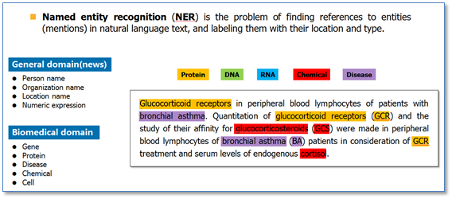

# 命名实体识别 Named Entity Recognition  

**命名实体识别**（ NER ）也称作“专名识别”，是指计算机将文本中的命名实体识别出来的过程。它是一个基本的 NLP（自然语言处理）任务。

### NER实现方法

命名实体识别的实现方法可以分成两种：一种是基于规则的方法，另一种是基于统计的方法。

命名实体识别是否成功的判断依据体现在两个方面：实体的边界是否正确；实体的类型是否标注正确。

### NER 的应用

命名实体识别是信息提取、问答系统、句法分析、机器翻译等应用领域的重要基础工具，是结构化信息提取的重要步骤。

### 参考来源

【1】  https://blog.csdn.net/cuixianpeng/article/details/18084807

【2】  http://www.cnblogs.com/robert-dlut/p/6847401.html