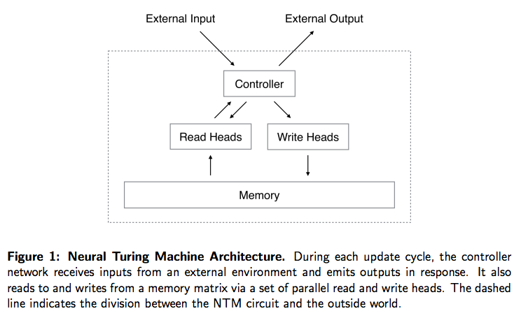

# 神经图灵机 Neural Turing Machine	

**神经图灵机**是一种依据于神经网络的图灵机，它是从图灵机中获得灵感，能够实现微分功能的机器算法。它包括一个神经网络控制器（ controller ）、和外部存储器（ memory ）。

NTM 是在一个很高的层面上构建神经计算模型，作为图灵机的实现。来执行一些计算机可以解决得很好而机器学习模型并不能很好地解决的任务。

计算机/图灵机的计算是绝对的，要么是 0 要么是 1 ，计算机在非此即彼的逻辑或者整数中运作。神经图灵机会使用实数，或平滑的模拟函数。

##### 相关词：图灵机，神经网络。

### 参考来源

【1】  http://www.dengfanxin.cn/?p=60