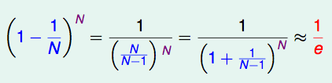
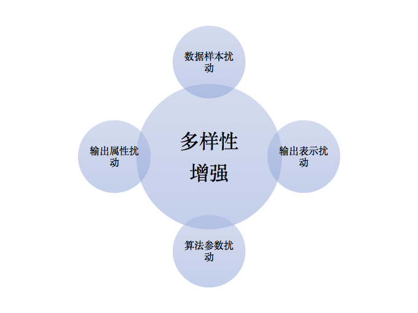
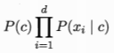

# README

# *O List*

*****

# 奥卡姆剃刀 Occam's Razor

**奥卡姆剃刀**是指若有多个假设与观察一致，则选最简单的那个。奥卡姆剃刀常被作为启发法技巧来使用，是帮助人们发展理论模型的工具，不能作为判断理论的依据。

### 奥卡姆剃刀的由来

奥卡姆剃刀在一些地方也称“奥坎的剃刀”，其拉丁文为 lex parsimoniae ，意思是简约之法则.

它是由14世纪逻辑学家、圣方济各会修士奥卡姆的威廉提出的一个解决问题的法则，他在《箴言书注》2卷15题说“切勿浪费较多东西，去做‘用较少的东西，同样可以做好的事情’。”

换一种说法，如果关于同一个问题有许多种理论，每一种都能作出同样准确的预言，那么应该挑选其中使用假定最少的。尽管越复杂的方法通常能做出越好的预言，但是在不考虑预言能力（即结果大致相同）的情况下，假设越少越好。

### 奥卡姆剃刀的应用

奥卡姆剃刀的原型只适用于具有同等解释力的模型（也就是说，它只是告诉在同样好的模型中选择较简单的那一个）。

奥卡姆剃刀的一个更通用的形式，可以从贝叶斯模型比较中产生。

它基于贝叶斯因子，可以适用于那些并不和观察结果同样吻合的模型比较。这些模型有时候可以在解释力和复杂性中找到最好的平衡。

总的来说，贝叶斯因子的准确值很难得到，但是有很多种方法给出近似值，例如赤池信息量准则、贝叶斯信息准则、变分贝叶斯方法、错误发现率以及拉普拉斯方法。许多人工智能研究者将这些方法用于奥卡姆学习中。

### 参考来源：

【1】  https://zh.wikipedia.org/wiki/奥卡姆剃刀

*****

# 包外估计 Out-of-Bag Estimate

**包外估计**是指用于测试的样本没在训练集中出现的测试结果。

### 包外估计的定义

随机森林的 Bagging 过程，对于每一颗训练出的决策树 g t ，与数据集 D 有如下关系：

对于星号的部分，即是没有选择到的数据，称之为 Out-of-bag（OOB）数据，当数据足够多，对于任意一组数据( xn , yn ) 是包外数据的概率为：

由于基分类器是构建在训练样本的自助抽样集上的，只有约 63.2％ 原样本集出现在中，而剩余的 36.8％ 的数据作为包外数据，可以用于基分类器的验证集。

经验证，包外估计是对集成分类器泛化误差的无偏估计.在随机森林算法中数据集属性的重要性、分类器集强度和分类器间相关性计算都依赖于袋外数据。

### 包外估计的用途

- 当基学习器是决策树时，可使用包外样本来辅助剪枝，或用于估计决策树中各结点的后验概率以辅助对零训练样本结点的处理；
 
- 当基学习器是神经网络时，可使用包外样本来辅助早期停止以减小过拟合。 

##### 父级词： 随机森林算法

### 参考来源：

【1】  钱雪忠, 秦静, 宋威. 改进的并行随机森林算法及其包外估计[J]. 计算机应用研究, 2018(6).

【2】  http://cerulean.me/

*****

# 输出调制法 Output Smearing

**输出调制法**是一种转化输出表示，造成其扰动的方法，常用来增加学习器多样性的方法。是将分类输出转化为回归输出后构建个体学习器。

输出表示的扰动思路是经过一些操作，对输出表示实现操纵，从而达到增加多样性的目的。

### 输出扰动

除了输出调制法，还可以达到输出表示扰动的操作有：

1）翻转法（ Flipping Output ），随机改变一些训练样本的标记；

2）ECOC 法，利用纠错输出码将多分类任务拆解为一系列二分类任务来训练基学习器。是将原任务拆解为多个可同时求解的子任务的方法。

多样性增强的方法：

  

### 参考来源：

【1】  周志华. 机器学习. 清华大学出版社 , 2016.

【2】  Breiman L. Randomizing outputs to increase prediction accuracy[J]. Machine Learning, 2000, 40(3): 229-242.

*****

# 过拟合 Overfitting

**过拟合** 是机器学习中的一种现象。指把样本中一些并不需要拿来作为分类的属性学习了的情况，此时学习的决策树模型并不是最优的模型，而且会会导致泛化性能下降。

### 过拟合造成的影响

在统计学和机器学习中，过拟合一般在描述统计学模型随机误差或噪音时用到。它通常发生在模型过于复杂的情况下，如参数过多等。过拟合会使得模型的预测性能变弱，并且增加数据的波动性。

### 避免过拟合可采取的措施

导致过拟合的因素有很多种，通常是由于学习能力过于强大。所以如果一味追求提高对训练数据的预测能力，所选择模型的复杂度往往比真模型更高，就会出现过拟合。

为了避免过拟合，有必要使用一些额外的技术，如交叉验证、正则化、 early stopping 、贝斯信息量准则、赤池信息量准则或 model comparison ，以指出何时会有更多训练而没有导致更好的一般化。

### 过拟合与欠拟合

与过拟合相对的是“欠拟合”（ underfitting ），指对训练样本不够，导致对样本的一般性质尚未学好。

##### 相关词：欠拟合

### 参考来源：

【1】  https://en.wikipedia.org/wiki/Overfitting 

【2】  https://blog.csdn.net/Dream_angel_Z/article/details/48898817

*****

# 过采样 Oversampling

**过采样**是指对训练集里的某类样例增加采样次数以减小类别不平衡。

与之相对应的是欠采样，是指对训练集里的某类样例减少采样次数。

### 过采样和欠采样的对比

过采样会随机复制少数样例以增大它们的规模。欠采样则随机地少采样主要的类。

过采样的好处是它也会复制误差的数量。相对地，欠采样会让独立变量的方差看起来比其实际的方差更高。

#### 过采样和类别不平衡

类别不平衡（ class-imbalance ）是指在训练分类器中所使用的训练集的类别分布不均。比如说一个二分类问题， 1000 个训练样本，比较理想的情况是正类、负类样本的数量相差不多；而如果正类样本有 995 个、负类样本仅5个，就意味着存在类别不平衡。

类别不平衡会导致模型没有学习到如何判别少类别，会在判断是出现偏差。

类别不平衡可以通过过采样、欠采样和调整 θ 值的方式去解决。其中过采样和欠采样是针对训练集里的样本数量，去相应的作出合适的采样方法，最终缓解类别不平衡。

##### 父级词：采样法
##### 同级词；欠采样

### 参考来源：

【1】  www.cnblogs.com/Determined22/p/5772538.html

【2】  zh.wikipedia.org/wiki/过采样

*****

# 目标函数 Objective Function	

**目标函数**是指用设计变量来表示的所追求的目标形式，是设计变量的函数。

目标函数是一个广泛的名称。一般都是先确定一个“目标函数”，再去优化它。

### 目标函数的形式 

目标函数可以是：

- 最大化后验概率 MAP (比如朴素贝叶斯)。

- 最大化适应函数(遗传算法)。

- 最大化回报/值函数（增强学习）。

- 最大化信息增益/减小子节点纯度( CART  决策树分类器)。

- 最小化平方差错误成本（或损失）函数（ CART ，决策树回归，线性回归，线性适应神经元）。

- 最大化 log- 相似度或者最小化信息熵损失（或者成本）函数。

- 最小化 hinge 损失函数（支持向量机 SVM ）。

### 参考来源

【1】  http://nooverfit.com/wp/损失函数-成本函数-目标函数-的区别/
  
*****

# 异策略 Off Policy 

**异策略**指生成新样本的策略跟网络更新参数时使用的策略不同。典型的异策略如 Q-learning 算法。

### 异策略思想

异策略学习指想要学习的是一个策略，而用于采样的是另一个策略。

先产生某概率分布下的大量行为数据，意在探索。从这些偏离（ off ）最优策略的数据中寻求目标策略。

当然这么做是需要满足数学条件的：假設 π 是目标策略, µ 是行为策略，那么从 µ 学到 π 的条件是：π ( a | s ) > 0 必然有 µ ( a | s ) > 0 成立。

### Q-learning 算法

Q-learning 通过感知奖励和惩罚，学习如何选择下一步动作，Q-Learning 算法中的 “Q” 代表着策略 π 的质量函数 Quality function ，该函数能在观察状态 s 确定动作 a 后，把每个状态动作对 ( s , a ) 与总期望的折扣未来奖励进行映射。

Q-Learning 算法属于 model-free 型，这意味着它不会对 MDP 动态知识进行建模，而是直接估计每个状态下每个动作的 Q 值 。然后，通过在每个状态下选择具有最高Q值的动作，来选择相应的策略。

如果计算机不断地访问所有状态动作对，则 Q-Learning 算法会收敛到最优 Q 函数。

### 异策略的优势 

1）可以从人类给出的示教样本或其他智能体给出的引导样本中学习；

2）可以重用由旧策略生成的经验；

3）可以在使用一个探索性策略的同时学习一个确定性策略；

4）可以用一个策略进行采样，然后同时学习多个策略。

##### 相关词：同策略，策略函数。

### 参考来源

【1】  https://blog.csdn.net/u013745804/article/details/78238678

【2】  https://blog.csdn.net/weixin_37895339/article/details/74937023

【3】  http://www.sohu.com/a/232174380_610300

*****

# 一次性学习 One Shot Learning

**一次性学习**是指机器通过一次演示后无需事先了解新的环境场景，能在不同环境中重复工作的一种能力。

### 一次性学习描述

一次性学习的起源其实是向人类学习，人类很多新的技能是在看过别人演示过一、两次后，就可以模仿着学会。

一次性学习处理的是计算机视觉中的对象分类问题。旨在从一个或少数训练图像中学习关于对象类别的信息。

一次性学习是在学过工作技巧后－术语叫先验知识（ prior knowledge ），基于先前所学技巧形成的知识架构，依照演示一次学得新工作技巧。

### 参考来源

【1】  https://baijiahao.baidu.com/s?id=1605774002659229089&wfr=spider&for=pc

*****

# 独依赖估计 One Dependent Estimator

**独依赖估计**（ODE）独依赖估计是半朴素贝叶斯分类器最常用的一种策略。所谓独依赖，就是假设每个属性在类别之外最多仅依赖一个其他属性。

朴素贝叶斯的类条件概率：

独依赖估计下的类条件概率：

其中 pai 为属性 xi 所依赖的属性，称为 xi 的父属性。对每个属性，若其父属性已知，则可采用数学办法来估计概率值 P ( xi | c，pai )。

### 独依赖估计的分类

独依赖估计的实现主要有三种方法：

1） SPODE（超父独依赖估计），假设所有属性都依赖于同一个属性，称为“超父”（ super-parent ），然后通过交叉验证等模型方法来确定超父属性。

2） TAN（ Tree Augmented naive Bayes ），在最大带权生成树算法基础上构建依赖。

3） AODE（平均独依赖估计），尝试将每个属性作为超父来构建 SPOE ，集成结果，与朴素贝叶斯相似，无需模型选择，是对符合条件的样本计数。

##### 相关词：半朴素贝叶斯分类器，超父属性。

### 参考来源

【1】  https://blog.csdn.net/fjssharpsword/article/details/60089266#comments

【2】  http://www.mamicode.com/info-detail-1713501.html

*****

# 同策略 On Policy

**同策略**是指生成样本的策略跟网络更新参数时使用的策略相同。同策略方法的典型如 SARAS 算法。

同策略是基于当前的策略直接执行下一次动作选择，然后用这个样本更新策略，其生成样本的策略和学习时的策略相同。

### SARSA 算法

SARSA （State-Action-Reward-State-Action）是一个学习马尔可夫决策过程策略的算法，通常使用在机器学习领域的增强学习上。

- SARSA 算法的要点

1） 在状态 s' 时，就知道了要采取哪个 a' ，并真的采取了这个动作；

2） 动作 a 的选取遵循 e-greedy 策略，目标 Q 值的计算也是根据 e-greedy 策略得到的动作 a' 计算得来，因此是 on-policy 学习。

### 同策略的优缺点

优点：

1） 每一步都可以更新，这是显然，学习速度快；
 
2） 可以面对没有结果的场景，应用范围广。

缺点：

1） 会遭遇探索-利用的矛盾，只利用目前已知的最优选择，可能学不到最优解，收敛到局部最优，而加入探索又降低了学习效率。

### 同策略和异策略

与同策略相对应的是异策略，同策略和异策略的区别在于：更新 Q 值时，是沿用既定的策略还是使用新的策略。

### 参考来源

【1】  https://blog.csdn.net/weixin_37895339/article/details/74937023

【2】  http://www.voidcn.com/article/p-mjyycpfx-bpe.html

*****

# 序数属性 (ordinal attribute)

**序数属性**是一种属性，其可能的值之间具有有意义的序或秩评定( ranking )，但是相继值之间的差是未知的。具有先后顺序，有大小之分。   

### 序数属性应用

序数属性可能的取值之间具有有意义的序或秩评定，但相继值之间的差是未知的。

例如，学生的成绩属性可以分为优、良、中、差四个等级；成绩有 A+ ,  A , A- , B+ , B  等；某快餐店的饮料杯具有大、中、小三个可能值。然而，具体“大”比“中”大多少是未知的。

序数属性可用于记录不能客观度量的主观质量评估。因此，序数属性常用于等级评定调查。

如某销售部门客户服务质量的评估， 0 表示很不满意， 1 不太满意， 2 表示中性， 3 表示满意， 4 表示非常满意。

### 序数属性特点

通过数据预处理中的数据规约，序数属性可以通过将数据的值域划分成有限个有序类别，将数值属性离散化而得到。

应注意的是，序数属性是定性的，只描述样本的特征，而不给出实际大小或数量。

##### 父级词：属性

### 参考来源

【1】  https://blog.csdn.net/qq_33457248/article/details/79594782

【2】  http://morecoder.com/article/1018317.html

*****

斜决策树 Oblique decision tree
	     	    
几率 Odds
	      	
输出层 Output layer

	     