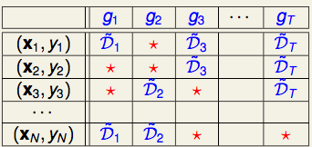
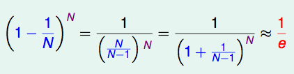

# 包外估计 Out-of-Bag Estimate

**包外估计**是指用于测试的样本没在训练集中出现的测试结果。

### 包外估计的定义

随机森林的 Bagging 过程，对于每一颗训练出的决策树 g t ，与数据集 D 有如下关系：

对于星号的部分，即是没有选择到的数据，称之为 Out-of-bag（OOB）数据，当数据足够多，对于任意一组数据( xn , yn ) 是包外数据的概率为：

由于基分类器是构建在训练样本的自助抽样集上的，只有约 63.2％ 原样本集出现在中，而剩余的 36.8％ 的数据作为包外数据，可以用于基分类器的验证集。

经验证，包外估计是对集成分类器泛化误差的无偏估计.在随机森林算法中数据集属性的重要性、分类器集强度和分类器间相关性计算都依赖于袋外数据。

### 包外估计的用途

- 当基学习器是决策树时，可使用包外样本来辅助剪枝，或用于估计决策树中各结点的后验概率以辅助对零训练样本结点的处理；
 
- 当基学习器是神经网络时，可使用包外样本来辅助早期停止以减小过拟合。 

##### 父级词： 随机森林算法

### 参考来源：

【1】  钱雪忠, 秦静, 宋威. 改进的并行随机森林算法及其包外估计[J]. 计算机应用研究, 2018(6).

【2】  http://cerulean.me/