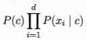
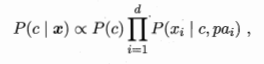

# 独依赖估计 One Dependent Estimator

**独依赖估计**（ODE）独依赖估计是半朴素贝叶斯分类器最常用的一种策略。所谓独依赖，就是假设每个属性在类别之外最多仅依赖一个其他属性。

朴素贝叶斯的类条件概率：

独依赖估计下的类条件概率：

其中 pai 为属性 xi 所依赖的属性，称为 xi 的父属性。对每个属性，若其父属性已知，则可采用数学办法来估计概率值 P ( xi | c，pai )。

### 独依赖估计的分类

独依赖估计的实现主要有三种方法：

1） SPODE（超父独依赖估计），假设所有属性都依赖于同一个属性，称为“超父”（ super-parent ），然后通过交叉验证等模型方法来确定超父属性。

2） TAN（ Tree Augmented naive Bayes ），在最大带权生成树算法基础上构建依赖。

3） AODE（平均独依赖估计），尝试将每个属性作为超父来构建 SPOE ，集成结果，与朴素贝叶斯相似，无需模型选择，是对符合条件的样本计数。

##### 相关词：半朴素贝叶斯分类器，超父属性。

### 参考来源

【1】  https://blog.csdn.net/fjssharpsword/article/details/60089266#comments

【2】  http://www.mamicode.com/info-detail-1713501.html