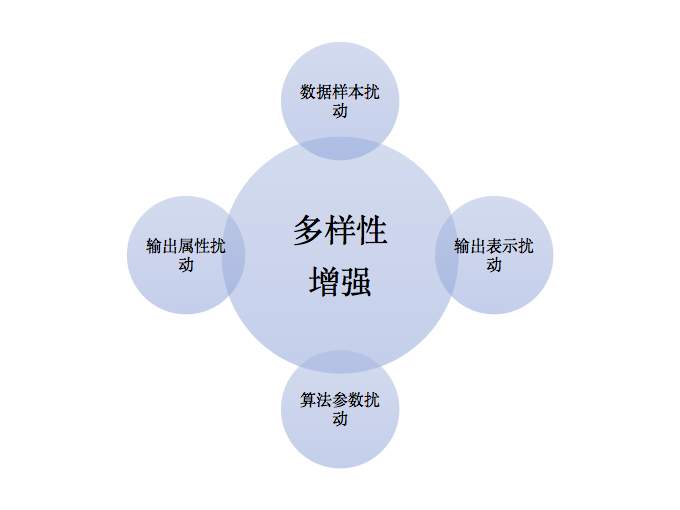

# 输出调制法 Output Smearing

**输出调制法**是一种转化输出表示，造成其扰动的方法，常用来增加学习器多样性的方法。是将分类输出转化为回归输出后构建个体学习器。

输出表示的扰动思路是经过一些操作，对输出表示实现操纵，从而达到增加多样性的目的。

### 输出扰动

除了输出调制法，还可以达到输出表示扰动的操作有：

1）翻转法（ Flipping Output ），随机改变一些训练样本的标记；

2）ECOC 法，利用纠错输出码将多分类任务拆解为一系列二分类任务来训练基学习器。是将原任务拆解为多个可同时求解的子任务的方法。

多样性增强的方法：

  

### 参考来源：

【1】  周志华. 机器学习. 清华大学出版社 , 2016.

【2】  Breiman L. Randomizing outputs to increase prediction accuracy[J]. Machine Learning, 2000, 40(3): 229-242.
