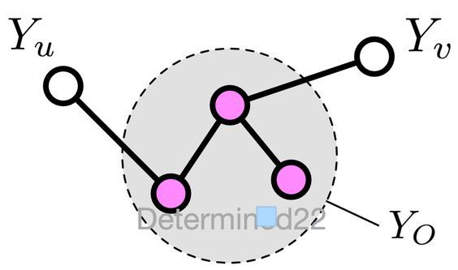
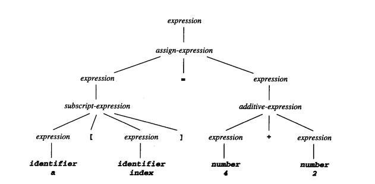
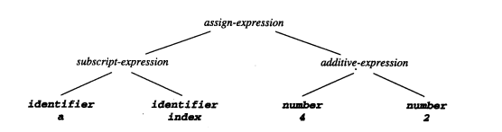
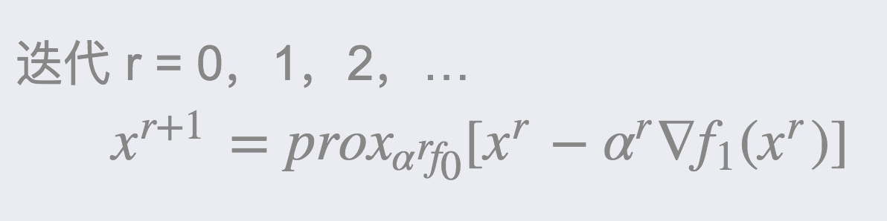

# README 

# *P List*

****

# 配对 t 检验 Paired t-Test

**配对 t 检验**是常用的一种 t 检验。它是指对同一个总体，在不同的条件下获取两组样本进行分析，以评价不同条件是否有显著影响。不同条件可以指不同存放环境、不同的测量系统等。  

此外的 t 检验还包括单样本 t 检验，双样本 t 检验等。

### 使用配对 t 检验的意义

当两个样本相关时，使用配对 t 检验，使用 配对 t 可执行以下操作：

- 确定两个配对样本之间差值的均值是否不同于 0（或目标值）。

- 计算可能包括总体均值的差值的值范围。

配对设计：将受试对象的某些重要特征按相近的原则配成对子，目的是消除混杂因素的影响，一对观察对象之间除了处理因素/研究因素之外，其它因素基本齐同，每对中的两个个体随机给予两种处理。

目的：判断不同的处理是否有差别。

### 配对 t 检验场景举例：

将两种同质对象分别接受两种不同的处理，如性别、年龄、体重、病情程度相同配成对。具体有两种：

• 对同一科目进行前后对比观察（例如对学生在课程前后的诊断测试）。   

• 对同一测试者，比较两种不同的测量方法或两种不同的处理方法的区别（例如分别使用听诊器和血压计测量血压）。

##### 父级词： t 检验
##### 子级词：单样本t检验，双样本 t 检验
    
### 参考来源：

【1】  http://www.ttdoc.cn/article/671.jhtml

【2】  https://blog.csdn.net/m0_37752335/article/details/77422346

****

# 成对马尔可夫性 Pairwise Markov Property

**成对马尔可夫性**是指在给定了其他所有变量的情况下，两个非邻接变量条件独立。  

 成对马尔可夫性是马尔可夫性的一个类别，马尔可夫性还包括局部马尔可夫性和全局马尔可夫性。
 
 
### 数学表述

设无向图中的任意两个没有边连接的节点 u 和 v ，其他所有节点为 O 。成对马尔可夫性是指：给定随机变量组 *YO* 的条件下， 随机变量 *Yu* 和 *Yv* 是条件独立的。 即 
*P ( Yu , Yv | YO )=P ( Yu | YO ) P ( Yv | YO )* 。

 
  
  
##### 父级词：马尔可夫性。
##### 同级词：局部马尔可夫性，全局马尔可夫性。
##### 相关词：条件独立。

### 参考来源  

【1】  Frydenberg M. The chain graph Markov property[J]. Scandinavian Journal of Statistics, 1990: 333-353.   
 
【2】  Pieczynski W. Pairwise markov chains[J]. IEEE Transactons on pattern analysis and machine intelligence, 2003, 25(5): 634-639.
参数 Parameter

****

# 参数 Parameter

**参数**是整个总体的描述性度量，它可用作概率分布函数的输入以生成分布曲线。

在统计学中，可以假设一个变量的分布，比如高斯分布。高斯分布的两个参数分别是平均值（ μ ）和标准差（ sigma ）。这在机器学习中是有效的，其中这些参数可以用数据估计得到并用作预测模型的一部分。

编程中可以将参数传递给函数。在这种情况下，参数是一个函数参数，可以有一个取值范围。在机器学习中，使用的具体模型就是函数，需要参数才能对新数据进行预测。例如，权重是参数，它的值是机器学习系统通过连续的训练迭代逐渐学习到的。

#### 相关词：调参，参数模型，非参数

### 参考来源：

【1】  https://www.deeplearn.me/1854.html

【2】  https://en.wikipedia.org/wiki/Parameter_(computer_programming)

****

# 参数估计 Parameter Estimation

**参数估计**是指用样本指标估计总体指标。具体是用样本均数估计总体均数或用样本率估计总体率。  

具体思想是，希望用较少的参数去描述总体的分布。  

### 常用的参数估计
　  　  
常用的参数估计有：最大似然估计，贝叶斯估计和最大后验估计。

- 最大似然估计是把待估计的参数看做是确定性的量，只是值未知，因此只需要求得最佳估计即可，就是使得产生已观测到的样本概率为最大值的那个值。

- 贝叶斯估计是把待估计的参数看成是符合某种先验概率分布的随机变量。对比两种方法，极大似然估计更简单，样本量增大时收敛效果更好。

- 最大后验概率估计则是想求出似然函数最大时的参数。求得的参数不单单让似然函数大，自己出现的先验概率也得大。 

### 参数估计分类

参数估计通常有点估计 ( point estimation ) 和区间估计 ( interval estimation ) 两种。  

- 点估计是指：用样本的一个函数去估计总体函数。 
 
- 区间估计是指：用区间函数去估计总体函数。

### 其他
除了参数估计，还存在另一种非参数估计：是指已知样本所属类别，但未知总体概率密度函数的形式，要求直接推断概率密度函数本身。

### 参考来源：

【1】  https://blog.csdn.net/u011508640/article/details/72815981

【2】  https://guangchun.wordpress.com/2011/10/13/ml-bayes-map/

【3】  https://wiki.mbalib.com/wiki/参数估计

****
	 
# 解析树 Parse Tree

**解析树**，也称作具体语法树，是语法分析结果的一种表现形式，以树状表示语言的语法结构。

解析树一般按照两种相反的法则生成，一种是依存语法,一种是短语结构语法。解析树和抽象语法树是不同的。抽象语法树是分析树多包涵信息的浓缩。

### 解析树与抽象语法树

抽象语法树（ Abstract Syntax Tree，AST ），简称语法树（ Syntax tree ），是语法结构的一种抽象表示。它也以树状的形式表现结构，树上的每个节点都语法中的一种结构。“抽象”地方在于，这里的语法并不会表示出真实语法中出现的每个细节。

而具体的语法树以完全解析的形式表示源文本。一般来说，它符合定义源语言的上下文无关语法。具体的语法树包含了一些的括号，空白和注释等所有信息，抽象语法树从这些信息中抽象出来。

简单地说， AST 只包含代码的语义，解析树也包含了如何编写代码的信息。一个具体的语法树匹配语法规则所说的语法。 AST 的目的是对“解析树”中必不可少信息的简单表示。

解析树示例：

抽象语法树示例：

##### 相关词：语法树

### 参考来源：

【1】  https://www.cnblogs.com/xiaomiao/p/3146390.html

【2】  http://www.dovov.com/9362.html

****
	 
# 粒子群优化算法 Particle Swarm Optimization 

**粒子群优化算法**，（ PSO ），又称微粒群算法，是基于群体智能理论的优化算法,群体中的粒子在每次迭代搜索的过程中,以完成对问题的寻优过程。

是由 J. Kennedy 和 R.C.Eberhart 于1995年提出的一种演化计算技术，来源于对一个简化社会模型的模拟。通过跟踪群体 2 个极值:粒子本身所找到的最优解 Pbest 和群体找到的最优解 Gbest 来动态调整自己位置和速度,

### 概念解释

其中“群（ swarm ）”来源于微粒群匹配 M.M.Millonas 在开发应用于人工生命的模型时所提出的群体智能的一个基本原则。“粒子（ particle ）”是为了将群体中的成员描述为没有质量、没有体积的，但具有速度和加速状态的概念。

### PSO的应用

PSO 属于群智能算法的一种，是通过模拟鸟群捕食行为设计的。假设区域里就只有一块食物（即通常优化问题中所讲的最优解），鸟群的任务是找到这个食物源。鸟群在整个搜寻的过程中，通过相互传递各自的信息，让其他的鸟知道自己的位置，通过这样的协作，来判断自己找到的是不是最优解，同时也将最优解的信息传递给整个鸟群，最终，整个鸟群都能聚集在食物源周围，即我们所说的找到了最优解，即问题收敛。

### 标准 PSO 的算法流程：

1. 初始化一群微粒（群体规模为 m ），包括随机的位置和速度；

2. 评价每个微粒的适应度；

3. 对每个微粒，将它的适应值和它经历过的最好位置 pbest 的作比较，如果较好，则将其作为当前的最好位置 pbest ；

4. 对每个微粒，将它的适应值和全局所经历最好位置 gbest 的作比较，如果较好，则重新设置 gbest 的索引号；

5. 根据方程变化微粒的速度和位置；

6. 如未达到结束条件（通常为足够好的适应值或达到一个预设最大代数Gmax），回到 2 ）。

### 参考来源：  

【1】  杨维, 李歧强. 粒子群优化算法综述[J]. 中国工程科学, 2004, 6(5): 87-94.

【2】  https://zh.wikipedia.org/wiki/粒子群优化

*****

# 词性标注 Part-of-Speech Tagging

**词性标注**（ POS tagging )是将对句子中的词语进行分类标注的过程。是依据字词在句法结构或语言形态上承担的成分，通过词性分类赋予每个词的词性标记的过程。
   
也就是要确定句子中每个词是名词、动词、形容词或其他词性的过程，又称词类标注或者简称标注。  

词性标注是自然语言处理中的一项基础任务，在语音识别、信息检索及自然语言处理的许多领域都有应用。

### 词的分类
词主要可以分为以下2类：

+ 实词：名词、动词、形容词、状态词、区别词、数词、量词、代词   
+ 虚词：副词、介词、连词、助词、拟声词、叹词。

词性标注指为分词结果中的每个单词标注一个正确的词性的程序，也即确定每个词的词性的过程。

### 词性标注实现的方法：

主要可以分为基于规则和基于统计的方法，主要有

（1）基于最大熵的词性标注

（2）基于统计最大概率输出词性

（3）基于HMM的词性标注

### 词性标注的应用：

（1）句法分析预处理

（2）词汇获取预处理

（3）信息抽取预处理

### 词性标注和其他

（1）词性标注从本质上来说，也是一个序列标注的问题，再细化，是一个分类问题。

（2）词性标注和中文分词是紧密相连的，可通过两种途径将它们进行结合。

- 管道/串行（ Pipeline ）：先分词，再标注
- 联合模型（ Joint Model ）：分词和标注同时进行

##### 相关词： 语法树

### 参考来源：  

【1】  http://janfan.cn/chinese/2017/04/10/pos-tagging.html

【2】  https://www.gooseeker.com/cn/node/Fuller/2010041301

****
	
 
# 感知机 Perceptron

**感知机** 是一种二元线性分类模型，可以被视为一种最简单形式的前馈神经网络，是Frank Rosenblatt 在 1957 年发明的一种模型。其输入为实例的特征向量，输出为实例的类别。

作为一种线性分类器，感知机可说是最简单的前向人工神经网络形式。尽管结构简单，感知机能够学习并解决相当复杂的问题。感知机主要的缺陷是它不能处理线性不可分问题。

### 感知器的定义

感知器使用特征向量来表示的前馈神经网络，它是一种二元分类器，把矩阵上的输入 x（实数值向量）映射到输出值 f ( x ) 上（一个二元的值）。

其中 w 是实数的表示权重的向量，w·x 是点积。w·x = ∑ wjxj

b 是偏置，一个不依赖于任何输入值的常数。偏置可以认为是激励函数的偏移量，或者给神经元一个基础活跃等级。

f ( x )（ 0 或 1 ）用于对 x 进行分类，看它是肯定的还是否定的，这属于二元分类问题。

如果 b 是负的，那么加权后的输入必须产生一个肯定的值并且大于 -b ，这样才能令分类神经元大于阈值 0 。

从空间上看，偏置改变了决策边界的位置。

由于输入直接经过权重关系转换为输出，所以感知器可以被视为最简单形式的前馈式人工神经网络。

### 感知机学习策略：

核心：极小化损失函数。

如果训练集是可分的，感知机的学习目的是求得一个能将训练集正实例点和负实例点完全分开的分离超平面。为了找到这样一个平面（或超平面），即确定感知机模型参数 w 和 b ，一般采用的是损失函数，同时并将损失函数极小化。

##### 父级词：

关联词： 多层感知机，神经网络

### 参考来源：  

【1】  https://zh.wikipedia.org/wiki/感知器

【2】  https://www.jiqizhixin.com/articles/2018-01-15-2

【3】  http://www.cnblogs.com/OldPanda/archive/2013/04/12/3017100.html

****
	 
# 性能度量 Performance Measure

**性能度量**是用于衡量模型泛化能力的评价标准。  

性能度量用于判定机器学习的结果好坏程度。在比对不同的模型能力的时候，使用不同的性能度量往往会导致不同的评判结果。判断模型的好坏是相对的，取决于采用什么性能度量，而采用什么性能度量则应取决于实际的任务需求。

### 常用的性能度量

- 回归任务中的性能度量

   均方差
   
- 分类任务中的性能度量
   
   1.错误率和精度  
   
   2.查准率、查全率与F1度量  
   
   4.ROC (受试者工作特征曲线)和 AUC （ Area under ROC Curve ）
     
   5.代价敏感错误率和代价曲线  

### 参考来源：

【1】  https://kingsfish.github.io/2017/07/15/Machine-Learning-02/

【2】  https://blog.csdn.net/sinat_33761963/article/details/54910447

【3】  https://www.jianshu.com/p/c5111d585367

****
	 
# 即插即用生成网络 Plug and Play Generative Networks

**即插即用生成网络**（ PPGN ）是 Nguyen 等人在 2016 年提出的一个模型。

 PPGN 是通过近似 Langevin 采样方法，使用马尔可夫链来产生图像。  Langevin 采样器的梯度通过使用一个降噪的（ denoising ） 自动编码器来估计。 这个降噪自动编码器使用几个损失函数来进行训练， 其中包含一个 GAN 的损失。

### PPGN 的特点

- PPGN 整合了对抗训练、cnn 特征匹配、降噪自编码、Langevin 采样；

- PPGN 生成的图像同类差异化大，可根据指定生成不同类别的图像、多类化，生成的图像清楚分辨率高。

- PPGN 可使用 imagenet1000 类分类网络生成特定类别的图像。

### 参考来源：

【1】  Nguyen A, Clune J, Bengio Y, et al. Plug & Play Generative Networks: Conditional Iterative Generation of Images in Latent Space[C]//CVPR. 2017, 2(5): 7.

【2】  https://sinpycn.github.io/2017/05/12/GAN-Tutorial-Plug-and-play-generative-networks.html

****

# 相对多数投票法 Plurality Voting

**相对多数投票法**最一种简单的投票方法，通俗的说法是少数服从多数。

使用在在分类问题中，对样本的预测结果是，票数最多的类别会成为最终的分类类别；如果不止一个类别获得最高票，则随机选择一个做为最终类别。

### 其他的投票方法：

相对多数投票法是分类问题中常见的投票策略。其他的投票法还有绝对多数投票法（ Majority Voting ）和加权投票法（ Weighted Voting ）。

绝对多数投票法：多个分类器对某一类别的预测结果，如果大于总投票结果的的一半，就预测是该类别，否则就拒绝预测。通俗说法是票过半数。

加权投票法：和加权平均类似，这种投票法下，每个分类票数要乘以一个权重，最终将各个类别的加权票数求和，最大的值对应的类别为最终类别。

##### 父级词：投票法。  
##### 同级词：绝对多数投票法，加权投票法。 

### 参考来源：

【1】  https://feisky.xyz/machine-learning/ensemble/

【2】  https://blog.csdn.net/u011995719/article/details/77863248

*****

	   
# 多项式核函数 Polynomial kernel function

**多项式核函数**指以多项式形式表示的核函数。它是一种非标准核函数，适合于正交归一化后的数据，其具体形式见图。

加一个图。

在机器学习中，多项式核是一种常用于支持向量机（SVM）和其他核化模型的核函数，它表示特征空间中的向量（训练样本）与原始变量的多项式之间的相似性，允许学习非线性模型。

### 常见的核函数有：

1）线性核函数；
2）多项式核函数；
3）高斯（ RBF ）核函数；
4） sigmoid 核函数；
5）自定义核函数。

### 核函数的数学形式：

##### 父级词：核函数

### 参考来源：

【1】  https://blog.csdn.net/lqhbupt/article/details/8610443

【2】https://en.wikipedia.org/wiki/Polynomial_kernel

*****

# 池化 Pooling

**池化**也叫空间池化，是卷积神经网络中用来提取特征的一种方法，

对不同位置的特征进行聚合统计处理。得到比概要统计特征更低的维度，同时避免出现过拟合现象的出现。

池化降低了各个特征图的维度，但可以保持大部分重要的信息。池化有下面几种方式：最大化、平均化、加和等等。

### 常见的池化操作

最常见的池化操作有平均池化（ mean pooling ）和最大池化（ max pooling ）：

平均池化：计算图像区域的平均值作为该区域池化后的值。

最大值池化：选图像区域的最大值作为该区域池化后的值。

定义一个空间邻域，并从窗口内的修正特征图中取出最大的元素。也可以取平均值。在实际中，最大池化被证明效果更好一些。

![] (最大值池化.jpg)

### 池化的作用

池化函数可以逐渐降低输入表示的空间尺度。特别地，池化能够：

- 使输入表示（特征维度）变得更小，并且网络中的参数和计算的数量更加可控的减小，因此，可以控制过拟合。

- 使网络对于输入图像中更小的变化、冗余和变换变得不变性（输入的微小冗余将不会改变池化的输出——因为我们在局部邻域中使用了最大化/平均值的操作。

- 帮助获取图像最大程度上的尺度不变性（准确的词是“不变性”）。它非常的强大，因为可以检测图像中的物体，无论它们位置在哪里。

### 参考来源：

【1】  http://www.hackcv.com/index.php/archives/104/?hmsr=toutiao.io&utm_medium=toutiao.io&utm_source=toutiao.io

【2】  https://ujjwalkarn.me/2016/08/11/intuitive-explanation-convnets/

【3】  https://www.cnblogs.com/bzjia-blog/p/3415790.html

*****

	  
# 正类 Positive Class

**正类**是指在二元分类问题中，期望得到的类别。与之对应的类别称为负类（ Positive Class ）

对于有两种类别的分类，可以分别将两种类别标记为正类和负类，相应的可记为 1 和 0 。在实际应用中，把一个类别标记为正类或负类是任意的，但一般来说会用正类代表拥有某样东西，用负类代表缺少某样东西。

### 应用示范

例如判断一封邮件是否属于垃圾邮件、判断一个在线交易是否属于诈骗、一个肿瘤属于良性肿瘤还是恶性肿瘤等问题中，通常把“是垃圾邮件”，“是诈骗”，“是良性肿瘤”当做正类，相对的另一类别做为负类。

##### 父级词：二分类问题  
##### 同级词：负类
    
### 参考来源：

【1】  http://www.cnblogs.com/rgvb178/p/5840621.html

【2】  《机器学习》，周志华，清华大学出版社

*****
	  
#  正定矩阵 Positive Definite Matrix

**正定矩阵**是一种对称矩阵，所有特征值都大于 0 。

（加一个公式）（加定义）

在线性代数中，正定矩阵是一种埃尔米特矩阵，正定矩阵的性质类似复数中的正实数。与正定矩阵相对应的线性算子是对称正定双线性形式（复域中则对应埃尔米特正定双线性形式）。

### 正定矩阵的性质：

（1）正定矩阵的行列式恒为正；

（2）实对称矩阵A正定当且仅当A与单位矩阵合同；

（3）若A是正定矩阵，则A的逆矩阵也是正定矩阵；

（4）两个正定矩阵的和是正定矩阵；

（5）正实数与正定矩阵的乘积是正定矩阵。

### 正定矩阵的判定

根据正定矩阵的定义及性质，判别对称矩阵 A 的正定性有两种方法：

（1）求出A的所有特征值。若 A 的特征值均为正数，则 A 是正定的；若 A 的特征值均为负数，则 A 为负定的。 
 
（2）计算 A 的各阶主子式。若 A 的各阶主子式均大于零，则 A 是正定的；若 A 的各阶主子式中，奇数阶主子式为负，偶数阶为正，则 A 为负定的。

### 正定矩阵的应用：

正定矩阵的性质，比如存在唯一的 LDU 分解，如果为实对称的话，可进一步分解为 GGT，而矩阵的三角分解带来的的巨大的计算复杂度的下降。

而样本的协方差矩阵正是一种实对称正定矩阵。

##### 相关词：矩阵，特征值

### 参考来源 

【1】  https://zh.wikipedia.org/wiki/正定矩阵

*****

	 
# 后剪枝 Post-Prunning 

**后剪枝**是指在决策树生成后进行的剪枝操作。  

后剪枝方法首先要构造完整的决策树，允许树过度拟合训练数据，然后对置信度不够的结点子树用叶子结点来代替，该叶子的类标号用该结点子树中最频繁的类标记。

后剪枝的过程是对拥有同样父节点的一组节点进行检查，判断如果将其合并，熵的增加量是否小于某一阈值。如果确实小，则这一组节点可以合并一个节点，其中包含了所有可能的结果。后剪枝是目前最普遍的做法。

### 后剪枝的方法：

基于已有的树切分测试数据： 

1）如果存在任一子集是一棵树，则在该子集递归剪枝过程； 
2) 计算不合并的误差；
3) 如果合并会降低误差的话，就将叶节点合并。

### 后剪枝算法列举：

1）错误率降低剪枝 REP ，（ Reduced-Error Pruning ）；

2）悲观剪枝代价 EBP ， ( Error-Based Pruning )； 

3）复杂度剪枝 CCP ，（ Cost-Complexity Pruning ）；  

4）基于错误的剪枝 PEP ，（ Pesimistic-Error Pruning ）。

### 前剪枝和后剪枝的对比：

前阈值的设定很敏感，一点点的变动，会引起整颗树非常大的变动，不好设定。前剪枝生成比后剪枝简洁的树。一般用后剪得到的结果比较好。

后剪枝可以保留了更多的分支，相比于预剪枝欠拟合风险更小，但是后剪枝是根据已经训练好的决策树自底向上逐层扫面判定，因此会导致训练的时间和开销比预剪枝较大。

相比于前剪枝，后剪枝方法更常用，是因为在前剪枝方法中精确地估计何时停止树增长很困难。

##### 父级词：剪枝  
##### 关联词：预剪枝

### 参考来源：

【1】  https://www.deeplearn.me/645.html

【2】  http://isilic.iteye.com/blog/1846726

******	  
# 查准率 Precision 

**查准率**是用于信息检索和统计分类中的一个度量值。指提取出的正确样本，相对于提取数量的比值。

相近的概念召回率，召回率是指提取的样本数与总样本数量（不论有没有提取出来）的比率。

### 两个概念的区别（混淆矩阵的准确性）

二分类问题的四种结果，也称混淆矩阵（ Confusion Matrix ），如图

|    真实类别  |  预测为正 | 预测为反 |
|-----------|---------|----------|
|正例 | TP（真正例) | FP（假反例）|
|反例 | FN（假正例）| TN（真反例）|

对于上述结果相关的几个度量：

查准率 *P* = TP / ( TP + FP )  
预测为1的样本里实际为1的概率  

召回率 *R* = TP / ( TP + FN )  
实际为1的样本里预测为1的概率

两者取值在 0 和 1 之间，数值越接近 1 ，查全率或查准率就越高。

### 两者的联系

查准率和召回率经常作为相关指标来判断机器学习的性能指标。主要的有 P-R 曲线和 F1 度量。

P-R 曲线：以查准率和召回率分别作为 X 轴和 Y 轴得到的曲线。  
F1度量：是查准率和召回率的调和平均值。定义为 1 / F 1 = 1 / 2 * (1 / P + 1 / R)

### 参考来源：

【1】  https://blog.csdn.net/Zhang_hongchao/article/details/75127138

【2】  https://en.wikipedia.org/wiki/Precision

*****
	 
# 预剪枝 Pre-Puning

**预剪枝**是剪枝算法中的其中一类。是指在决策树生成之前进行剪枝操作。

在决策树生长过程中，对每个结点在分支前做预先估计，如果该结点的划分不能带来决策树泛化性能的提升，就停止划分并将此结点标记为叶结点。

预剪枝是剪枝操作的一种，对应的还有后剪枝，是指在决策树生成后进行剪枝操作。

### 预剪枝的常用策略：

1. 定义一个高度，当决策树达到该高度时就停止决策树的生长。

2. 达到某个节点的实例具有相同的特征向量，即使这些实例不属于同一类，也可以停止决策树的生长。这个方法对于处理数据的数据冲突问题比较有效。

3. 定义一个阈值，当达到某个节点的实例个数小于阈值时就可以停止决策树的生长。

4. 定义一个阈值，通过计算每次扩张对系统性能的增益，并比较增益值与该阈值大小来决定是否停止决策树的生长。

### 优缺点

预剪枝由于避免了不必要的节点展开，一定程度上减少决策树训练的时间和测试的时间，但是也存在欠拟合的风险。

##### 父级词：剪枝  
##### 同级词：后剪枝
    
### 参考来源：

【1】  Bramer M. Pre-pruning classification trees to reduce overfitting in noisy domains[C]//International Conference on Intelligent Data Engineering and Automated Learning. Springer, Berlin, Heidelberg, 2002: 7-12.

【2】  https://www.cnblogs.com/starfire86/p/5749334.html

*****
	  
# 主成分分析 Principal Components Analysis

**主成分分析**（ PCA ）是一种分析、简化数据集的技术。是利用降维的思想，把多指标转化为较少的综合指标。PCA 是最简单的以特征量分析多元统计分布的方法。

主成分分析由卡尔·皮尔逊于1901年提出，用于分析数据及建立数理模型。其方法主要是通过对协方差矩阵进行特征分解，以得出数据的主成分（即特征向量）与它们的权值（即特征值）。

  
### PCA算法的实现
 
   PCA的具体操作就是找出数据里最主要的方面，用数据里最主要的方面来代替原始数据。具体的，假如我们的数据集是 n 维的，共有 m 个数据  ( x ( 1 ) , x ( 2 ) , ... , x ( m ) ) 。我们希望将这 m 个数据的维度从 n 维降到 n' 维，希望这 m 个 n' 维的数据集尽可能的代表原始数据集，同时试图保证损失尽可能小。
   
### PCA的应用

1）探索数据分析；
2）数据预处理和降维；
3) 数据压缩和重建。

### PCA算法的优缺点

PCA算法的主要优点有：

1）仅仅需要以方差衡量信息量，不受数据集以外的因素影响。

2）各主成分之间正交，可消除原始数据成分间的相互影响的因素。  

3）计算方法简单，主要运算是特征值分解，易于实现。  

PCA算法的主要缺点有：

1）主成分各个特征维度的含义具有一定的模糊性，不如原始样本特征的解释性强。  

2）方差小的非主成分也可能含有对样本差异的重要信息，因降维丢弃可能对后续数据处理有影响。  

### 参考来源：

【1】  wiki.mbalib.com/wiki/主成分分析法  

【2】  https://zh.wikipedia.org/wiki/主成分分析

【3】  https://www.cnblogs.com/pinard/p/6239403.html

*****
    
# 多释原则 Principle of Multiple Experience

**多释原则**是主张保留与经验观察一致的所有假设的一种思想。最早由古希腊哲学家伊壁鸠鲁最早提出。具体为如果有不止一种的理论可以描述结果，就保留所有的解释理论。

##### 相关词：奥卡姆剃刀

###参考来源：

【1】  《机器学习》，周志华，清华大学出版社

*****
  
# 先验概率 Prior Probability

**先验概率**是指根据以往经验和分析得到的概率。通常即为统计概率。

在贝叶斯统计中，先验概率分布是指关于某个变量 p 的概率分布，在获得某些信息或者依据前，对 p 的不确定性进行概率预测。

### 先验概率和后验概率

先验概率：表示在一定数据的前提下，对参数的估计概率；即 P（ A ）。
  
极大似然：找到一个参数，使我们观测到的数据出现的概率最大；P（ A | B ）/ P（ B ）。

后验概率：就是在极大似然情况下，出现的那个最大概率的数值。即 P（ A | B ）。

P( A | B ) 是已知 B 发生后A的条件概率，也由于得自B的取值而被称作A的后验概率。
P( A ) 是 A 的先验概率（或边缘概率）。之所以称为"先验"是因为它不考虑任何 B 方面的因素。
P( B | A )是已知 A 发生后B的条件概率，也由于得自A的取值而被称作B的后验概率。
P( B )是 B 的先验概率或边缘概率。

##### 同级词：后验概率

### 参考来源：

【1】  https://en.wikipedia.org/wiki/Prior_probability

【2】  https://blog.csdn.net/liyaohhh/article/details/51137282

*****

  
# 概率图模型 Probability Graphical Model

**概率图模型**是指用图结构来表达变量相关关系的概率模型。

概率图模型是用图来表示变量概率依赖关系的理论，结合概率论与图论的知识，利用图来表示与模型有关的变量的联合概率分布。由图灵奖获得者Pearl提来。
 

### 概率图模型的分类：

根据图是有向的还是无向的，可以将图的模式分为两大类——贝叶斯网络（  Bayesian network ）和马尔可夫随机场( Markov Random Field )。

它们的主要区别在于采用不同类型的图来表达变量之间的关系：贝叶斯网络采用有向无环图( Directed Acyclic Graph )来表达因果关系，马尔可夫随机场则采用无向图( Undirected Graph )来表达变量间的相互作用。

贝叶斯网络中每一个节点都对应于一个先验概率分布或者条件概率分布，因此整体的联合分布可以直接分解为所有单个节点所对应的分布的乘积。

而对于马尔可夫场，由于变量之间没有明确的因果关系，它的联合概率分布通常会表达为一系列势函数（ potential function ）的乘积。

##### 子级词：贝叶斯网络，马尔可夫随机场。

### 参考来源：

【1】  https://www.jiqizhixin.com/articles/2017-11-29-3 
  
【2】  http://nooverfit.com/wp/stanford教授daphne-koller-概率图模型-终极入门-第一讲-有向图模/

*****
  
  
# 剪枝 Pruning

**剪枝**是让决策树停止分支的一种方法。是为了解决决策树出现过拟合问题时的处理手段。

决策树学习过程中，为了尽可能正确分类训练样本，会不断地生成结点，有时会造成决策树分支过多，此时就需要对其进行剪枝操作，对决策树进行简化。   

### 剪枝的意义

决策树算法中的问题之一是决定树的最佳大小。太大的树可能会出现过拟合，并且很难推广到新样本。小树可能无法捕获有关样本空间的重要结构信息。

但是，很难判断树算法何时应该停止，因为无法判断添加单个额外节点是否会显着减少错误。一种常见的策略是增长树，直到每个节点包含少量实例，然后使用剪枝来删除不提供其他信息的节点。

### 剪枝的思路及做法

剪枝的准则是如何确定决策树的规模：

1：使用训练集合( Training Set ）和验证集合( Validation Set )，来评估剪枝方法在修剪结点上的效用。

2：使用所有的训练集合进行训练，但是用统计测试来估计修剪特定结点是否会改善训练集合外的数据的评估性能，如使用 Chi-Square（ Quinlan，1986 ）测试来进一步扩展结点是否能改善整个分类数据的性能，还是仅仅改善了当前训练集合数据上的性能。

3：使用明确的标准来衡量训练样例和决策树的复杂度，当编码长度最小时，停止树增长，如 MDL ( Minimum Description Length )准则。

剪枝的具体操作为:

从决策树上减掉一些子树或叶结点，然后将根结点或父节点作为叶节点。

### 剪枝的分类

剪枝通常分为两类：预剪枝（ Pre-Pruning ）和后剪枝（ Post-Pruning ）（详见子词条）

##### 父词汇：决策树。
##### 子词汇：预剪枝，后剪枝。
    
### 参考来源：

[1]  https://en.wikipedia.org/wiki/Pruning_(decision_trees)

[2]  https://www.displayr.com/machine-learning-pruning-decision-trees/

*****	  

# 伪标记 Pseudo-label	

**伪标记**（ PL ）是对目标域数据产生伪实例级标注。

给定一个神经网络，不管是 CNN 还是 Autoencoder，他们的训练过程都包含了一个分类器，当输入的样本是一个有标记的样本的时候，我们需要最小化模型输出和样本标记的交叉熵（cross entropy ），这就是监督学习，那么没有标记的怎么办，就需要一个伪标记。

使用伪标记的流程示意：

### 参考来源：

【1】  http://www.atyun.com/8381.html  

【2】  https://blog.csdn.net/g8015108/article/details/70941024

*****	  

# 近端梯度下降 Proximal Gradient Descent

**近端梯度法**（ PGD ）是一种特殊的梯度下降方法，主要用于求解目标函数不可微的最优化问题。如果目标函数在某些点是不可微的，那么该点的梯度无法求解，传统的梯度下降法也就无法使用。PGD 算法的思想是，使用临近算子作为近似梯度，进行梯度下降。

是常用来求解L1正则化的一种方法。

### 相关概念

设 f ( x ) = f0 ( x ) + f1 ( x ) ，其中 f0 , f1 为凸函数，f1为 光滑函数，那么近端梯度:

 

其中：

### 近端梯度法流程

对目标函数： 
  

 
其中 f0 非光滑， f1 光滑
  
 
  
当 f0 = 0 时，是梯度下降法;
  
当 f1 = 0 时，是近端点法。

### 近端梯度方法的特殊实例

1）预计 Landweber；
2）交替投影；
3）乘法器的交替方向法；
4）快速迭代收缩阈值算法（ FISTA ）。

### 参考来源：

【1】  https://blog.csdn.net/qq547276542/article/details/78251779

【2】  https://en.wikipedia.org/wiki/Proximal_gradient_method

****