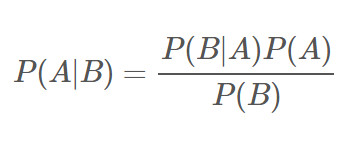

# 先验概率 Prior Probability

**先验概率**是指根据以往经验和分析得到的概率。通常即为统计概率。

在贝叶斯统计中，先验概率分布是指关于某个变量 p 的概率分布，在获得某些信息或者依据前，对 p 的不确定性进行概率预测。

### 先验概率和后验概率

贝叶斯公式：

先验概率：表示在一定数据的前提下，对参数的估计概率；
  
极大似然：找到一个参数，使我们观测到的数据出现的概率最大；

后验概率：就是在极大似然情况下，出现的那个最大概率的数值。

##### 同级词：后验概率

### 参考来源：

【1】  https://en.wikipedia.org/wiki/Prior_probability

【2】  https://blog.csdn.net/liyaohhh/article/details/51137282