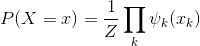

# 势函数 Potential Function

**势函数**定义为数据结构到实数集的一个映射。

势函数解释：

在链式CRF的情况，可以把势函数理解为联合概率密度的归一化分解因子，势函数的作用域都是图的一个最大分团(Maxima clique)。 

对于clique这个概念，是指对于给定图G=(V,E)。其中，V={1,…,n}是图G的顶点集，E是图G的边集。图G的团 就是一个两两之间有边的顶点集合。如果一个团不被其他任一团所包含，即它不是其他任一团的真子集，则称该团为图G的极大团（maximal clique）。顶点最多的极大团，称之为图G的最大团（maximum clique）。

实际上，理论上讲，如果不是链式CRF，那么势函数表示的就是一个图中的每一个团，而不是最大团。势函数是一个表示其对应的clique状态的非负实值函数，表征的是该clique的状态。举个例来说，对于马尔可夫网络来说，其联合概率分布可以看成

这里的x(k)就表示第k个clique的状态，或者说是出现在这个clique之中的变量的状态。

对于一个图中的每一个clique来讲，它有一个状态，用势函数表示，状态则是由多个feature的加权和构成，因为一个clique是包含多个节点的，每个节点，其对应的随机变量，都会对应一个feature。

参考来源：

1. https://www.cnblogs.com/549294286/archive/2013/06/06/3121454.html