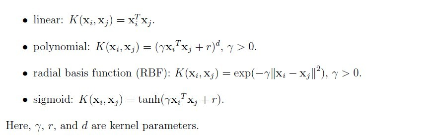

# 多项式核函数 Polynomial kernel function

**多项式核函数**指以多项式形式表示的核函数。它是一种非标准核函数，适合于正交归一化后的数据，其具体形式见图。

在机器学习中，多项式核是一种常用于支持向量机（SVM）和其他核化模型的核函数，它表示特征空间中的向量（训练样本）与原始变量的多项式之间的相似性，允许学习非线性模型。

### 常见的核函数有：

1）线性核函数；
2）多项式核函数；
3）高斯（ RBF ）核函数；
4） sigmoid 核函数；
5）自定义核函数。

### 核函数的数学形式：

##### 父级词：核函数

### 参考来源：

【1】  https://blog.csdn.net/lqhbupt/article/details/8610443

【2】https://en.wikipedia.org/wiki/Polynomial_kernel