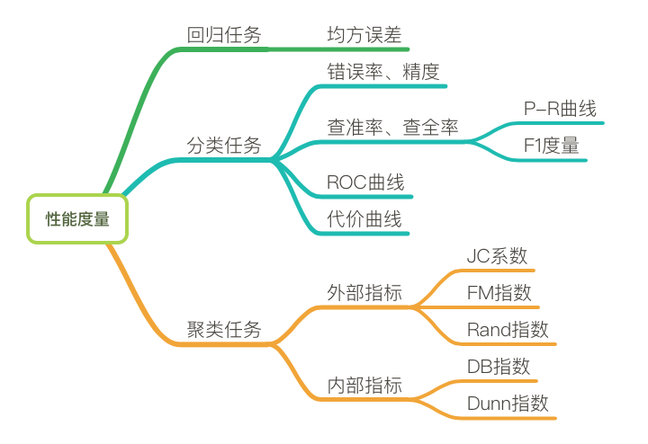

# 性能度量 Performance Measure

**性能度量**是用于衡量模型泛化能力的评价标准。  

性能度量用于判定机器学习的结果好坏程度。在比对不同的模型能力的时候，使用不同的性能度量往往会导致不同的评判结果。判断模型的好坏是相对的，取决于采用什么性能度量，而采用什么性能度量则应取决于实际的任务需求。

### 常用的性能度量

- 回归任务中的性能度量

   均方差
   
- 分类任务中的性能度量
   
   1.错误率和精度  
   
   2.查准率、查全率与F1度量  
   
   4.ROC (受试者工作特征曲线)和 AUC （ Area under ROC Curve ）
     
   5.代价敏感错误率和代价曲线  

##### 父级词：模型评估  

### 参考来源：

【1】  https://kingsfish.github.io/2017/07/15/Machine-Learning-02/

【2】  https://blog.csdn.net/sinat_33761963/article/details/54910447

【3】  https://www.jianshu.com/p/c5111d585367