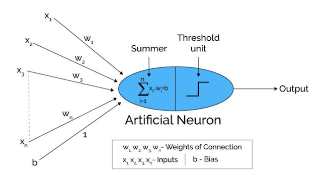

# 感知机 Perceptron

**感知机** 是 Frank Rosenblatt 在 1957 年发明的一种模型。它可以被视为一种最简单形式的前馈神经网络，是一种二元线性分类模型：其输入为实例的特征向量，输出为实例的类别。

在人工神经网络领域中，感知机也被指为单层的人工神经网络，以区别于较复杂的多层感知机（ Multilayer Perceptron ）。

作为一种线性分类器，感知机可说是最简单的前向人工神经网络形式。尽管结构简单，感知机能够学习并解决相当复杂的问题。感知机主要的缺陷是它不能处理线性不可分问题。

### 感知器的定义

感知器使用特征向量来表示的前馈神经网络，它是一种二元分类器，把矩阵上的输入 x（实数值向量）映射到输出值 f ( x ) 上（一个二元的值）。

其中 w 是实数的表示权重的向量，w·x 是点积。w·x = ∑ wjxj

b 是偏置，一个不依赖于任何输入值的常数。偏置可以认为是激励函数的偏移量，或者给神经元一个基础活跃等级。

f ( x )（ 0 或 1 ）用于对 x 进行分类，看它是肯定的还是否定的，这属于二元分类问题。

如果 b 是负的，那么加权后的输入必须产生一个肯定的值并且大于 -b ，这样才能令分类神经元大于阈值 0 。

从空间上看，偏置改变了决策边界的位置。

由于输入直接经过权重关系转换为输出，所以感知器可以被视为最简单形式的前馈式人工神经网络。

### 感知机学习策略：

核心：极小化损失函数。

如果训练集是可分的，感知机的学习目的是求得一个能将训练集正实例点和负实例点完全分开的分离超平面。为了找到这样一个平面（或超平面），即确定感知机模型参数 w 和 b ，一般采用的是损失函数，同时并将损失函数极小化。

##### 父级词：神经网络

### 参考来源：  

【1】  https://zh.wikipedia.org/wiki/感知器

【2】  https://www.jiqizhixin.com/articles/2018-01-15-2

【3】  http://www.cnblogs.com/OldPanda/archive/2013/04/12/3017100.html

