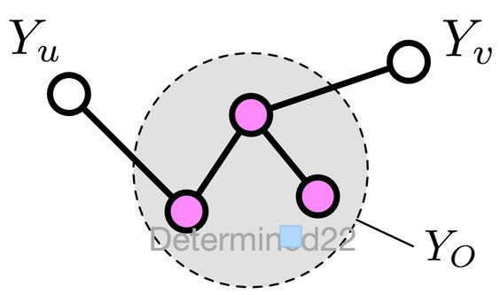

# 成对马尔可夫性 Pairwise Markov Property

**成对马尔可夫性**是指在给定了其他所有变量的情况下，两个非邻接变量条件独立。  

 成对马尔可夫性是马尔可夫网络（无向图模型）的一个类别，马尔可夫网还包括局部马尔可夫性和全局马尔可夫性。
 
 
### 数学表述

设无向图中的任意两个没有边连接的节点 u 和 v ，其他所有节点为 O 。成对马尔可夫性是指：给定随机变量组 *YO* 的条件下， 随机变量 *Yu* 和 *Yv* 是条件独立的。 即 
*P ( Yu , Yv | YO )=P ( Yu | YO ) P ( Yv | YO )* 。

  
  
  
##### 父级词：马尔可夫网络。
##### 同级词：局部马尔可夫性，全局马尔可夫性。
##### 相关词：无向图，条件独立。
    
### 参考来源  

【1】  Frydenberg M. The chain graph Markov property[J]. Scandinavian Journal of Statistics, 1990: 333-353.   
 
【2】  Pieczynski W. Pairwise markov chains[J]. IEEE Transactons on pattern analysis and machine intelligence, 2003, 25(5): 634-639.