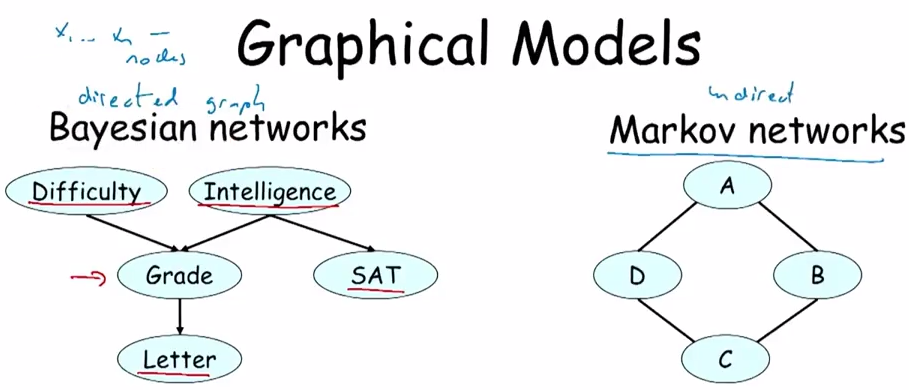

# 概率图模型 Probability Graphical Model

**概率图模型**是指用图结构来表达变量相关关系的概率模型。

概率图模型是用图来表示变量概率依赖关系的理论，结合概率论与图论的知识，利用图来表示与模型有关的变量的联合概率分布。由图灵奖获得者Pearl提来。
 

### 概率图模型的分类：

根据图是有向的还是无向的，可以将图的模式分为两大类——贝叶斯网络（  Bayesian network ）和马尔可夫随机场( Markov Random Field )。

它们的主要区别在于采用不同类型的图来表达变量之间的关系：贝叶斯网络采用有向无环图( Directed Acyclic Graph )来表达因果关系，马尔可夫随机场则采用无向图( Undirected Graph )来表达变量间的相互作用。

贝叶斯网络中每一个节点都对应于一个先验概率分布或者条件概率分布，因此整体的联合分布可以直接分解为所有单个节点所对应的分布的乘积。

而对于马尔可夫场，由于变量之间没有明确的因果关系，它的联合概率分布通常会表达为一系列势函数（ potential function ）的乘积。

##### 子级词：贝叶斯网络，马尔可夫随机场。

### 参考来源：

【1】  https://www.jiqizhixin.com/articles/2017-11-29-3 
  
【2】  http://nooverfit.com/wp/stanford教授daphne-koller-概率图模型-终极入门-第一讲-有向图模/

