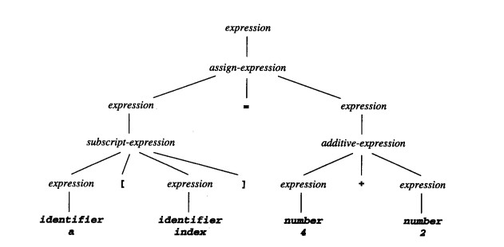
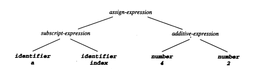

# 解析树 Parse Tree

**解析树**，也称作具体语法树，是语法分析结果的一种表现形式，以树状表示汇编语言的语法结构。

解析树一般按照两种相反的法则生成，一种是依存语法,一种是短语结构语法。解析树和抽象语法树是不同的。抽象语法树是分析树多包涵信息的浓缩。

### 解析树与抽象语法树

抽象语法树（ Abstract Syntax Tree，AST ），简称语法树（ Syntax tree ），是源代码语法结构的一种抽象表示。它也以树状的形式表现编程语言的语法结构，树上的每个节点都表示源代码中的一种结构。“抽象”地方在于，这里的语法并不会表示出真实语法中出现的每个细节。

而具体的语法树以完全解析的形式表示源文本。一般来说，它符合定义源语言的上下文无关语法。具体的语法树包含了一些的括号，空白和注释等所有信息，抽象语法树从这些信息中抽象出来。

简单地说， AST 只包含代码的语义，解析树也包含了如何编写代码的信息。一个具体的语法树匹配语法规则所说的语法。 AST 的目的是对“解析树”中必不可少信息的简单表示。

解析树示例：

抽象语法树示例：

##### 相关词：语法树

### 参考来源：

【1】  https://www.cnblogs.com/xiaomiao/p/3146390.html

【2】  http://www.dovov.com/9362.html
