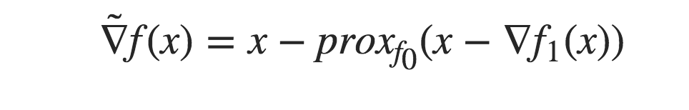
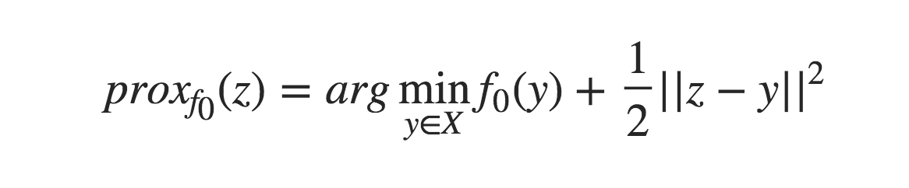
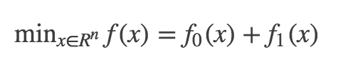
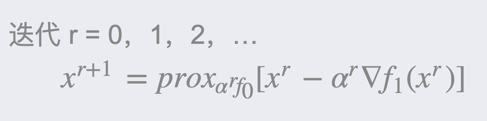

# 近端梯度下降 Proximal Gradient Descent

**近端梯度法**（ PGD ）是一种特殊的梯度下降方法，主要用于求解目标函数不可微的最优化问题。如果目标函数在某些点是不可微的，那么该点的梯度无法求解，传统的梯度下降法也就无法使用。PGD 算法的思想是，使用临近算子作为近似梯度，进行梯度下降。

是常用来求解L1正则化的一种方法。

### 相关概念

设 f ( x ) = f0 ( x ) + f1 ( x ) ，其中 f0 , f1 为凸函数，f1为 光滑函数，那么近端梯度:

 

其中：

### 近端梯度法流程

对目标函数： 
  

 
其中 f1 非光滑， f2 光滑
  
 
  
当 f0 = 0 时，是梯度下降法;
  
当 f1 = 0 时，是近端点法。

### 近端梯度方法的特殊实例

1）预计 Landweber；
2）交替投影；
3）乘法器的交替方向法；
4）快速迭代收缩阈值算法（ FISTA ）。

### 参考来源：

【1】  https://blog.csdn.net/qq547276542/article/details/78251779

【2】  https://en.wikipedia.org/wiki/Proximal_gradient_method