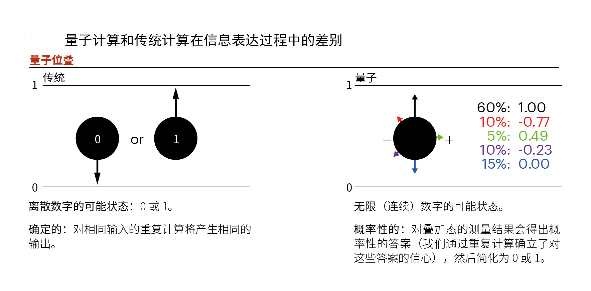

# 量子计算 Quantum Computing

**量子计算**是一种基于量子效应的新型计算方式。基本原理是以量子位作为信息编码和存储单元，通过大量量子位的受控演化来完成计算任务。

### 量子计算和传统计算的对比

(1)  信息表达

在传统计算中，计算机运行的单位是比特，取值为 0 或 1 。量子位与此类似，但除了 0 或 1 ，它还包含了更多复杂信息，甚至是取负值。

量子位在取值之前处于不确定状态（即所谓的“叠加”），可能受到其他量子位的影响（这就是所谓的“纠缠”）。量子位能够以多种方式（电子自旋、光偏振、超导电路等）实现，但量子理论的结果与信息存储和处理的具体机制无关。

(2) 信息处理

在传统计算机中，比特是按顺序处理的，这类似于人们一步步手动解决数学问题的方式。在量子计算中，量子位则纠缠在一起。一个量子位状态的改变，会影响其他量子位的状态。

从本质上来讲，这使量子计算机可以快速地收敛到问题的正确答案。因此，在找到最优解决方案上，量子计算比某些传统方式更有效。

(3) 解释结果

在传统计算中，受算法的设计限制，只可以使用明确定义的结果。量子答案（在数量上称为振幅）具有概率性。这意味着，由于叠加和纠缠，在特定的计算中会考虑多种可能的答案。随着问题的多次出现，不断给出可能答案的样本，并累加对所提供最佳答案的信心。结合统计学可以得到某一答案为正确答案的可能性。能通过调整该置信度阈值来提供最佳的速度和准确度。

##### 相关词：量子计算机 

### 参考来源：

【1】 https://www.ibm.com/developerworks/cn/linux/other/quant/index.html

【2】 https://www.accenture.com/cn-zh/insight-outlook-zhanwang-thinking-beyond-ones-zeros

