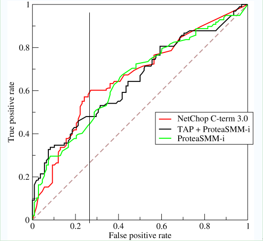
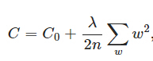
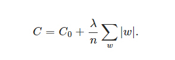
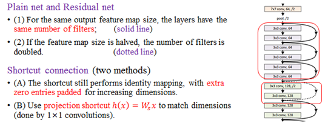

# README 

# *R Lists*

*****

# 径向基函数 Radial Basis Function

**径向基函数**（RBF）是沿径向对称的标量函数。通常定义为空间中任一点 X 到某一中心 Xc 之间距离的单调函数。可记作 K ( || X - X c || ), 其作用往往是局部的 , 即当 X 远离 Xc 时函数取值很小。

其中，范数一般为欧几里得距离，不过也能使用其他距离函数。

### 径向基函数的应用

径向基函数的主要是为了解决多变量插值的问题可以用于许多向函基数的和来逼近某一给定的函数。这一逼近的过程可看作是一个简单的神经网络。

在机器学习中，径向基函数还被用作支持向量机的核函数。在神经网络结构中，可以作为全连接层和 ReLU（线性修正单元）层的主要函数。

### 常见的径向基函数

常见的 RBF 有： 1）高斯函数； 2）多二次函数； 3）逆二次函数； 4）逆多二次函数； 5）多重调和样条； 6）薄板样条。

### 径向基函数适用条件  

RBF 用于根据大量数据点生成平滑表面。这些函数可为平缓变化的表面（如高程）生成很好的结果。

但在表面值在短距离内出现剧烈变化和/或怀疑样本值很可能有测量误差或不确定性时，这些方法不适用。

### 径向基函数网络

使用径向基函数作为激活函数的人工神经网络称为径向基函数网络（ Radial basis function network ）。

径向基函数网络的输出是输入的径向基函数和神经元参数的线性组合。

径向基函数网络具有多种用途，包括包括函数近似法、时间序列预测、分类和系统控制。

##### 父级词：径向奇函数网络
##### 相关词：高斯核函数     

### 参考来源：

【1】  https://www.cnblogs.com/hxsyl/p/5231389.html

【2】  https://en.wikipedia.org/wiki/Radial_basis_function

【3】  https://blog.csdn.net/dengheCSDN/article/details/78109253?locationNum=2&fps=1

*****
       
# 随机森林算法 Random Forest Algrithm 

**随机森林**是一种多功能的算法，能够执行回归和分类的任务。同时，它也是一种数据降维手段，用于处理缺失值、异常值以及其他数据探索中的重要步骤。另外，它还是集成学习中的重要方法，会用在将几个低效模型整合为一个高效模型。

### 随机森林的描述

随机森林用有放回抽样（ Bootstrap 抽样）构成的样本集训练多棵决策树，训练决策树的每个节点时只使用了随机抽样的部分特征。

当在基于某些属性对一个新的对象进行分类判别时，随机森林中的每一棵树都会给出自己的分类选择，并由此进行“投票”，森林整体的输出结果将会是票数最多的分类选项；而在回归问题中，随机森林的输出将会是所有决策树输出的平均值。

随机森林算法中，“随机”是其核心灵魂，“森林”只是一种简单的组合方式而已。随机森林在构建每颗树的时候，为了保证各树之间的独立性，通常会采用两到三层的随机性。

### 随机森林的构建过程

由于随机森林是集成学习中的 Bagging 算法，所以过程和 Baging 类似：

1. 从原始训练集中使用 Bootstraping 方法随机有放回采样选出 m 个样本，共进行 n 次采样，生成 n 个训练集。
2. 对于 n 个训练集，我们分别训练 n 个决策树模型。
3. 对于单个决策树模型，假设训练样本特征的个数为 n0，那么每次分裂时根据信息增益/信息增益比/基尼指数选择最好的特征进行分裂。
4. 每棵树都一直分裂下去，直到该节点的所有训练样例都属于同一类。在决策树的分裂过程中不需要剪枝。
5. 将生成的多棵决策树组成随机森林。对于分类问题，按多棵树分类器投票决定最终分类结果；对于回归问题，由多棵树预测值的均值决定最终预测结果。

### 随机森林的特点：

优点：

- 具有极高的准确率。

- 不容易过拟合。
- 很好的抗噪声能力。
- 能处理很高维度的数据，并且不用做特征选择。 
- 既能处理离散型数据，也能处理连续型数据。
- 数据集无需规范化。
- 训练速度快，可以得到变量重要性排序。 
- 容易实现并行化。

缺点：

- 参数较复杂。

- 训练时需要的空间和时间会较大。 
- 随机森林模型还有许多不好解释的地方。

##### 父级词：Bagging算法

### 参考来源：

【1】  https://blog.csdn.net/qq547276542/article/details/78304454

【2】  https://blog.csdn.net/lishuandao/article/details/52555103

【3】  https://en.wikipedia.org/wiki/Random_forest
http://dataunion.org/23602.html

*****
	  
# 随机漫步 Random Walk

**随机漫步**是由一连串的随机行动的轨迹组成的统计模型，用来表示不规则的变动形式。类似于人在酒后乱步，形成的随机过程记录。它是 1905 年由卡尔·皮尔逊首次提出的。

### 随机漫步的特性

通常来说，随机漫步被假定为具有马尔可夫链的性质，也即是每一个步骤具有“无记忆”的特性，换句话说，每一次变动都不会影响别的变动。

此外，还有许多更加复杂的随机漫步。在维度方面，随机漫步处于图和面上，或者维度更多的结构中，例如群。

#### 随机漫步的应用

- 计算机科学中，随机漫步可用于万维网尺度的预测；

- 图像分割中，可以用来确认每一个像素的标签（例如是目标还是背景。
 常用的分割算法包括随机漫步者（ Random Walker ）等；

- 无线网络中，可以应用于模型节点运动的研究。

##### 相关词：随机过程

### 参考来源：

【1】  http://blog.sina.com.cn/s/blog_95a50bb80100y1g0.html

【2】  https://en.wikipedia.org/wiki/Random_walk

*****	
     
# 召回率 Recall Rate

**召回率**也叫查全率，是检索出的样本数和所有样本数的比率，衡量的是检索系统的查全率。
  

召回率（ Recall ）和查准率（ Precise ）是广泛用于信息检索和统计学分类领域的两个度量值，用来评价结果的质量。

|    真实类别  |  预测为正 | 预测为反 |
|-----------|---------|----------|
|正例 | TP（真正例) | FN（假反例）|
|反例 | FP（假正例）| TN（真反例）|

召回率的计算公式是 *R* = TP / ( TP + FN ) 

它表示的是“正确被检索的结果（ TP ）”占所有“应该检索到的结果( TP + FN )”的比例。

​	 
​其他参见查准率。
​
##### ​相关词：查准率，F1 度量

### 参考来源

【1】  https://blog.csdn.net/quiet_girl/article/details/70830796

【2】  http://www.cnblogs.com/maybe2030/p/5375175.html
​
*****
	  
# 受试者工作特征 Receiver Operating Characteristic

**受试者工作特征**（ ROC ）是一种系统匹配算法的测试指标。它是匹配分数阈值、误识率以及拒识率之间的一种关系。它反映了识别算法在不同阈值上，拒识率和误识率的平衡关系。

|    真实类别  |  预测为正 | 预测为反 |
|-----------|---------|----------|
|正例 | TP（真正例) | FN（假反例）|
|反例 | FP（假正例）| TN（真反例）|

ROC曲线是以真正例率（ TPR ）为横坐标，假正例率（ FPR ）为纵坐标生成的曲线图。定义如下：

TPR ：在所有实际为阳性的样本中，被正确地判断为阳性之比率。TPR = TP / ( TP + FN )   

FPR ：在所有实际为阴性的样本中，被错误地判断为阳性之比率。FPR = FP / ( FP + TN )

ROC 曲线可以用来计算“均值平均精度”（ mean average precision ），这是通过改变阈值来选择最好的结果时所得到的平均精度（ PPV ）。

一般情况下，曲线距离左上角越近,证明分类器效果越好。

##### 相关词：AOU 曲线

### 参考来源：

【1】  https://www.cnblogs.com/gatherstars/p/6084696.html

【2】  https://blog.csdn.net/mingtian715/article/details/53488094

【3】  https://en.wikipedia.org/wiki/Receiver_operating_characteristic

*****  
  
# 线性修正单元 Rectified linear unit

**线性修正单元**（ReLU）,又称线性整流函数, 是一种人工神经网络中常用的激活函数（ activation function ），通常指代以斜坡函数及其变种为代表的非线性函数。

### 线性修正单元的特点

比较常用的 ReLU 有斜坡函数 f ( x ) = max ( 0 , x ) ，以及带泄露整流函数 ( Leaky ReLU )，其中 x 为神经元的输入。

线性整流被认为有一定的生物学原理，并且由于在实践中通常有着比其他常用激活函数（譬如逻辑函数）更好的效果，而被如今的深度神经网络广泛使用于诸如图像识别等计算机视觉人工智能领域。

ReLU 作为神经网络中最常用的激活函数，它保留了 step 函数的生物学启发（只有输入超出阈值时神经元才激活），不过当输入为正的时候，导数不为零，从而允许基于梯度的学习（尽管在   x = 0 的时候，导数是未定义的）。

使用这个函数能使计算变得很快，因为无论是函数还是其导数都不包含复杂的数学运算。然而，当输入为负值的时候，ReLU 的学习速度可能会变得很慢，甚至使神经元直接无效，因为此时输入小于零而梯度为零，从而其权重无法得到更新，在剩下的训练过程中会一直保持静默。

##### 相关词：激活函数
##### 子级词：斜坡韩式，泄露整流函数

### 参考来源：
 
【1】  https://zh.wikipedia.org/wiki/线性整流函数

【2】  https://www.jiqizhixin.com/articles/2017-10-10-3

*****
  
# 循环神经网络 Recurrent Neural Network

**循环神经网络**是用来处理序列数据的网络模型。它指一个序列当前的输出与前面的输出有关。

具体的表现为网络会对前面的信息进行记忆并应用于当前输出的计算中，即隐藏层之间的节点不再无连接而是有连接的，并且隐藏层的输入不仅包括输入层的输出还包括上一时刻隐藏层的输出。

循环神经网络已经被广泛应用在语音识别、语言模型以及自然语言生成等任务上。

### 循环神经网络的特点

RNN 是一类具有短期记忆能力的神经网络。它的神经元不但可以接受其它神经元的信息，也可以接受自身的信息，形成具有环路的网络结构。和前馈神经网络相比，循环神经网络更加符合生物神经网络的结构。

理论上，循环神经网络能够对任何长度的序列数据进行处理。但是在实践中，为了降低复杂性往往假设当前的状态只与前面的几个状态相关，下图是其示意图： 

循环神经网络可以扩展到两种更广义的记忆网络模型：递归神经网络和图网络。

### 循环神经网络的应用

循环神经网络在词向量表达、语句合法性检查、词性标注都有很好的应用，目前使用最广泛最成功的模型便是 LSTMs ( Long Short-Term Memory，长短时记忆模型）模型。循环神经网络的使用主要在以下几个方面：

1) 语言模型与文本生成( Language Modeling and Generating Text )；

2) 机器翻译( Machine Translation )；

3) 语音识别( Speech Recognition )；

4) 图像描述生成 ( Generating Image Descriptions )。

##### 相关词：神经网络

### 参考来源：

【1】  https://blog.csdn.net/heyongluoyao8/article/details/48636251

【2】  神经网络与深度学习，邱锡鹏 https://nndl.github.io/

*****
  	  
# 递归神经网络 Recursive neural network

**递归神经网络**是一种表示学习方法，它可以将词、句、段、篇按照他们的语义映射到同一个向量空间中，也就是把可组合（树/图结构）的信息表示为一个个有意义的向量。

### 递归神经网络分类

递归神经网络包括两种人工神经网络的：

时间递归神经网络（ recurrent neural network ），它的神经元间连接构成有向图；

结构递归神经网络（ recursive neural network ），是利用相似的神经网络结构递归构造更为复杂的深度网络。

### 参考来源：

【1】  http://wiki.jikexueyuan.com/project/tensorflow-zh/tutorials/recurrent.html

***** 
  	  
# 回归 Regression

**回归**是定义输入与输出的关系的一种操作。通常的回归过程中，输入即现有知识，而输出则为预测。

回归方法是一种对数值型连续随机变量进行预测和建模的监督学习算法。使用案例一般包括房价预测、股票走势或测试成绩等连续变化的案例。

回归任务的特点是标注的数据集具有数值型的目标变量。也就是说，每一个观察样本都有一个数值型的标注真值以监督算法。回归的目的在于得到一个最优的拟合线。

### 回归的步骤

一个预测问题在回归模型下的解决步骤为：

1）积累知识： 将储备的知识称之为训练集 Training Set。  

2）学习：学习如何预测，得到输入与输出的关系。在学习阶段，应当有合适的指导方针，学习算法 （ Learning Algorithm ）。

3）预测：学习完成后，当接受了新的数据（输入）后，通过学习阶段获得的对应关系来预测输出。

### 回归方法

1）线性回归（正则化）

线性回归是处理回归任务最常用的算法之一。该算法的形式十分简单，它期望使用一个超平面拟合数据集（只有两个变量的时候就是一条直线）。  

2）回归树（集成方法）

回归树（决策树的一种）通过将数据集重复分割为不同的分支而实现分层学习，分割的标准是最大化每一次分离的信息增益。这种分支结构让回归树很自然地学习到非线性关系。

### 回归与其他问题的联系

- 输入变量与输出变量均为连续变量的预测问题是回归问题；

- 输出变量为有限个离散变量的预测问题成为分类问题；

- 输入变量与输出变量均为变量序列的预测问题成为标注问题。

##### 相关词：分类，标注。

### 参考来源：

【1】  https://yoyoyohamapi.gitbooks.io/mit-ml/content/线性回归/articles/回归问题.html

【2】  https://www.jiqizhixin.com/articles/2017-05-20-3

*****
   	 
# 正则化 Regularization

**正规化**是引入附加信息以解决不适定问题或防止过度拟合的过程。是数学、统计学和计算机科学，特别是机器学习和逆问题中常用的方法。

### 常用的正则化方法：

1） L2 正则化（权重衰减）

L2 正则化项，这样来的：所有参数 w 的平方的和，除以训练集的样本大小 n 。λ就是正则项系数，权衡正则项与 C0 项的比重。另外还有一个系数 1/2。添加正则化项的目的在于减少参数平方的总和。机器学习中最常用的正则化方法是对权重施加 L2 范数约束。

C0 代表原始的代价函数，后面那一项就是 L2 正则化项。

2） L1 正则化

L1 正则化项，即所有权重 w 的绝对值的和，乘以 λ / n 。L1 正则化向目标函数添加正则化项，以减少参数的绝对值总和。常用于特征选择设置中。

3） Dropout

L1、L2 正则化是通过修改代价函数来实现的，而Dropout则是通过修改神经网络本身来实现的，它是在训练网络时用的一种技巧。

4） Drop Connect 

Drop Connect 是另一种减少算法过拟合的正则化策略，是 Dropout 的一般化。在 Drop Connect 的过程中需要将网络架构权重的一个随机选择子集设置为零，取代了在 Dropout 中对每个层随机选择激活函数的子集设置为零的做法。

5）早停法

早停法可以限制模型最小化代价函数所需的训练迭代次数。早停法通常用于防止训练中过度表达的模型泛化性能差。

##### 子级词： L1正则化，L2正则化。

### 参考来源：

【1】  https://en.wikipedia.org/wiki/Regularization_(mathematics)

【2】  https://www.jiqizhixin.com/articles/2017-12-20

【3】  http://www.cnblogs.com/mfryf/p/6245050.html?spm=a2c4e.11153940.blogcont326880.6.4d804612GZ5QRR

***** 
    	
# 强化学习 Reinforcement learning

**强化学习**（ RL ）是机器学习的一个重要分支，是多学科多领域交叉的一个产物，它的本质是解决 decision making 问题，即自动进行决策，并且可以做连续决策。

强化学习主要包含四个元素，agent，环境状态，行动，奖励, 强化学习的目标就是获得最多的累计奖励。

### 主要算法和分类 

从强化学习的几个元素的角度划分的话，方法主要有下面几类：

- Policy based, 关注点是找到最优策略。 

- Value based, 关注点是找到最优奖励总和。

- Action based, 关注点是每一步的最优行动。

##### 父级词：机器学习  

### 参考来源：

【1】  https://blog.csdn.net/aliceyangxi1987/article/details/73327378

【2】  https://blog.csdn.net/trillion_power/article/details/70992333

【3】  https://en.wikipedia.org/wiki/Reinforcement_learning

 
  	  
# 表征学习 Representation learning

**表征学习**又称表示学习，是利用机器学习技术自动获取每一个实体或者关系的向量化表达，以便在构建分类器或其他预测变量时更易提取有用信息。

在机器学习中，表征学习是学习一个特征的技术的集合：将原始数据转换成为能够被机器学习来有效开发的一种形式。它避免了手动提取特征的麻烦，允许计算机学习使用特征的同时，也学习如何提取特征：学习如何学习。

### 表征学习分类

表征学习可分为两类：有监督的和无监督的。
 
1）在监督表征学习中，被标记过的数据被当做特征用来学习。例如神经网络，多层感知器，(监督)字典学习。 

2）在无监督表征学习中，未被标记过的数据被当做特征用来学习。例如(无监督)字典学习，独立成分分析，自动编码，矩阵分解 ，各种聚类分析及其变形。

##### 父级词：机器学习
##### 相关词：强化学习

### 参考来源：

【1】  https://blog.csdn.net/yunxinan/article/details/52850903

【2】  https://blog.csdn.net/zhangsh_20930/article/details/78820512

*****

# 重采样法 Re-sampling

**重采样法**是指从原始数据样本中提取重复样本。这是一种统计推断的非参数方法。即重采样不使用通用分布来逼近地计算概率 p 的值。

重采样基于实际数据生成一个独特的采样分布。它使用经验性方法，而不是分析方法，来生成该采样分布。重采样基于数据所有可能结果的无偏样本获取无偏估计。

### 常用的重采样方法

1，Nearest Neighbour Resampling （最邻近）

最简单暴力的一种重采样的方法，根据目标图像的宽（高）与源图像的宽（高）比值，取源图像相对位置的像素点作为目标像素点的值。

2，Bilinear Resampling（双线性/两次线性）

这种算法不像第一种那样无脑，而是参考了源像素相应位置周围4个点的值，根据相对位置取相应的权重，从而得到目标图像。

3，Bicubic Resampling  （双立方/两次立方）

可以看出第一种算法的目标像素值由源图上单个像素决定，第二种算法由源像素某点周围4个像素点按一定权重获得，而双立方重采样算法更进一步参考了源像素某点周围4*4个像素来获得。

4，Lanczos Resampling 

Lanczos算法实际上是Arnoldi算法对于对称矩阵的特殊形式，可应用于对称矩阵线性方

程组求解的Krylov子空间方法以及对称矩阵的特征值问题。很显然这种算法参考了更多的源图像像素值，计算量增大了很多，也是效果最好的一种。

##### 相关词：采样，欠采样

### 参考来源

【1】  http://ncic.ac.cn/codesign/blog/?p=2826

【2】  https://blog.csdn.net/LanerGaming/article/details/49207435

*****    	

# 受限玻尔兹曼机 Restricted Boltzmann Machine/RBM 

**受限玻尔兹曼机**是一类具有两层结构、对称连接且无自反馈的随机神经网络模型。它的特点是是层内全连接，层外无连接。是由多伦多大学的 Geoff Hinton 等人提出，可用于降维、分类、回归、协同过滤、特征学习以及主题建模的算法。

上面一层神经元组成隐藏层( hidden layer ), 用 h 向量隐藏层神经元的值。下面一层的神经元组成可见层( visible layer ),用 v 向量表示可见层神经元的值。

和玻尔兹曼机（ BM ）的不同在于，PBM 层内没有连接，因此说它是受限的。其实是一种简化了的 BM 模型。

### 参考来源 

【1】  https://blog.csdn.net/xbinworld/article/details/44901865

【2】  张春霞, 姬楠楠, 王冠伟. 受限波尔兹曼机[J]. 工程数学学报, 2015(2):159-173.

*****

# 规则学习 Rule Learning

**规则学习**是从训练数据中学习出一组由原子命题组成的 IF-THEN 的规则,属于非监督学习的一种,常用被归属为分类的一种.

### 概念

规则( rule ) : 语义明确,能描述数据分布所隐含的客观规律或领域概念.

规则学习( rule learning ) : 从训练数据集中学习出一组能用于对未见示例进行判别的规则.

### 规则学习中的规则

规则学习的规则分为两种:

1） 命题规则（propositional rule）

由”原子命题”和逻辑连接词 与、或、非和蕴含构成的简单陈述句。

    Examples:

    Rule1: (胎生 = no ) ∧ (会飞 = yes ) → 鸟类

    Rule2: (胎生 = no ) ∧ (在水里生活 = yes ) → 鱼类

2) 一阶规则( first-order rule )

不像命题规则只处理简单的陈述命题，一阶逻辑还额外包含了断言和量化。
一阶规则能表达复杂的关系，也被称为关系型规则( relational rule )。

### 生成规则的方法

1) 直接生成法( Direct Method ) : 直接从训练集中归纳出规则。

2) 间接生产法( Indirect Method ) : 从决策树转换而来。

### 规则学习的目的

规则学习的目标是产生一个能覆盖尽可能多的样例的规则集。

最直接的做法是序贯覆盖（ sequential covering ），即逐条归纳：在训练集上每学到一条规则，就将该规则覆盖的训练样例去除，然后以剩下的训练样例组成训练集重复上述过程。由于每次只处理一部分数据，因此也称为分治（ separate-and-conquer ）策略。

### 参考来源

【1】  http://lyn.s76.org/2017/05/09/rule-learning/

【2】  http://shuaihuang.github.io/2017/01/15/Rule-Learning/

*****

# 再生核希尔伯特空间 Reproducing Kernel Hilbert Space

**再生核Hilbert空间**（ RKHS ）是由函数构成的具有再生核的Hilbert空间。在希尔伯特空间中，使用“核技巧”把一组数据映射到一个高维空间，这个空间就是一个可再生核希尔伯特空间。

### 相关概念

再生核的概念：在一定条件下，我们可以找到一个对应于这个Hilbert Space上的唯一的一个再生核函数 K ，它满足：

- 对任意固定 x0 属于 X ，K( x , x0 ), 作为 x 的函数属于 H ; 

- 对任意 x 属于 X 和 f (.) 属于 H ，有 f ( x ) = < f ( . ) ， K ( . , x ) > H

则称 K ( x , y ) 为 H 的再生核, H 是以 K ( x , y )
为再生核的Hilbert空间，简称再生核 Hilbert 空间，简记为 RKHS 。

### 希尔伯特空间定义的流程是：

> 线性空间（向量空间）–> 内积空间 –> 赋范向量空间 –> 度量空间 –完备的–> 希尔伯特空间

向量空间( vector space )： 满足加法和标量乘操作的集合

范数向量空间( normed vector space )： 定义了向量长度的向量空间。

度量空间( metric space )： 定义了两个点的距离的集合（这里不必须是向量空间）。

Banach 空间： 一个完备的范数向量空间。一个完备的空间指没有缺失的元素（所有的柯西序列都是收敛的）。

内积空间( inner product space )：是指在定义域上可进行内积运算法操作的向量空间，

希尔伯特空间（ Hilbert Space ）： 当一个内积空间满足通过内积空间可推导出范数空间(赋范空间)，并且是完备的，那么这个内积空间就是希尔伯特空间。

### RKHS 的两个定理：

1） 一个希尔伯特空间 H 是一个再生核希尔伯特空间，当且仅当它有一个再生核；

2） 对于给定的再生核希尔伯特空间，它的再生核是唯一的。

##### 相关词：希尔伯特空间，再生核。

### 参考来源

【1】  https://www.fanyeong.com/2017/11/13/linear-space-to-rkhs/

【2】  http://heimingx.cn/2016/05/24/reproducing-kernel-hilbert-spaces/

*****

# 残差映射 Residual Mapping

**残差映射**是构建残差网络依据的对应关系，常见的表现形式为 H ( x ): = F( x ) + x ，其中 F ( x ) 为残差函数。

### 相关概念

残差定义: 数理统计上, 残差表示实际观测值与估计值(拟合值)的差, 蕴含模型的重要信息.

假设，层间需要学习的隐藏映射为 H ( x ) ，残差映射表示为 F ( x ) = H ( x )− x ，将原本需要学习的映射 H ( x ) 变为残差函数 F ( x ) + x 。这里的残差定义： 输出 - 输入 = 残差。 

### 残差映射和网络

通过增加一个恒等映射（identity mapping），同时在输出个输入之间引入一个 shortcut connection，而不是简单的堆叠网络。

将原始所要学习的函数 H(x) 转换成 F(x) + x。这样可以解决网络由于很深出现梯度消失的问题，从而可以把网络做的很深，就构成了残差网络 ResNet。其中一个网络结构如下图所示：

### 参考来源：
【1】  http://pengshuang.space/2017/08/05/Resnet-学习笔记/

【2】  https://wenku.baidu.com/view/e655459ecaaedd3382c4d3d5.html（百度文库）

*****

# 残差网络 Residual Network

**残差网络**（ ResNet ）是在简单网络的基础上，插入了快捷连接，将网络转化为其对应的残差版本。残差网络并不直接拟合目标，而是拟合残差。

ResNet 的基本思想是引入了能够跳过一层或多层的“ shortcut connection ”。

原始模型相当于在函数 f( x )的空间寻参，残差网络相当于是在 x + f ( x ) 的空间寻参。

### 残差网络的设计规则：

对于普通网络，其实对残差网络也是适用的:

(1)具有相同特征图尺度大小，具有相同个数的卷积核。

(2)特征图的大小减半时，特征图的数目加倍。

而对于虚线区域内的快捷连接，也有两种方式来解决

（1）在周围填充 0 来增加维度。

（2） 使用投影快捷。

### 残差网络的优点：

很容易训练，值得是前向和反向都可以保证，线性使得网络加深，可以达到 1000 层精度提升，此外可以被移植到其他问题。能够通过反向更新解决梯度消失的问题。 

### 残差网络的应用：

图像的很多问题都可以应用、视觉识别、图像生成、自然语言处理、语音识别、广告，用户预测。

### 参考来源

【1】  https://blog.csdn.net/qq_29184757/article/details/77983824

【2】  https://www.jianshu.com/p/e58437f39f65

【3】  https://my.oschina.net/u/876354/blog/1622896

*****

# 鲁棒性/稳健性 Robustness

**鲁棒性**是指一个计算机系统在执行过程中处理错误，以及算法在遭遇输入、运算等异常时继续正常运行的能力。 

鲁棒是Robust的音译，也就是健壮和强壮的意思。它是在异常和危险情况下系统生存的关键。比如说，计算机软件在输入错误、磁盘故障、网络过载或有意攻击情况下，能否不死机、不崩溃，就是该软件的鲁棒性。

### 鲁棒性的意义

鲁棒性是标称系统所具有的某一种性能品质，对于具有不确定性的系统集的所有成员的关系。

如果所关心的是系统的稳定性，那么就称该系统具有鲁棒稳定性；如果所关心的是用干扰抑制性能或用其他性能准则来描述的品质，那么就称该系统具有鲁棒性能。
诸如模糊测试之类的形式化方法中，必须通过制造错误的或不可预期的输入来验证程序的健壮性。

很多商业产品都可用来测试软件系统的鲁棒性。鲁棒性也是失效评定分析中的一个方面。

##### 相关词：鲁棒控制，衡量

### 参考来源

【1】  https://zh.wikipedia.org/wiki/健壮性_(计算机科学)

【2】  https://blog.csdn.net/xiaoshengforever/article/details/14120273

【3】  https://blog.csdn.net/zhouxinxin0202/article/details/79915873

*****

# 根结点 Root Node 

**根结点**是在树数据结构中第一个结点。通常的结点可能具有父结点和子结点，但由于根音符是第一个结点，因此它只有子结点。

### 树和根结点

树（ tree ）树是由根结点和若干颗子树构成的，是包含n（n>0）个结点的有穷集合，其中：

1） 每个元素称为结点（ node ）；树是由一个集合以及在该集合上定义的一种关系构成的。集合中的元素称为树的结点，所定义的关系称为父子关系。

2） 父子关系在树的结点之间建立了一个层次结构。在这种层次结构中有一个结点具有特殊的地位，有一个特定的结点被称为根结点或树根（ root ）。

3） 除根结点之外的其余数据元素被分为 m（ m≥0 ）个互不相交的集合 T1 ，T2 ， ... ，Tm-1 ，其中每一个集合 Ti （ 1 <= i <= m ）本身也是一棵树，被称作原树的子树（ subtree ）。

### 根结点的性质

根结点就像任何结点一样，因为它是数据结构的一部分，该数据结构由一个或多个字段组成，这些字段具有到其他结点的链接并包含数据字段; 

它是第一个结点。在这方面，如果客观地选择树的该部分，则任何结点可以是与其自身及其子结点相关的根结点。

##### 相关词：树，结点，子树。

### 参考来源

【1】  https://www.techopedia.com/definition/21839/root-node

【2】  https://zh.wikipedia.org/wiki/树_(数据结构)

*****

# 规则引擎 Rule Engine

**规则引擎**由推理引擎发展而来，是一种嵌入在应用程序中的组件，实现了将业务决策从应用程序代码中分离出来，并使用预定义的语义模块编写业务决策。

### 规则引擎的功能

规则引擎实现了将业务决策从应用程序代码中分离出来，并使用预定义的语义模块编写业务决策。

规则引擎具体执行可以分为接受数据输入，解释业务规则，根据业务规则做出业务决策几个过程。

使用规则引擎可以把复杂、冗余的业务规则同整个支撑系统分离开，做到架构的可复用移植。

### 规则引擎的选型应用

相对于业务系统，规则引擎可以认为是一个独立于业务系统的模块，负责一些规则的计算等。

一般来说，规则引擎主要应用在下面的场景中：

1） 风控模型配置，风控是规则引擎；

2） 用户积分等配置，如日常操作引起积分变化等；

3） 简单的离线计算，各类数据量比较小的统计等。

### 目前常用的引擎规则

目前的规则引擎系统中，使用较多的开源规则引擎有：

1)  Ilog JRules 是最有名的商用 BRMS ；

2)  Drools 是最活跃的开源规则引擎；

3)  Jess 是Clips的java实现，就如 JRuby 之于 Ruby，是 AI 系的代表；

4)  Visual Rules（旗正规则引擎）国内商业规则引擎品牌。

### 参考来源

【1】  http://www.cnblogs.com/binyue/p/6774903.html

【2】  https://github.com/Hale-Lee/RuleEngine/wiki/规则引擎使用

【3】  https://en.wikipedia.org/wiki/Business_rules_engine

*****

# 表示定理 Representer Theorem

**表示定理**是统计学习中的一个定理，表明在再生核 Hilbert 空间上定义的正则化风险函数的最小值，可以表示为在训练集数据中的输入点上的线性组合。

### 实际应用举例

在 L2 正则化问题上：

表示定理是指任意一个 L2 正则化的问题，其最佳 w∗ 都可以用 βn 与 Zn 线性组合得到。

### 表示定理的意义

表示定理简化了正则化的经验风险最小化问题 。

表示定理能将原始（无限维）最小化问题减少到搜索最优系数的三维向量，然后可以通过应用标准函数最小化算法来求解。

表示定理为一般机器学习问题推广到可实现算法提供了理论基础。

##### 相关词：线性组合，L2 正则化。

### 参考来源

【1】  https://en.wikipedia.org/wiki/Representer_theorem

【2】  http://cerulean.me/?paged=2

【3】  https://alex.smola.org/papers/2001/SchHerSmo01.pdf

*****
