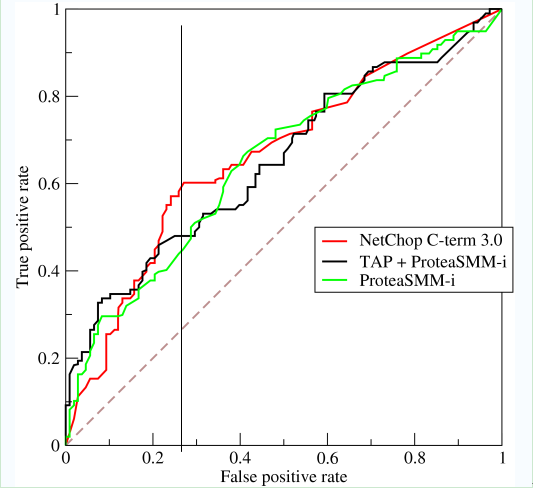

# 受试者工作特征 Receiver Operating Characteristic

**受试者工作特征**（ ROC ）是一种已经被广泛接受的系统匹配算法测试指标，它是匹配分数阈值、误识率以及拒识率之间的一种关系。它反映了识别算法在不同阈值上，拒识率和误识率的平衡关系。

|    真实类别  |  预测为正 | 预测为反 |
|-----------|---------|----------|
|正例 | TP（真正例) | FP（假反例）|
|反例 | FP（假正例）| TN（真反例）|

ROC曲线是以真正例率（ TPR ）为横坐标，假正例率（ FPR ）为纵坐标生成的曲线图。定义如下：

TPR ：在所有实际为阳性的样本中，被正确地判断为阳性之比率。TPR = TP / ( TP + FN )   

FPR ：在所有实际为阴性的样本中，被错误地判断为阳性之比率。FPR = FP / ( FP + TN )

ROC 曲线可以用来计算“均值平均精度”（ mean average precision ），这是通过改变阈值来选择最好的结果时所得到的平均精度（ PPV ）。

一般情况下，曲线距离左上角越近,证明分类器效果越好。

##### 相关词：AOU 曲线

### 参考来源：

【1】  https://www.cnblogs.com/gatherstars/p/6084696.html

【2】  https://blog.csdn.net/mingtian715/article/details/53488094

【3】  https://en.wikipedia.org/wiki/Receiver_operating_characteristic