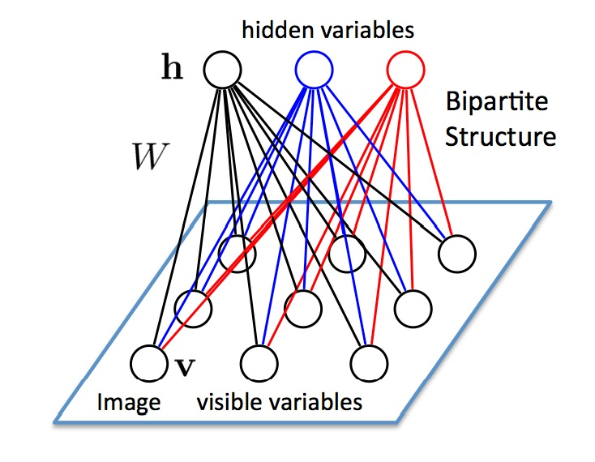

# 受限玻尔兹曼机 Restricted Boltzmann Machine/RBM 

**受限玻尔兹曼机**是一类具有两层结构、对称连接且无自反馈的随机神经网络模型。它的特点是是层内全连接，层外无连接。是由多伦多大学的 Geoff Hinton 等人提出，是一种可以用于降维、分类、回归、协同过滤、特征学习以及主题建模的算法。

上面一层神经元组成隐藏层( hidden layer ), 用h向量隐藏层神经元的值。下面一层的神经元组成可见层( visible layer ),用 v 向量表示可见层神经元的值。

和玻尔兹曼机（ BM ）的不同在于，PBM 层内没有连接，因此说它是受限的。其实是一种简化了的 BM 模型。

### 参考来源 

【1】  https://blog.csdn.net/xbinworld/article/details/44901865

【2】  张春霞, 姬楠楠, 王冠伟. 受限波尔兹曼机[J]. 工程数学学报, 2015(2):159-173.