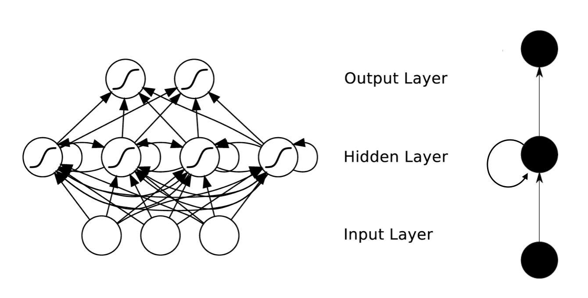

# 循环神经网络 Recurrent Neural Network

**循环神经网络**是用来处理序列数据的网络模型。它指一个序列当前的输出与前面的输出有关。

具体的表现为网络会对前面的信息进行记忆并应用于当前输出的计算中，即隐藏层之间的节点不再无连接而是有连接的，并且隐藏层的输入不仅包括输入层的输出还包括上一时刻隐藏层的输出。

循环神经网络已经被广泛应用在语音识别、语言模型以及自然语言生成等任务上。

### 循环神经网络的特点

RNN 是一类具有短期记忆能力的神经网络。它的神经元不但可以接受其它神经元的信息，也可以接受自身的信息，形成具有环路的网络结构。和前馈神经网络相比，循环神经网络更加符合生物神经网络的结构。

理论上，循环神经网络能够对任何长度的序列数据进行处理。但是在实践中，为了降低复杂性往往假设当前的状态只与前面的几个状态相关，下图是其示意图： 

循环神经网络可以扩展到两种更广义的记忆网络模型：递归神经网络和图网络。

### 循环神经网络的应用

循环神经网络在词向量表达、语句合法性检查、词性标注都有很好的应用，目前使用最广泛最成功的模型便是 LSTMs ( Long Short-Term Memory，长短时记忆模型）模型。循环神经网络的使用主要在以下几个方面：

1) 语言模型与文本生成( Language Modeling and Generating Text )；

2) 机器翻译( Machine Translation )；

3) 语音识别( Speech Recognition )；

4) 图像描述生成 ( Generating Image Descriptions )。

### 参考来源：

【1】  https://blog.csdn.net/heyongluoyao8/article/details/48636251

【2】  神经网络与深度学习，邱锡鹏 https://nndl.github.io/
