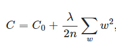
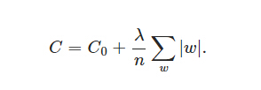

# 正则化 Regularization

**正规化**是引入附加信息以解决不适定问题或防止过度拟合的过程。是数学、统计学和计算机科学，特别是机器学习和逆问题中常用的方法。

### 常用的正则化方法：

1） L2 正则化（权重衰减）

L2正则化项，这样来的：所有参数w的平方的和，除以训练集的样本大小n。λ就是正则项系数，权衡正则项与 C0 项的比重。另外还有一个系数 1/2。添加正则化项的目的在于减少参数平方的总和。机器学习中最常用的正则化方法是对权重施加 L2 范数约束。

C0 代表原始的代价函数，后面那一项就是 L2 正则化项。

2） L1 正则化

L1 正则化项，即所有权重 w 的绝对值的和，乘以 λ / n 。L1 正则化向目标函数添加正则化项，以减少参数的绝对值总和。常用于特征选择设置中。

3） Dropout

L1、L2正则化是通过修改代价函数来实现的，而Dropout则是通过修改神经网络本身来实现的，它是在训练网络时用的一种技巧。

4） Drop Connect 

Drop Connect 是另一种减少算法过拟合的正则化策略，是 Dropout 的一般化。在 Drop Connect 的过程中需要将网络架构权重的一个随机选择子集设置为零，取代了在 Dropout 中对每个层随机选择激活函数的子集设置为零的做法。

5）早停法

早停法可以限制模型最小化代价函数所需的训练迭代次数。早停法通常用于防止训练中过度表达的模型泛化性能差。

### 参考来源：

【1】  https://en.wikipedia.org/wiki/Regularization_(mathematics)

【2】  https://www.jiqizhixin.com/articles/2017-12-20

【3】  http://www.cnblogs.com/mfryf/p/6245050.html?spm=a2c4e.11153940.blogcont326880.6.4d804612GZ5QRR