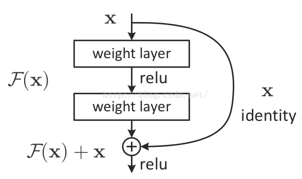
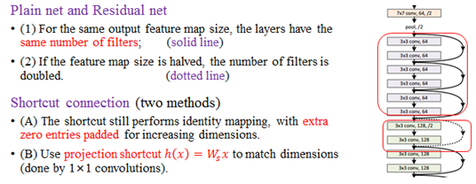

# 残差网络 Residual Network

**残差网络**（ ResNet ）是在简单网络的基础上，插入了快捷连接，将网络转化为其对应的残差版本。残差网络并不直接拟合目标，而是拟合残差。

ResNet 的基本思想是引入了能够跳过一层或多层的“ shortcut connection ”。

原始模型相当于在函数 f( x )的空间寻参，残差网络相当于是在 x + f ( x ) 的空间寻参。

### 残差网络的设计规则：

对于普通网络，其实对残差网络也是适用的:

(1)具有相同特征图尺度大小，具有相同个数的卷积核。

(2)特征图的大小减半时，特征图的数目加倍。

而对于虚线区域内的快捷连接，也有两种方式来解决

（1）在周围填充 0 来增加维度。

（2） 使用投影快捷。

### 残差网络的优点：

很容易训练，值得是前向和反向都可以保证，线性使得网络加深，可以达到 1000 层精度提升，此外可以被移植到其他问题。能够通过反向更新解决梯度消失的问题。 

### 残差网络的应用：

图像的很多问题都可以应用、视觉识别、图像生成、自然语言处理、语音识别、广告，用户预测。

### 参考来源

【1】  https://blog.csdn.net/qq_29184757/article/details/77983824

【2】  https://www.jianshu.com/p/e58437f39f65

【3】  https://my.oschina.net/u/876354/blog/1622896