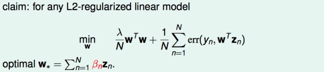

# 表示定理 Representer Theorem

**表示定理**是统计学习中的一个定理，表明在再生核 Hilbert 空间上定义的正则化风险函数的最小值，可以表示为在训练集数据中的输入点上的线性组合。

### 实际应用举例

在 L2 正则化问题上：

表示定理是指任意一个 L2 正则化的问题，其最佳 w∗ 都可以用 βn 与 Zn 线性组合得到。

### 表示定理的意义

表示定理简化了正则化的经验风险最小化问题 。

表示定理能将原始（无限维）最小化问题减少到搜索最优系数的三维向量，然后可以通过应用标准函数最小化算法来求解。

表示定理为一般机器学习问题推广到可实现算法提供了理论基础。

##### 相关词：线性组合，L2 正则化。

### 参考来源

【1】  https://en.wikipedia.org/wiki/Representer_theorem

【2】  http://cerulean.me/?paged=2

【3】  https://alex.smola.org/papers/2001/SchHerSmo01.pdf