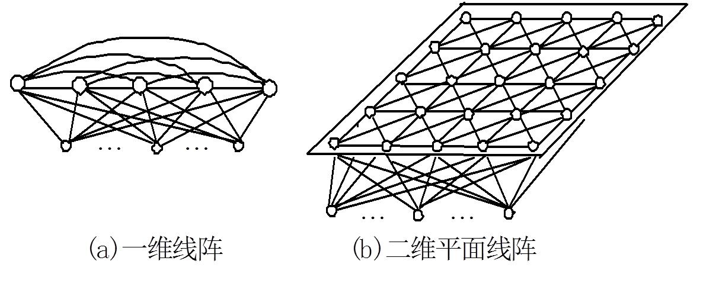
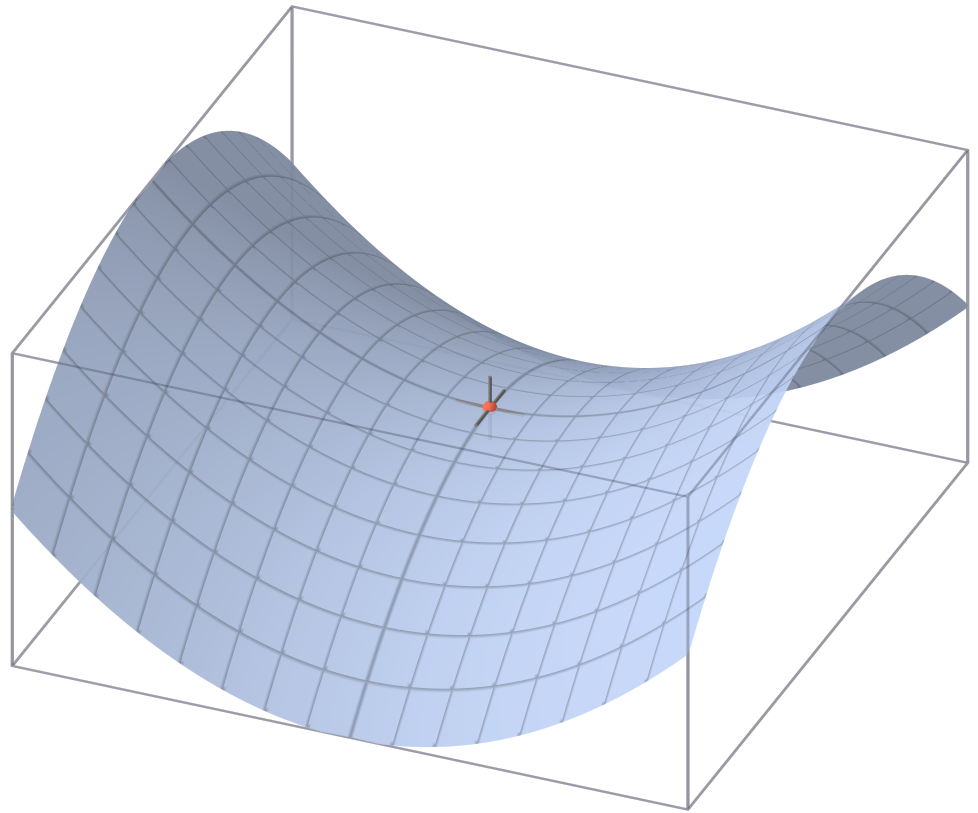
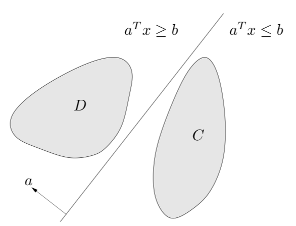
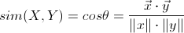
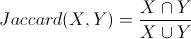
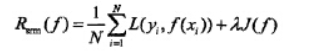

# README

# *S lists*

*****

# 自组织映射 Self-Organizing Map

**自组织映射**（ SOM ）或自组织特征映射（ SOFM ）是一种使用非监督式学习来产生训练样本的输入空间的一个低维（通常是二维）离散化的表示的人工神经网络（ ANN ）。自组织映射与其他人工神经网络的不同之处在于它使用一个邻近函数来保持输入空间的拓扑性质。

### SOM 典型结构

典型SOM网共有两层，输入层模拟感知外界输入信息的视网膜，输出层模拟做出响应的大脑皮层。

下图是 1 维和 2 维的两个 SOM 网络示意图。

### SOM 算法流程

### SOM 与自组织神经网络

SOM 是一种自组织（竞争型）神经网络，除了 SOM 外，其他常见的自组织（竞争型）神经网络还有对偶传播( Counter propagation )网络，自适应共振理论（ Adaptive Resonance Theory ）网络等。

##### 父级词：自组织网络
##### 同级词：对偶传播网络，自适应共振理论网络

### 参考来源

【1】  https://zh.wikipedia.org/wiki/自组织映射

【2】  https://blog.csdn.net/xbinworld/article/details/50826892

【3】  https://www.cnblogs.com/sylvanas2012/p/5117056.html

*****

# 半朴素贝叶斯分类器 Semi-naive Bayes classifiers

**半朴素贝叶斯分类器**是考虑一部分属性间的相互依赖关系下的分类方式，是朴素贝叶斯分类器特征相互独立难以满足时的一种放松策略。

半朴素贝叶斯分类器最常用的策略：假定每个属性仅依赖于其他最多一个属性，称其依赖的这个属性为其超父属性，这种关系称为：独依赖估计（ ODE ）。

### 数学形式上的变化

朴素贝叶斯的样本预测概率为：

而半朴素贝叶斯的样本预测概率为：

可以看到类条件概率 P( xi | c) 修改为了 xi 依赖于分类 c 和 一个依赖属性 pai 。

##### 相关词：朴素贝叶斯分类器
##### 子级词：独依赖估计

### 参考来源

【1】  https://blog.csdn.net/xo3ylAF9kGs/article/details/78643424

【2】  https://github.com/familyld/Machine_Learning/blob/master/07Bayes_classifier.md

*****

# 半监督学习 Semi-Supervised Learning

**半监督学习**是介于监督学习和无监督学习之间的学习技术。它同时利用有标记样本与无标记样本进行学习。

半监督学习是让让学习器不依赖外界交互，自动地利用未标记样本来提升学习性能。

### 常见的两种半监督学习假设

一类是“聚类假设”（ cluster assumption ），即假设数据存在簇结构，同一个簇样本属于同一个类别。

另一类是“流形假设”（ manifold assumption ），即假设数据分布在一个流形结构上，邻近的样本拥有相似的输出值。

### 半监督学习理论简述:

半监督学习有两个样本集,一个有标记,一个没有标记.分别记作

Lable = { ( xi , yi ) }, Unlabled = { ( xi ) }.并且数量上, L << U.

1） 单独使用有标记样本,我们能够生成有监督分类算法；

2） 单独使用无标记样本,我们能够生成无监督聚类算法；

3） 两者都使用,我们希望在1中加入无标记样本,增强有监督分类的效果;同样的,我们希望在 2 中加入有标记样本,增强无监督聚类的效果.

 
一般而言,半监督学习侧重于在有监督的分类算法中加入无标记样本来实现半监督分类.也就是在 1 中加入无标记样本,增强分类效果.

### 半监督学习算法分类:

1） self-training(自训练算法)；

2） generative models生成模型；

3） SVMs半监督支持向量机；

4） graph-basedmethods图论方法；

5） multiview learing多视角算法。

### 参考来源

【1】  https://blog.csdn.net/ice110956/article/details/13775071

【2】  http://blog.sciencenet.cn/blog-242887-309591.html

【3】  https://www.zybuluo.com/Team/note/1133211

*****

# 鞍点 Saddle Point

**鞍点**是指不是局部极值点的驻点。

广义而说，一个光滑函数（曲线，曲面，或超曲面）的鞍点邻域的曲线，曲面，或超曲面，都位于这点的切线的不同边。

### 鞍点在不同领域的定义

在微分方程中，沿着某一方向是稳定的，另一条方向是不稳定的奇点，叫做鞍点。

在泛函中，既不是极大值点也不是极小值点的临界点，叫做鞍点。

在矩阵中，一个数在所在行中是最大值，在所在列中是最小值，则被称为鞍点。

在物理上要广泛一些，指在一个方向是极大值，另一个方向是极小值的点。

### 鞍点的判别

如下图，鞍点这词语来自于不定二次型 z = x^2 - y^2 的二维图形，该图形像个马鞍：在x-轴方向往上曲，在y-轴方向往下曲。

对只有一个变数的函数。这函数在鞍点的一次导数等于零，二次导数换正负符号·例如，函数  y = x^3 ,就有一个鞍点在原点。

检验二元实函数F(x,y)的驻点是不是鞍点的一个简单的方法，是计算函数在这个点的海森矩阵：如果该矩阵为一不定矩阵，则该点就是鞍点。

##### 相关词：驻点，拐点，极值。

### 参考来源：

【1】  https://www.csdn.net/article/2015-11-05/2826132
 
【2】  https://zh.wikipedia.org/wiki/鞍點

*****

# 样本空间 Sample Space

**样本空间**是一个实验或随机试验所有可能结果的集合，而随机试验中的每个可能结果称为样本点。

样本空间里可以进行加法运算，可以进行数乘（除）运算。 可以求平均值。

例如，如果抛掷一枚硬币，那么样本空间就是集合{正面，反面}。如果投掷一个骰子，那么样本空间就是 {1,2,3,4,5,6}。

### 相关定义

1） 样本空间：考虑一个实验，所有可能结果构成的子集，称为该实验的样本空间。 这个定义就说明了样本空间的概率是1。

2） 事件：样本空间的任意子集称为事件。

3)  集合运算：
 
因为事件是集合，所以概率计算中就需要用到集合的各种运算，总结如下：
 
1、交并补。

2、交换律、结合律、分配率。
 
3、德摩根定律。 

4)  互斥事件：

两个事件 E F 互斥（不相容），满足 E F = 空集。也就是说两个事件不可能同时发生。

##### 相关词：样本，集合，概率

### 参考来源

【1】  https://blog.csdn.net/vincent_hbl/article/details/78838158

【2】  https://zh.wikipedia.org/wiki/样本空间

*****

# 抽样  Sampling

**抽样**是一种常用的推论统计方法，它是指从目标总体（ Population ，或称为母体）中抽取一部分个体作为样本（ Sample ），通过观察样本的某一或某些属性，依据所获得的数据对总体的数量特征得出具有一定可靠性的估计判断，从而达到对总体的认识。

### 抽样过程主要阶段：

- 定义总体（母体。

- 确定抽样框。
- 确定抽样方法。
- 决定样本量。
- 实施抽样计划。
- 抽样与数据收集。
- 回顾抽样过程。

### 常用抽样方法

1） 简单随机抽样（ simple random sampling ），也叫纯随机抽样。

从总体N个单位中随机地抽取n个单位作为样本，使得每一个容量为样本都有相同的概率被抽中。

特点是：每个样本单位被抽中的概率相等，样本的每个单位完全独立，彼此间无一定的关联性和排斥性。简单随机抽样是其它各种抽样形式的基础。通常只是在总体单位之间差异程度较小和数目较少时，才采用这种方法。

2） 系统抽样（ systematic sampling ），也称等距抽样。

将总体中的所有单位按一定顺序排列，在规定的范围内随机地抽取一个单位作为初始单位，然后按事先规定好的规则确定其他样本单位。先从数字1到k之间随机抽取一个数字r作为初始单位，以后依次取r+k、r+2k……等单位。这种方法操作简便，可提高估计的精度。

3） 分层抽样（ stratified sampling ）。

将抽样单位按某种特征或某种规则划分为不同的层，然后从不同的层中独立、随机地抽取样本。从而保证样本的结构与总体的结构比较相近，从而提高估计的精度。

4） 整群抽样（ cluster sampling ）。

将总体中若干个单位合并为组，抽样时直接抽取群，然后对中选群中的所有单位全部实施调查。抽样时只需群的抽样框，可简化工作量，缺点是估计的精度较差。

### 参考来源

【1】 https://zh.wikipedia.org/wiki/抽樣

*****

# 半监督支持向量机 semi-Supervised Support Vector Machine

**半监督支持向量机**（ S3VM )是支持向量机在半监督学习上的推广。相对于支持向量机要找出最大间隔划分超平面，S3VM 考虑了未标注样本的信息，试图找到能将两类有标记样本分开，且穿过数据低密度区域的划分超平面。

### S3VM 的特点

S3VM 基于聚类假设，试图通过探索未标记数据来规范、调整决策边界。
为了利用未标记的数据，需要在原来的支持向量机（ SVM ）的基础上，添加两个对未标记的数据点的限制。

### S3VM 和其他支持向量机

1）TSVM 

直推式支持向量机（ TSVM ）与半监督支持向量机（ S3VM ）在同一年提出，且算法主要的思想和要求解的优化问题类似，所以这两个概念时通常是可以互换的。

TSVM 针对二分类问题，其试图考虑对未标记样本进行各种可能的标记指标（ label assignment ），即尝试将每个未标记样本分别作为正例或反例，然后在所有这些结果中，寻求一个在所有样本上间隔最大化的划分超平面。一旦划分超平面得以确定，未标记样本的最终标记指派就是其预测结果。

2） Laplacian SVM

比较流行除了 S3VM 和 TSVM 以外，还有 Laplacian SVM。Laplacian SVM 主要是通过图的拉普拉斯矩阵来探索数据的流形结构。

这些支持向量机的一个共同特点是，都是对未标记的数据的类别进行直接的估计。

### 参考来源

【1】  https://www.jianshu.com/p/7d4323c28716

【2】  http://lamda.nju.edu.cn/huangsj/dm11/files/niansl.pdf

*****

# 评分函数  Score function

**评分函数**是所选模型可用的“得分”类型。例如，目标的预测值、预测值的概率或所选目标值的概率。

### 一些评分函数列举

预测值。 兴趣目标结果的预测值。这对所有模型可用，没有目标的模型除外。

预测值的概率。 预测值的概率是以比例表示的正确值。这对具有分类目标的大部分模型可用。

所选值的概率。 所选值的概率是以比例表示的正确值。从“值”列中的下拉列表选择一个值。可用值由模型定义。这对具有分类目标的大部分模型可用。

置信。 与分类目标的预测值关联的概率测量。对于二元 Logistic 回归、多项 Logistic 回归和朴素贝叶斯模型，其结果与预测值的概率相同。对于树和 Ruleset 模型，置信可以被解释为预测类别的调整概率，而且始终比预测值的概率小。对于这些模型，置信值比预测值的概率更加可靠。

节点编号。 树模型的预测终端节点编号。

标准误差。预测值的标准误差。对带刻度目标的线性回归模型、一般线性模型和广义线性模型可用。这只在模型文件中保存了协方差矩阵时可用。

累积风险 (Cumulative Hazard). 估计累积风险函数。该值指示了在给定预测变量值的前提下，在指定时间或该时间之前观察到事件的概率。

最近邻元素。 最近邻元素的 ID。如果提供的话，该 ID 是个案标签变量的值，否则则为个案编号。只应用于最近邻元素模型。

第 K 个最近邻元素。 第 k 个最近邻元素的 ID 。在“值”列中输入一个整数作为 k 值。如果提供的话，该 ID 是个案标签变量的值，否则则为个案编号。只应用于最近邻元素模型。

到最近邻元素的距离。 到最近邻元素的距离。根据不同模型，将使用 Euclidean 或城市街区距离。只应用于最近邻元素模型。

到第 k 个最近邻元素的距离。 到第 k 个最近邻元素的距离。在“值”列中输入一个整数作为 k 值。根据不同模型，将使用 Euclidean 或城市街区距离。只应用于最近邻元素模型。

### 评分函数的分类

评分函数主要分为两类，一类是贝叶斯评分函数，另一类是基于信息论的评分函数。

### 参考来源

【1】  https://www.ibm.com/support/knowledgecenter/zh/SSLVMB_25.0.0/statistics_mainhelp_ddita/spss/base/idh_scoring_wizard_select_expressions.html

*****

# 无人驾驶 Self-Driving

**无人驾驶**主要是指自动驾驶汽车，又称为无人驾驶汽车、电脑驾驶汽车或轮式移动机器人，是无人地面载具的一种，具有传统汽车的运输能力。

作为自动化载具，自动驾驶汽车不需要人为操作即能感测其环境及导航。完全的自动驾驶汽车仍未全面商用化，大多数均为原型机及展示系统，部分可靠技术才下放至量产车型。

自动驾驶汽车能以雷达、光学雷达、GPS 及电脑视觉等技术感测其环境。先进的控制系统能将感测资料转换成适当的导航道路，以及障碍与相关标志。

根据定义，自动驾驶汽车能透过感测输入的资料，更新其地图资讯，让交通工具可以持续追踪其位置，即使条件改变，或汽车驶进了未知的环境内。

### 参考来源

【1】  https://zh.wikipedia.org/wiki/自動駕駛汽車

*****

# 分离超平面 Separating Hyperplane

**超平面分割**是指如果两个不相交的凸集都是开放的，则存在超平面，可将它们分割开。

在数学中，超平面（ Hyperplane ）是  n 维欧氏空间中余维度等于 1 的线性子空间。这是平面中的直线、空间中的平面之推广。

### 分离超平面定理

如果存在两个并查集合 C 和 D（ 不相交 即C ∩ D = ∅ ），且这两个集合都为凸集，

则必然存在一个超平面（ 超平面既是凸集又是仿射集 ），

使得对于集合 C 中所有点 x 满足 a T x ≤ b , x ∈ C，集合 D 中所有点 x 满足 a T x ≥b, x ∈ D，

换言之，仿射函数a T - b 在集合 C 上非正，在集合 D 上非负。

超平面 { x ∣ a T = b } 称为集合 C 和 D 的分割超平面，如下图。 

### 逆定理

超平面分割定理的逆定理（ converse separating hyperplane theorems ）：

对于任意两个凸集 C 和 D ，其中至少一个集合为开集，则当且仅当集合 C 和 D 间存在一个分割超平面时，集合 C 和 D 是不相交（ disjoint ）的。

##### 相关词：仿射集，凸优化
##### 子级词：超平面

### 参考来源

【1】  https://en.wikipedia.org/wiki/Hyperplane_separation_theorem

【2】  http://www.hanlongfei.com/凸优化/2015/05/26/hyperplane/

*****

# Sigmoid 函数 Sigmoid function

**Sigmoid函数**是一个常见的 S 型函数，也称为 S 型生长曲线。由于其单增以及反函数单增等性质，Sigmoid 函数常被用作神经网络的阈值函数，将变量映射到 0,1 之间。

### Sigmoid 函数的基本性质：

Sigmoid 函数形式及图像：

![] (Sigmoid 函数公式.png)

![] (Sigmoid 函数图像.png)

- 定义域：( −∞ , +∞ )；

- 值域：(− 1 , 1 )；

- 函数在定义域内为连续和光滑函数；

- 处处可导，导数为：f′ ( x ) = f ( x ) ( 1 − f ( x ) )。

- 函数的取值在 0-1 之间，且在 0.5 处为中心对称，并且越靠近 x = 0 的取值斜率越大。

### Sigmoid 函数与逻辑回归

从 逻辑回归（ LR ）的目的上来看，在选择函数时，有两个条件是必须要满足的： 

1） 取值范围在 0~1 之间。 

2） 对于一个事件发生情况， 50% 是其结果的分水岭，选择函数应该在 0.5 中心对称。

从这两个条件来看， Sigmoid 很好的符合了 LR 的需求。

##### 相关词：逻辑回归，阀至函数。

### 参考来源

【1】  https://blog.csdn.net/saltriver/article/details/57531963

【2】  https://zh.wikipedia.org/wiki/邏輯函數

【3】  http://www.voidcn.com/article/p-ayyohasr-nh.html

*****

# 相似度度量 Similarity Measure

**相似度度量**是估算不同样本之间的相似程度的，常用做分类问题的判断标准。

在机器学习和数据挖掘中，需要知道个体间差异的大小，进而评价个体的相似性和类别。

常见的是数据分析中的相关分析，数据挖掘中的分类和聚类算法，如 K 最近邻（KNN）和 K 均值（K-Means）等等。根据数据特性的不同，可以采用不同的度量方法。

### 距离度量和相似度度量

- 距离度量：

距离度量（ Distance Measure ）用于衡量个体在空间上存在的距离，距离越远说明个体间的差异越大。

- 相似度度量：

相似度度量（ Similarity Measure ），即计算个体间的相似程度，与距离度量相反，相似度度量的值越小，说明个体间相似度越小，差异越大。

### 常用的相似度度量方法

1） 向量空间余弦相似度（ Cosine Similarity ）

　　余弦相似度用向量空间中两个向量夹角的余弦值作为衡量两个个体间差异的大小。相比距离度量，余弦相似度更加注重两个向量在方向上的差异，而非距离或长度上。

   

2） 皮尔森相关系数（ Pearson Correlation Coefficient ）

　　即相关分析中的相关系数 r ，分别对 X 和 Y 基于自身总体标准化后计算空间向量的余弦夹角。公式如下：

   

3） Jaccard 相似系数（ Jaccard Coefficient ）

　　Jaccard 系数主要用于计算符号度量或布尔值度量的个体间的相似度，因为个体的特征属性都是由符号度量或者布尔值标识，因此无法衡量差异具体值的大小，只能获得“是否相同”这个结果，所以 Jaccard 系数只关心个体间共同具有的特征是否一致这个问题。如果比较 X 与 Y 的Jaccard相似系数，只比较 xn 和 yn 中相同的个数，公式如下：

   

4） 调整余弦相似度（ Adjusted Cosine Similarity ）

  余弦相似度对数值的不敏感会导致结果的误差，修正这种不合理性，就出现了调整余弦相似度，即所有维度上的数值都减去一个均值，比如 X 和 Y 的评分均值都是 3，那么调整后为 ( -2 , -1 ) 和( 1 , 2 ) ，再用余弦相似度计算，得到 -0.8 ，相似度为负值并且差异不小，但显然更加符合现实。
  
##### 相关词：距离度量。

### 参考来源

【1】  https://en.wikipedia.org/wiki/Similarity_measure

【2】  http://webdataanalysis.net/reference-and-source/distance-and-similarity/#comments

【3】  http://www.cnblogs.com/daniel-D/p/3244718.html

【4】  http://www.cnblogs.com/heaad/archive/2011/03/08/1977733.html

*****

# 模拟退火 Simulated annealing

**模拟退火**是一种通用概率算法，常用来在一定时间内寻找在一个很大搜寻空间中的近似最优解。

### 模拟退火算法描述

算法先以搜寻空间内一个任意点作起始：每一步先选择一个“邻居”，然后再计算从现有位置到达“邻居”的概率。

> 若J( Y ( i + 1 ) ) >=  J ( Y ( i ) )  (即移动后得到更优解)，则总是接受该移动；

> 若 J ( Y ( i + 1 ) )< J ( Y ( i ) )  (即移动后的解比当前解要差)，则以一定的概率接受移动，而且这个概率随着时间推移逐渐降低（逐渐降低才能趋向稳定）。

这里的“一定的概率”的计算参考了金属冶炼的退火过程，这也是模拟退火算法名称的由来。

### 模拟退化算法的关键步骤

1） 新状态产生函数；2）新状态接受函数；3）抽样稳定准则；4）退温函数；5）退火结束准则。

### 模拟退火的优点

模拟退火算法是一种随机算法，并不一定能找到全局的最优解，但可以较快的找到问题的近似最优解。 

如果参数设置得当，模拟退火算法搜索效率比穷举法要高。

##### 相关词：优化算法

### 参考来源

【1】  https://zh.wikipedia.org/wiki/模拟退火

【2】  https://www.cnblogs.com/heaad/archive/2010/12/20/1911614.html

【3】  http://blog.renren.com/share/146945463/1797584310/1

*****

# 同步定位与地图构建 Simultaneous Localization and Mapping

**同步定位与地图构建**（ SLAM ）是一种概念：希望机器人从未知环境的未知地点出发，在运动过程中通过重复观测到的地图特征（比如，墙角，柱子等）定位自身位置和姿态，再根据自身位置增量式的构建地图，从而达到同时定位和地图构建的目的。

SLAM 过程流程图 

### SLAM 核心问题

第一核心问题: 地图构建，是研究如何把从一系列传感器收集到的信息，集成到一个一致性的模型上的问题。

第二核心问题: 定位，是在地图上估测机器人的坐标和姿势形态的问题。

SLAM 要在建立新地图模型或者改进已知地图的同时，在该地图模型上定位机器人。

### SLAM 的关键技术

1.地图的表示方式。

2.不确定性信息处理方法。

3.数据的关联。

4.自定位。

5.探索全局路径规划。

### SLAM 的分类

可以按传感器的形式和安装方式，分为激光雷达和视觉两大类。

1） 激光雷达 SLAM

激光雷达能以很高精度测出机器人周围障碍点的角度和距离，而且速度快，计算量也不大，容易做成实时 SLAM。

激光雷达一般用于扫描一个平面内的障碍物，适用于适用于平面运动的机器人（如无人车、扫地机器人）。

缺点是，激光雷达制造成本高，价格十分昂贵。

2） 视觉 SLAM

视觉 SLAM 是 21 世纪 SLAM 研究热点之一。CPU、GPU 处理速度的增长和硬件的提高，让许多以前被认为无法实时化的视觉算法，得以在 10 Hz 以上的速度运行。

按照摄像头的数量和种类分，视觉 SLAM 分 3 个子方向：单目、双目（或多目）、RGBD 。此外，还有鱼眼、全景等特殊摄像头，但是都属于少数。

### 参考来源

【1】  https://zh.wikipedia.org/wiki/即时定位与地图构建

【2】  https://www.rs-online.com/designspark/slam

【3】  http://www.widegrow.com/2017/02/26/scenario-a-wealth-of-slam-simultaneous-localization-and-mapping-technology-and-slam-sensor/

【4】  https://www.chainnews.com/articles/776790111106.htm

*****

# 奇异值分解 Singular Value Decomposition

**奇异值分解**（ SVD ）是一种重要的矩阵分解方法，对称阵特征向量分解的基础是谱分析，而奇异值分解则是谱分析理论在任意矩阵上的推广。

### SVD 数学表示

SVD 可表述为：假设 A 是一个 m×n 的实矩阵，

那么，存在 m×m 的酉矩阵 U 和 n×n 的酉矩阵 V 使得：

 

其中 Σ 是 m×n 的非负实数对角矩阵；

 

主對角元 σ i  > 0，i = 1 , 2 ,..., r ，且 σ i + 1= ... = σ  p  = 0 ，p = min { m , n }，称作奇异值 ( singular values )。

SVD 的分解不具有唯一性，通常将奇异值由大至小排序： σ 1 > σ 2 > ... > σ i > 0。

### SVD 的图形表示及几何意义

 
 
 
SVD 可视为 A 的三個分解步驟：旋轉 VT，伸縮 Σ ，再旋轉 U 。

### SVD 的应用

1） 求广义逆阵（伪逆）；2） 给出矩阵的列空间、零空间和秩的表示；3）求矩阵近似值，比如求解主成分分析问题。

##### 相关词：酉矩阵，谱分解
##### 父级词：矩阵分解

### 参考来源

【1】  https://liam0205.me/2017/11/22/SVD-for-Human-Beings/

【2】  http://www.cnblogs.com/LeftNotEasy/archive/2011/01/19/svd-and-applications.html

【3】  https:////ccjou.wordpress.com/2009/09/01/奇異值分解-svd/

【4】  https://zh.wikipedia.org/wiki/奇异值分解

*****

# 软投票  Soft voting

**软投票**也称加权平均概率投票。它是使用输出的类概率来进行分类的投票法，通过输入权重，得到每个类的类概率的加权平均值，值大的那一类会被选择。

### 软投票与硬投票

与硬投票相比，软投票将类别标签返回为预测概率之和的 argmax 。

分类的机器学习算法输出有两种类型：一种是直接输出类标签，另外一种是输出类概率，使用前者进行投票叫做硬投票(Majority/Hard voting)，使用后者进行分类叫做软投票(Soft voting)。

##### 父级词：投票分分类器
##### 相关词：多数投票，相对多数投票，硬投票

### 参考来源

【1】  http://sklearn.apachecn.org/cn/stable/modules/ensemble.html#id12

【2】  https://www.cnblogs.com/jiaxin359/p/8777574.html

*****

# 谱聚类 Spectral Clustering

谱聚类（ SC ）是一种基于图论的聚类方法。它将带权无向图划分为两个或两个以上的最优子图，使子图内部尽量相似，而子图间距离尽量距离较远，以达到常见的聚类的目的。

### 谱聚类的特点

谱聚类（spectral clustering）是广泛使用的聚类算法，比起传统的K-Means算法，谱聚类对数据分布的适应性更强，聚类效果也很优秀，同时聚类的计算量也小很多，更加难能可贵的是实现起来也不复杂。

### 谱聚类的方法

所谓聚类（ Clustering ），就是要把一堆样本合理地分成两份或者 K份。从图论的角度来说，聚类的问题就相当于一个图的分割问题。即给定一个图 G = ( V ,  E ) ，顶点集 V 表示各个样本，带权的边表示各个样本之间的相似度，

谱聚类的目的便是要找到一种合理的分割图的方法，使得分割后形成若干个子图，连接不同子图的边的权重（相似度）尽可能低，同子图内的边的权重（相似度）尽可能高。物以类聚，人以群分，相似的在一块儿，不相似的彼此远离。

##### 子级词：聚类
##### 相关词：图论

### 参考来源

【1】  https://www.cnblogs.com/pinard/p/6221564.html

【2】  https://www.cnblogs.com/sparkwen/p/3155850.html

【3】  http://blog.geohey.com/yong-ji-qi-xue-xi-zuo-kao-pu-de-ju-lei-pu-ju-lei-spectral-clustering/

*****

# 语音识别 Speech Recognition      

**语音识别**是实现计算机识别自然语言的技术。其目标是计算机把人类的语音内容转换为相应的文字。

语音识别是一门涉及面很广的交叉学科，它与声学、语音学、语言学、信息理论、模式识别理论以及神经生物学等学科都有非常密切的关系。

### 目前主流的语音识别技术

1）动态时间规整（ DTW ）技术。采用动态规整法，并结合时间变换关系，得到特征矢量之间的距离，是语音识别中的一种经典算法。

2）隐马尔可夫模型（ HMM ）技术。HMM用马尔科夫链中的状态表示语音的发音过程，在单字生成过程中，系统由一个状态转移到另一个状态，在每个状态下产生一个输出，直至该单字输出完毕。

3）人工神经网络（ ANN ）技术。训练时间长。

### 现有语音识别的难点

1）识别性能依赖周围环境。当训练环境和测试环境不一样时，效果变差；

2）噪声问题。如何去噪；

3）语音信息的模糊性。读音相似的词语，同音不同意思的词语，如何识别。

### 语音识别的应用

语音识别技术正逐步成为计算机信息处理技术中的关键技术，语音技术的应用已经成为一个具有竞争性的新兴高技术产业。

语音识别技术的应用包括语音拨号、语音导航、室内设备控制、语音文档检索、简单的听写数据录入等。语音识别技术与其他自然语言处理技术如机器翻译及语音合成技术相结合，可以构建出更加复杂的应用，例如语音到语音的翻译。

### 参考来源

【1】  https://www.jianshu.com/p/9888d593f1b1

【2】  https://zh.wikipedia.org/wiki/语音识别

【3】  https://blog.csdn.net/puqutogether/article/details/44279973

*****

# 统计学习 Statistical learning

**统计学习**是基于数据构建概率统计模型对数据进行预测与分析的一门学科，也称统计机器学习。

统计学习的前提是数据的基本假设是同类数据具有一定的统计规律性。

统计学习理论基于数据（ data ），它从数据出发，提取数据的特征，抽象出数据的模型，发现数据中的规律，找出预测性函数，之后解决问题。

统计学习的目的是考虑学习什么样的模型和如何学习模型。

统计学习是数据驱动的学科。统计学习是一门概率论、统计学、信息论、计算理论、最优化理论及计算机科学等多个领域的交叉学科。

### 统计学习的三要素

1） 模型： 

模型即选择生成模型还是判别模型。这两种模型不同的地方是目标不同，生成模型是想找到源数据的联合概率分布，判别模型是要找到条件概率或决策函数。

2） 策略：
 
选择一个合适的损失函数或风险函数，也就是选择一个目标函数（优化的目标）

3） 算法： 

这里就是指优化算法，包括梯度下降法，牛顿法/拟牛顿法、拉格朗日方法等经典的优化算法（统计学习的问题有了具体的形式之后就变成了最优化问题）。

### 参考来源

【1】  https://blog.csdn.net/qll125596718/article/details/8351337

【2】  https://zh.wikipedia.org/wiki/统计学习理论

【3】  https://blog.csdn.net/qq_33414271/article/details/79464510

*****

# 分层抽样 Stratified sampling

**分层抽样**是一种先分层再抽取的抽样方法。是统计学中常用的抽取样本的方法。

### 分层抽样的步骤

将调查的总体，依某种衡量标准，区分成若干个子体，称为层，层与层之间有较大的差异，每一层的个体差异不大。

在区分完层后，从每一层中利用简单随机抽样抽出所需比例的样本数，将各层样本合起来得到样本。每层抽取的比例是该层在总体中所占的比例。

### 分层抽样的优缺点

这种方能保证样本的结构与总体的结构比较相近，从而提高估计的精度。

分层抽样要求层内的差异较大，而层之间的差异较小。在总体差异不明显时不宜使用分层抽样。

##### 父级词：抽样
##### 同级词：简单抽样，簇抽样，系统抽样，自主抽样

### 参考来源

【1】  http://www.stat.nuk.edu.tw/prost/content2/statics_2.htm

【2】  https://zh.wikipedia.org/wiki/分层抽样

【3】  https://endymecy.gitbooks.io/spark-ml-source-analysis/content/基本统计/tratified-sampling.html

*****

# 监督学习 Supervised Learning

**监督学习**是输出与输入存在联系的一种机器学习方法。可以由训练资料中学到或建立一个模式，并依此模式推测新的实例。训练资料是由输入物件（通常是向量）和预期输出所组成。函数的输出可以是一个连续的值（称为回归分析），或是预测一个分类标签（称作分类）。

### 监督学习的分类

所有的回归算法和分类算法都属于监督学习。
回归和分类的算法区别在于输出变量的类型，定量输出称为回归，或者说是连续变量预测；定性输出称为分类，或者说是离散变量预测。

### 监督学习和其他

在机器学习领域，主要有三类不同的学习方法，除了监督学习还有：

非监督学习：直接对输入数据集进行建模，例如聚类。

半监督学习：综合利用有类标的数据和没有类标的数据，来生成合适的分类函数。

### 常用的监督学习

1）K 邻近算法；
2）决策树；
3）朴素贝叶斯；
4）逻辑回归。

##### 父级词：机器学习
##### 同级词：半监督学习，无监督学习
##### 子级词：回归算法，分类算法

### 参考来源

【1】  https://www.leiphone.com/news/201704/w6SbD8XGrvQ9IQTB.html

【2】  https://blog.csdn.net/u011067360/article/details/24735415

【3】  http://daniellaah.github.io/2016/Machine-Learning-Andrew-Ng-My-Notes-Week-1-Introduction.html

******

# 平滑 Smoothing

**平滑**是常用的一种数据处理方式。

在统计学和图像处理中，通过建立近似函数尝试抓住数据中的主要模式，去除噪音、结构细节或瞬时现象，来平滑一个数据集。

在平滑过程中，信号数据点被修改，由噪音产生的单独数据点被降低，低于毗邻数据点的点被提升，从而得到一个更平滑的信号。

### 平滑的方式

平滑可以两种重要形式用于数据分析：

一、若平滑的假设是合理的，可以从数据中获得更多信息；

二、提供灵活而且稳健的分析。有许多不同的算法可用于平滑。数据平滑通常通过最简单的密度估计或直方图完成。

### 平滑算法

最常用的一种算法是“移动平均”，通常被用于在重复的统计调查中捕获重要趋势。在图像处理和计算机视觉中，平滑被用于尺度空间的表示。 

最简单的平滑算法是“直角平滑”或“无加权滑动平均平滑”。 此方法用 m 个邻接点的平均值替换信号中的每个点， m 是称为“平滑宽度”的正整数，通常是奇数。三角平滑类似直角平滑，但实现了加权平滑函数。

### 平滑的具体应用

- Additive smoothing。
- Good-Turing estimate。
- Jelinek-Mercer smoothing ( interpolation )。
- Katz smoothing ( backoff )。
- Witten-Bell smoothing。
- Absolute discounting。
- Kneser - Ney smoothing。

### 参考来源

【1】  https://zh.wikipedia.org/wiki/平滑

【2】  https://ask.julyedu.com/question/175

【3】  http://www.shuang0420.com//2017/03/24/NLP%20笔记%20-%20平滑方法(Smoothing)小结/

*****

# 符号学习 Symbolic Learning

**符号学习**是指从功能上模拟人类学习能力的机器学习方法。

它是一种基于符号主义学派的机器学习观点——知识可以用符号来表示，机器学习过程实际上是一种符号运算过程。

对符号学习，可根据学习策略，即学习中所使用推理的方法，将其分为记忆学习、归纳学习和演绎学习等。

##### 相关词：记忆学习，归纳学习，演绎学习。

### 参考来源

【1】  http://wangweiguang.xyz/ai/2018/02/17/symbolic-learning.html

*****

# 符号主义 Symbolism

**符号主义**是认为人工智能源于数理逻辑的一个流派。

数理逻辑从 19 世纪末起得以迅速发展，到 20 世纪 30 年代开始用于描述智能行为。计算机出现后，又再计算机上实现了逻辑演绎系统。

其有代表性的成果为启发式程序 LT 逻辑理论家，证明了38条数学定理，表了可以应用计算机研究人的思维多成，模拟人类智能活动。正是这些符号主义者，早在 1956 年首先采用“人工智能”这个术语。

后来又发展了启发式算法->专家系统->知识工程理论与技术，并在 20 世纪 80 年代取得很大发展。

符号主义曾长期一枝独秀，为人工智能的发展作出重要贡献，尤其是专家系统的成功开发与应用，为人工智能走向工程应用和实现理论联系实际具有特别重要的意义。

在人工智能的其他学派出现之后，符号主义仍然是人工智能的主流派别。这个学派的代表任务有纽厄尔( Newell )、西蒙( Simon )和尼尔逊( Nilsson )等。

### 参考来源

【1】  https://blog.csdn.net/u011531010/article/details/52935348

*****

# 结构风险 Structural risk

**结构风险**是对经验风险和期望风险的折中，在经验风险函数后面加一个正则化项（惩罚项），得到结构分险。

### 概念解释

置信风险：分类器对未知样本进行分类，得到的误差。
经验风险：训练好的分类器，对训练样本重新分类得到的误差。即样本差
结构风险：置信风险 + 经验风险

### 结构风险的意义

结构风险最小化是对经验风险最小化问题处理的扩展。

经验风险越小，模型决策函数越复杂，其包含的参数越多，当经验风险函数小到一定程度就出现了过拟合现象。

为了过拟合，让惩罚项 J(f) 最小化，现在出现两个需要最小化的函数了。

结构风险函数整合了这两者，同时保证经验风险函数和模型决策函数的复杂度都达到最小化，然后对这个结构风险函数进行最小化操作，就达到了优化的目的。

##### 子级词：结构风险最小化
##### 相关词：置信风险，经验风险

### 参考来源

【1】 https://www.cnblogs.com/Joyce-song94/p/7443911.html

*****

# 结构风险最小化 Structural Risk Minimization

**结构风险最小化**（ SRM ）是机器学习中的一个归纳原理。是为了防止过拟合的一个策略。

### SRM的原理

结构风险 = 经验分险 + 置信分险

优化理论中，最小化结构化风险，主要是最小化样本上的经验风险，如果考虑防止过拟合，可以添加正则项，同时最小化置信风险。

当样本容量足够大时，经验风险趋近于结构风险，经验风险最小化就能保证足够好的学习效果，在现实中被广泛使用。

### SRM 的应用

如贝叶斯估计中，最大后验概率估计就是结构化风险最小化的例子：当模型是条件概率分布，损失函数为对数损失函数，模型的复杂度由模型的先验概率表示，结构风险最小化就等价于最大后验概率估计

##### 相关词：结构风险，经验风险最小化。

### 参考来源

【1】  http://www.voidcn.com/article/p-hdjpdlie-dq.html

【2】  http://wfwei.github.io/posts/statistical-ml/

*****

# 支持向量机 Support Vector Machine

**支持向量机**（ SVM ）是在分类与回归分析中处理数据的监督式学习方法。

支持向量机在高维或无限维空间中构造超平面或超平面集合，然后进行分类、回归或其他任务。直观来说，分类边界距离最近的训练数据点越远越好，因为这样可以缩小分类器的泛化误差。

它是一种二类分类模型，可定义为特征空间上的间隔最大的线性分类器，学习策略是间隔最大化，最终可转化为一个凸二次规划问题的求解。

### 支持向量机的应用

1）用于文本和超文本的分类。

2）用于图像分类。

3）用于手写字体识别。

4）用于医学中分类蛋白质。

##### 相关词：分类，回归，间隔最大化。

### 参考来源

【1】  https://zh.wikipedia.org/wiki/支持向量机

【2】  https://wizardforcel.gitbooks.io/dm-algo-top10/content/svm-1.html

*****

# 挤压函数 Squashing function

**挤压函数**是把较大范围的输入挤压到较小的区间的函数。经常用来做激活函数。

sigmoid 函数是一种常见的挤压函数，其将较大范围的输入挤压到【 0 , 1 】区间内。

TANH双曲正切是 sigmoid 函数的一种变体，它的取值范围为【 -1 ，1 】，定义域 R ，同样是挤压函数。

### 参考来源

【1】  https://blog.csdn.net/batuwuhanpei/article/details/51153183

【2】  https://zhuanlan.zhihu.com/p/29633019

*****

# 稳定性-可塑性困境 Stability-plasticity Dilemma

**稳定性-可塑性困境**是人工和生物神经系统的一个约束。

基本思想是在并行和分布式系统中学习需要可塑性来整合新知识，但也需要稳定性以防止忘记先前的知识。

太多的可塑性将导致先前编码的数据被不断遗忘，而太多的稳定性将阻碍在突触水平上对该数据的有效编码。

但在大多数情况下，神经计算已经解决了过度可塑性或过度稳定性相关的问题。

### 参考来源

【1】  http://standoutpublishing.com/g/stability-plasticity-problem.html

【2】  https://www.ncbi.nlm.nih.gov/pmc/articles/PMC3732997/

*****

# 切分变量 Splitting Variable

**切分变量**是在做空间切分是选择的参考变量。是分类问题中，用来切分以达到最优化分类的一类变量。

切分变量和切分点是用来寻找输入空间的最优划分法的指标和判断依据。

### 参考来源

【1】 https://blog.csdn.net/emmaczw/article/details/78239603

*****

# 软间隔 Soft Margin

**软间隔**是用来处理线性不可分问题及减少噪点影响的一种方法。软间隔是允许分类时存在一些错误点的做法。

软间隔支撑向量机可以理解为牺牲了在某些点上必须正确划分的限制，来换取更大的分隔间隔。

### 软间隔和硬间隔

硬间隔分类法，硬性的要求所有样本点都满足和分类平面间的距离必须大于某个值。

而软间隔则允许某些样本可以不满足约束。从而去掉一些噪点或者处理硬间隔分不了类的问题。

### 软间隔的使用

数据即使映射在高维时如果线性不可分. 这个时候就要对超平面进行一个调整, 即这里所说的软间隔。

另一种情况是即使数据是线性可分的, 但数据中可能存在噪点. 而如果硬间隔的方法, 噪点对结果影响很大。这个时候采取软间隔来尽可能减少噪点的影响。

##### 相关词：硬间隔，软间隔最大化

【1】  http://dataunion.org/8273.html

【2】  http://daniellaah.github.io/2016/CS229-Machine-Learning-Notes-Lecture-8-1.html

【3】  http://www.cnblogs.com/vivounicorn/archive/2010/12/22/1913538.html

*****

# 软间隔最大化

**软间隔最大化**是以软间隔的方式寻得最优解的优化方法。

选出最佳的分离超平面必然带来一个最优化问题。这个最优化问题就是几何间隔最大化。要最大化关于训练数据集的几何间隔，使得所有的训练样本到达分类超平面的几何间隔都大于这个几何间隔。

和硬间隔最大化的区别在于，加入了松弛变量，用软间隔的方法划分超平面，这样的方法排除了离群点对最优分类超平面的影响。

##### 相关词：软间隔，硬间隔最大化，分类问题

### 参考来源

【1】  https://posts.careerengine.us/p/59fdd9f34820850a10d8a0be

【2】  https://blog.csdn.net/xmu_jupiter/article/details/46776587

【3】  https://www.cnblogs.com/pinard/p/6100722.html

*****

# 松弛变量 Slack variables

**松弛变量**是应用软间隔方法分类时加入的辅助量。它的引入是为了解决离群点对分类的影响。

松弛变量的值实际上标示出了对应的点到底离群有多远，值越大，点就越远。

### 参考来源

【1】 https://blog.csdn.net/qll125596718/article/details/6910921

【2】 https://www.cnblogs.com/houkai/p/3392497.html

*****

# 随机梯度下降 Stochastic Gradient Gescent

**随机梯度下降**（ SGD ）是梯度下降算法的一种迭代求解思路。

SGD 是为了解决批量梯度下降法的弊端而衍生出的方法。

在 SGD 中，每次迭代可以只用一个训练数据来更新参数。

### 随机梯度下降的特点

优点：训练速度快；

缺点：准确度下降，并不是全局最优；不易于并行实现。

SGD 会最小化所有训练样本的损失函数，使得最终求解的是全局的最优解，即求解的参数是使得风险函数最小。

SGD 会最小化每条样本的损失函数， 虽然不是每次迭代得到的损失函数都向着全局最优方向， 但是大的整体的方向是向全局最优解的，最终的结果往往是在全局最优解附近。

##### 父级词：梯度下降法
##### 相关词：批量梯度下降法，小批量梯度下降法。

### 参考来源

【1】  https://blog.csdn.net/lilyth_lilyth/article/details/8973972

【2】  http://www.cnblogs.com/maybe2030/p/5089753.html

*****

# 替代函数 Surrogate function

**替代函数**是目标函数无法使用或效果不佳时使用的函数。

在一些优化问题中，目标函数太过复杂所以无法在每个迭代步都进行评估，这样的情形下，使用替代函数，这是一种来模仿真实的目标函数的大多数属性的函数，也更加容易进行解析分析或者其计算代价更小。

在选择要选择和原来目标函数性质近似同时可以解决当下问题的函数形式。

### 参考来源

【1】  https://www.jianshu.com/p/01f3e9fce812

*****

# 替代损失函数 Surrogate Loss Function

**替代损失函数**是原本的损失函数不便计算时使用的函数。

如果最优化代理损失函数的同时我们也最优化了原本的损失函数，就称校对性(calibration)或者一致性(consistency)。这个性质与我们所选择的代理损失函数相关。

一个重要的定理是，如果代理损失函数是凸函数，并且在 0 点可导，其导数小于 0 ，那么它一定是具有一致性的。这也是为什么我们通常选择凸函数作为我们的 loss function 的原因之一。

### 常用的替代函数

1） hinge损失：f ( x ) = max ( 0 , 1-x )；

2） 指数损失函数：f ( x ) = exp ( - x )；

3） 对数损失函数，f ( x ) = log ( 1 + exp ( -x ))；

##### 相关词： 代替函数，损失函数。

### 参考来源

【1】  http://sofasofa.io/forum_main_post.php?postid=1000605

【2】  https://blog.csdn.net/Touch_Dream/article/details/70171935

*****

# 稀疏表达 Sparse Representation

**稀疏表达**，简单的来说就是对于一个 N 维向量 x ，其中的元素大多数都为零，只有很少一部分元素为非零。对于一个分类问题，我们假设有k个不同的类在训练集中，同时每个类有 n 个样本，那么对于一个类，我们可以表示为：

如何通过最小数量的系数尽可能更多的描述信号的能量。不同类型的信号，其在不同变换下系数的分布会不同。

### 稀疏表达的意义

稀疏表达的意义在于降维，且这个降维并不局限于节省空间，稀疏表达后的特征向量各维之间的依赖性变低，更为独立。

稀疏表达求取时所加的稀疏约束，使得计算后得到的各个“基”对于解释数据具有相同的重要性，其目的正是尝试找出隐藏在数据背后的解释因子。

理论处理线性方程组的稀疏解。用于找到这些解决方案并在应用中利用它们的技术已经在图像处理，信号处理，机器学习，医学成像等中得到广泛应用。

1）特征选择(Feature Selection)：
      能实现特征的自动选择。

2）可解释性(Interpretability)：
       让模型更容易解释。
       
### 参考来源

【1】  https://blog.csdn.net/liuzhuomei0911/article/details/53259713

【2】  https://blog.csdn.net/aichipmunk/article/details/8712384

*****

# 子空间 Subspace

**子空间**一般也称为线性子空间或向量子空间，是向量空间的一个子集。

### 子空间判定定理

设 V 是在域 K 上的向量空间，并设 W 是 V 的子集。则 W 是个子空间，当且仅当它满足下列三个条件:

1） 零向量 0 在 W 中。

2） 如果 u 和 v 是 W 的元素，则向量和 u + v 是 W 的元素。

3）如果 u 是 W 的元素而 c 是来自 K 的标量，则标量积 cu 是 W 的元素。

### 子空间的性质

1） 对于所有向量空间 V，集合 { 0 } 和 V 自身是 V 的子空间。

2） 如果 V 是内积空间，则任何 V 的子空间的正交补也是子空间。

3） 任意多个向量子空间的交集仍然是向量子空间。

4） 特征化子空间的一种方式它们闭合在线性组合下。

条件 2） 和 3）是最基本的线性组合。

##### 相关词:向量空间

### 参考来源

【1】 https://zh.wikipedia.org/wiki/线性子空间

*****