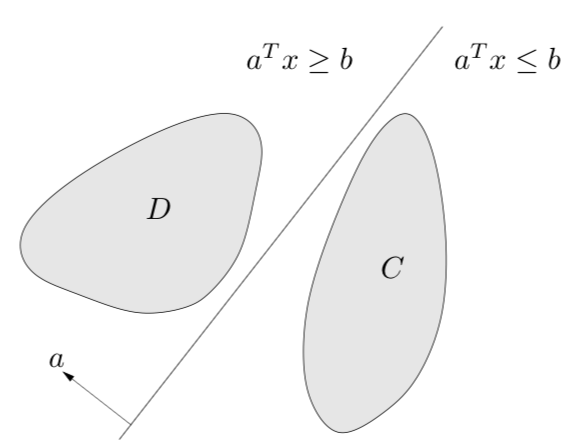

# 分离超平面 Separating Hyperplane

**超平面分割**是指如果两个不相交的凸集都是开放的，则存在超平面，可将它们分割开。

在数学中，超平面（ Hyperplane ）是  n 维欧氏空间中余维度等于 1 的线性子空间。这是平面中的直线、空间中的平面之推广。

### 分离超平面定理

如果存在两个并查集合 C 和 D（ 不相交 即C ∩ D = ∅ ），且这两个集合都为凸集，

则必然存在一个超平面（ 超平面既是凸集又是仿射集 ），

使得对于集合 C 中所有点 x 满足 a T x ≤ b , x ∈ C，集合 D 中所有点 x 满足 a T x ≥b, x ∈ D，

换言之，仿射函数a T - b 在集合 C 上非正，在集合 D 上非负。

超平面 { x ∣ a T = b } 称为集合 C 和 D 的分割超平面，如下图。 

### 逆定理

超平面分割定理的逆定理（ converse separating hyperplane theorems ）：

对于任意两个凸集 C 和 D ，其中至少一个集合为开集，则当且仅当集合 C 和 D 间存在一个分割超平面时，集合 C 和 D 是不相交（ disjoint ）的。

##### 相关词：仿射集，凸优化
##### 子级词：超平面

### 参考来源

【1】  https://en.wikipedia.org/wiki/Hyperplane_separation_theorem

【2】  http://www.hanlongfei.com/凸优化/2015/05/26/hyperplane/
