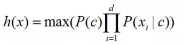
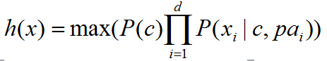

# 半朴素贝叶斯分类器 Semi-naive Bayes classifiers

**半朴素贝叶斯分类器**是考虑一部分属性间的相互依赖关系下的分类方式，是朴素贝叶斯分类器特征相互独立难以满足时的一种放松策略。

半朴素贝叶斯分类器最常用的策略：假定每个属性仅依赖于其他最多一个属性，称其依赖的这个属性为其超父属性，这种关系称为：独依赖估计（ ODE ）。

### 数学形式上的变化

朴素贝叶斯的样本预测概率为：

而半朴素贝叶斯的样本预测概率为：

可以看到类条件概率 P( xi | c) 修改为了 xi 依赖于分类 c 和 一个依赖属性 pai 。

##### 相关词：朴素贝叶斯分类器
##### 子级词：独依赖估计

### 参考来源

【1】  https://blog.csdn.net/xo3ylAF9kGs/article/details/78643424

【2】  https://github.com/familyld/Machine_Learning/blob/master/07Bayes_classifier.md