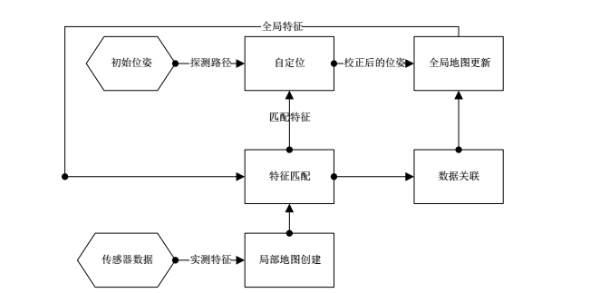
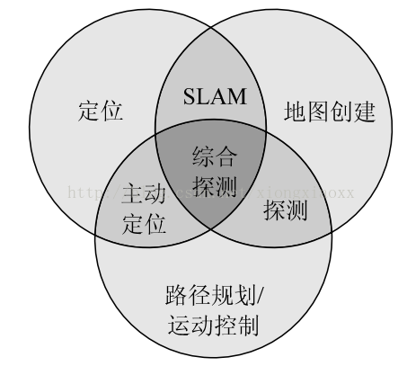

# 同步定位与地图构建 Simultaneous Localization and Mapping

**同步定位与地图构建**（ SLAM ）是一种概念：希望机器人从未知环境的未知地点出发，在运动过程中通过重复观测到的地图特征（比如，墙角，柱子等）定位自身位置和姿态，再根据自身位置增量式的构建地图，从而达到同时定位和地图构建的目的。

SLAM 过程流程图 

### SLAM 核心问题

第一核心问题: 地图构建，是研究如何把从一系列传感器收集到的信息，集成到一个一致性的模型上的问题。

第二核心问题: 定位，是在地图上估测机器人的坐标和姿势形态的问题。

SLAM 要在建立新地图模型或者改进已知地图的同时，在该地图模型上定位机器人。

### SLAM 的关键技术

1.地图的表示方式。

2.不确定性信息处理方法。

3.数据的关联。

4.自定位。

5.探索全局路径规划。

### SLAM 的分类

可以按传感器的形式和安装方式，分为激光雷达和视觉两大类。

1） 激光雷达 SLAM

激光雷达能以很高精度测出机器人周围障碍点的角度和距离，而且速度快，计算量也不大，容易做成实时 SLAM。

激光雷达一般用于扫描一个平面内的障碍物，适用于适用于平面运动的机器人（如无人车、扫地机器人）。

缺点是，激光雷达制造成本高，价格十分昂贵。

2） 视觉 SLAM

视觉 SLAM 是 21 世纪 SLAM 研究热点之一。CPU、GPU 处理速度的增长和硬件的提高，让许多以前被认为无法实时化的视觉算法，得以在 10 Hz 以上的速度运行。

按照摄像头的数量和种类分，视觉 SLAM 分 3 个子方向：单目、双目（或多目）、RGBD 。此外，还有鱼眼、全景等特殊摄像头，但是都属于少数。

### 参考来源

【1】  https://zh.wikipedia.org/wiki/即时定位与地图构建

【2】  https://www.rs-online.com/designspark/slam

【3】  http://www.widegrow.com/2017/02/26/scenario-a-wealth-of-slam-simultaneous-localization-and-mapping-technology-and-slam-sensor/

【4】  https://www.chainnews.com/articles/776790111106.htm

