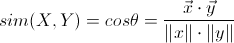
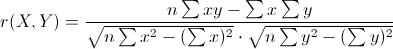
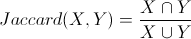

# 相似度度量 Similarity Measure

**相似度度量**是估算不同样本之间的相似程度的，常用做分类问题的判断标准。

在机器学习和数据挖掘中，需要知道个体间差异的大小，进而评价个体的相似性和类别。

常见的是数据分析中的相关分析，数据挖掘中的分类和聚类算法，如 K 最近邻（KNN）和 K 均值（K-Means）等等。根据数据特性的不同，可以采用不同的度量方法。

### 距离度量和相似度度量

- 距离度量：

距离度量（ Distance Measure ）用于衡量个体在空间上存在的距离，距离越远说明个体间的差异越大。

- 相似度度量：

相似度度量（ Similarity Measure ），即计算个体间的相似程度，与距离度量相反，相似度度量的值越小，说明个体间相似度越小，差异越大。

### 常用的相似度度量方法

1） 向量空间余弦相似度（ Cosine Similarity ）

　　余弦相似度用向量空间中两个向量夹角的余弦值作为衡量两个个体间差异的大小。相比距离度量，余弦相似度更加注重两个向量在方向上的差异，而非距离或长度上。

   

2） 皮尔森相关系数（ Pearson Correlation Coefficient ）

　　即相关分析中的相关系数 r ，分别对 X 和 Y 基于自身总体标准化后计算空间向量的余弦夹角。公式如下：

   

3） Jaccard 相似系数（ Jaccard Coefficient ）

　　Jaccard 系数主要用于计算符号度量或布尔值度量的个体间的相似度，因为个体的特征属性都是由符号度量或者布尔值标识，因此无法衡量差异具体值的大小，只能获得“是否相同”这个结果，所以 Jaccard 系数只关心个体间共同具有的特征是否一致这个问题。如果比较 X 与 Y 的Jaccard相似系数，只比较 xn 和 yn 中相同的个数，公式如下：

   

4） 调整余弦相似度（ Adjusted Cosine Similarity ）

  余弦相似度对数值的不敏感会导致结果的误差，修正这种不合理性，就出现了调整余弦相似度，即所有维度上的数值都减去一个均值，比如 X 和 Y 的评分均值都是 3，那么调整后为 ( -2 , -1 ) 和( 1 , 2 ) ，再用余弦相似度计算，得到 -0.8 ，相似度为负值并且差异不小，但显然更加符合现实。
  
##### 相关词：距离度量。

### 参考来源

【1】  https://en.wikipedia.org/wiki/Similarity_measure

【2】  http://webdataanalysis.net/reference-and-source/distance-and-similarity/#comments

【3】  http://www.cnblogs.com/daniel-D/p/3244718.html

【4】  http://www.cnblogs.com/heaad/archive/2011/03/08/1977733.html