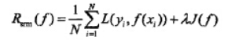

# 结构风险 Structural risk

**结构风险**是对经验风险和期望风险的折中，在经验风险函数后面加一个正则化项（惩罚项），得到结构分险。

### 概念解释

置信风险：分类器对未知样本进行分类，得到的误差。
经验风险：训练好的分类器，对训练样本重新分类得到的误差。即样本差
结构风险：置信风险 + 经验风险

### 结构风险的意义

结构风险最小化是对经验风险最小化问题处理的扩展。

经验风险越小，模型决策函数越复杂，其包含的参数越多，当经验风险函数小到一定程度就出现了过拟合现象。

为了过拟合，让惩罚项 J(f) 最小化，现在出现两个需要最小化的函数了。

结构风险函数整合了这两者，同时保证经验风险函数和模型决策函数的复杂度都达到最小化，然后对这个结构风险函数进行最小化操作，就达到了优化的目的。

##### 子级词：结构风险最小化
##### 相关词：置信风险，经验风险

### 参考来源

【1】 https://www.cnblogs.com/Joyce-song94/p/7443911.html

