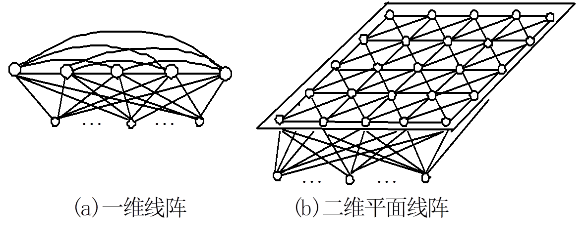
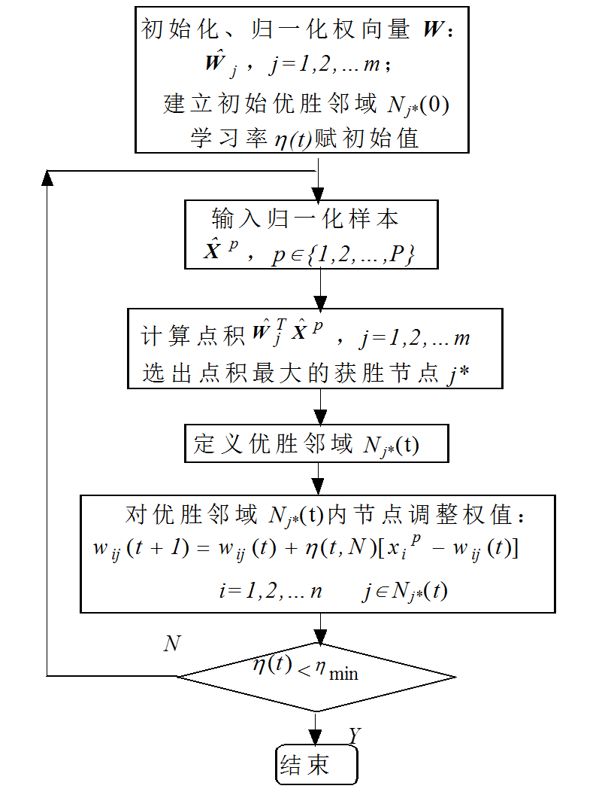

# 自组织映射 Self-Organizing Map

**自组织映射**（ SOM ）或自组织特征映射（ SOFM ）是一种使用非监督式学习来产生训练样本的输入空间的一个低维（通常是二维）离散化的表示的人工神经网络（ ANN ）。自组织映射与其他人工神经网络的不同之处在于它使用一个邻近函数来保持输入空间的拓扑性质。

### SOM 典型结构

典型SOM网共有两层，输入层模拟感知外界输入信息的视网膜，输出层模拟做出响应的大脑皮层。

下图是 1 维和 2 维的两个 SOM 网络示意图。

### SOM 算法流程

### SOM 与自组织神经网络

SOM 是一种自组织（竞争型）神经网络，除了 SOM 外，其他常见的自组织（竞争型）神经网络还有对偶传播( Counter propagation )网络，自适应共振理论（ Adaptive Resonance Theory ）网络等。

##### 父级词：自组织网络
##### 同级词：对偶传播网络，自适应共振理论网络

### 参考来源

【1】  https://zh.wikipedia.org/wiki/自组织映射

【2】  https://blog.csdn.net/xbinworld/article/details/50826892

【3】  https://www.cnblogs.com/sylvanas2012/p/5117056.html

