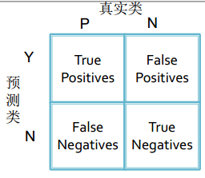

# README

# *T-Lists*

******

# T - 分布随机近邻嵌入 T-Distribution Stochastic Neighbour Embedding

**T - 分布随机近邻嵌入**（ t - SNE ）是一种用于降维的机器学习方法，它能帮我们识别相关联的模式。t - SNE 主要的优势就是保持局部结构的能力。这意味着高维数据空间中距离相近的点投影到低维中仍然相近。t-SNE 能生成漂亮的可视化。

### t-SNE 的特点

t - SNE 在低维空间下使用更重长尾分布的 t 分布来避免 crowding 问题和优化问题。

t - SNE 的梯度更新有两大优势：

1） 对于不相似的点，用一个较小的距离会产生较大的梯度来让这些点排斥开来。

2） 这种排斥又不会无限大(梯度中分母)，避免不相似的点距离太远。

### t - SNE 的不足

1） 主要用于可视化，很难用于其他目的。比如测试集合降维，因为他没有显式的预估部分，不能在测试集合直接降维；比如降维到10维，因为t分布偏重长尾，1个自由度的t分布很难保存好局部特征，可能需要设置成更高的自由度。

2） t-SNE倾向于保存局部特征，对于本征维数(intrinsic dimensionality)本身就很高的数据集，是不可能完整的映射到2-3维的空间

3） t-SNE没有唯一最优解，且没有预估部分。如果想要做预估，可以考虑降维之后，再构建一个回归方程之类的模型去做。但是要注意，t-sne中距离本身是没有意义，都是概率分布问题。

4） 训练太慢。有很多基于树的算法在t-sne上做一些改进

##### 相关词：T -分布

### 参考来源

【1】  https://blog.csdn.net/Uwr44UOuQcNsUQb60zk2/article/details/78536805

【2】  https://willhan.xyz/2018/04/23/t-SNE算法/

*****

# 张量 Tensor

**张量**是一个可用来表示在一些矢量、标量和其他张量之间的线性关系的多线性函数。这些线性关系的基本例子有内积、外积、线性映射以及笛卡儿积。

其坐标在  n  维空间内，有  n ^ r 个分量的一种量，其中每个分量都是坐标的函数，而在坐标变换时，这些分量也依照某些规则作线性变换。  r 称为该张量的秩或阶（与矩阵的秩和阶均无关系）。

在同构的意义下，第零阶张量（ r = 0 ）为标量，第一阶张量（  r = 1 ）为矢量， 第二阶张量（ r = 2 ）则成为矩阵。

由于变换方式的不同，张量分成“协变张量”（指标在下者）、“逆变张量”（指标在上者）、“混合张量”（指标在上和指标在下两者都有）三类。

### 参考来源

【1】  https://zh.wikipedia.org/wiki/張量

【2】  https://blog.csdn.net/qq_31821675/article/details/79188449

******

# 最小二乘法 The least square method

**最小二乘法**是一种数学优化方法。它通过最小化误差的平方和寻找数据的最佳函数匹配。

利用最小二乘法可以简便地求得未知的数据，并使得这些求得的数据与实际数据之间误差的平方和为最小。

### 最小二乘法的形式

最小二乘法原理可写为：

目标函数 = Σ（观测值-理论值）2

“最小二乘法”是对过度确定系统，即其中存在比未知数更多的方程组，以回归分析求得近似解的标准方法。在这整个解决方案中，最小二乘法演算为每一方程式的结果中，将残差平方和的总和最小化。

### 最小二乘法的应用

最重要的应用是在曲线拟合上。最小平方所涵义的最佳拟合，即残差（残差为：观测值与模型提供的拟合值之间的差距）平方总和的最小化。

最小平方问题分为两种：线性最小二乘法，和非线性的最小二乘法，取决于在所有未知数中的残差是否为线性。

线性的最小平方问题发生在统计回归分析中；它有一个封闭形式的解决方案。

非线性的问题通常经由迭代细致化来解决；在每次迭代中，系统由线性近似，因此在这两种情况下核心演算是相同的。

当观测值来自指数族且满足轻度条件时，最小平方估计和最大似然估计是相同的。最小二乘法也能从动差法得出。

### 最小二乘法的局限性

当问题在自变量（x变量）有重大不确定性时，那么使用简易回归和最小二乘法会发生问题；在这种情况下，须另外考虑变量-误差-拟合模型所需的方法，而不是最小二乘法。

### 参考来源

【1】  https://zh.wikipedia.org/wiki/最小二乘法

*****

# 阈值 Threshold

**阈值**又叫临界值或门槛值。是令对象发生某种变化所需的某种条件的值，在学术研究中是常用语。

阈值被广泛运用在包括建筑学、生物学、航天、化学、电信、电子和心理学等各个领域，并作为词根派生出大量的相关词汇。该词与极值没有必然联系。

个领域或一个系统的界限称为阈，其数值称为阈值。在各门科学领域中均有阈值。

### 参考来源

【1】  https://zh.wikipedia.org/wiki/阈

*****

# 阈值逻辑单元 Threshold logic unit

**阈值逻辑单元**（ TLU ）是构成神经网络的基本单元。

阈值逻辑单元示意图：

对它的每个输入和输入对应的权值进行相乘并求和，所得的和如果大于这个 TLU 的阈值，则输出1，否则则输出 0 ；利用单个的 TLU 可以进行简单动作的计算，而要构成神经网络，则需要通过TLU这样的元件；

其实就是一个由两层神经元构成的网络结构，它在输入层接收外界的输入，通过激活函数（含阈值）的变换，把信号传送至输出层，因此称之为“阈值逻辑单元”。

### 参考来源

【1】  https://www.ibm.com/developerworks/cn/linux/other/l-neural/index.html

【2】  https://blog.csdn.net/qq_38740763/article/details/78974533

*****

# 阈值移动 Threshold-moving

阈值移动是指根据实际情况调整划分类别的的阈值。常用来解决类别不平衡问题。

如对于分类问题，可以不直接预测实例的类标号，而是预测一个概率值，然后指定一个阈值来将实例分为正类和负类。通常情况下，指定阈值为0.5，但是可以根据实际的情况，对阈值进行移动，从而增加某一个类的权重，而达到解决类不平衡的目的。

### 参考来源

【1】  https://blog.csdn.net/zxd1754771465/article/details/73558356

*****

# 标记化 Tokenization

**标记化**也称词汇分析，是将字符（例如在计算机程序或网页中）转换成标记（具有指定且因此标识的含义的字符串）的过程。

执行词法分析的程序可以称为词法分析器，标记器，或扫描仪，但扫描仪也是词法分析器第一阶段的术语。词法分析器通常与解析器组合，解析器一起分析编程语言，网页等的语法。

标记化是划分并可能对输入字符串的部分进行分类的过程。然后将得到的标记传递给某种其他形式的处理。该过程可以被视为解析输入的子任务。

### 参考来源

【1】  https://en.wikipedia.org/wiki/Lexical_analysis#Tokenization

*****

# 训练误差 Training error

**训练误差**是在在数据训练中出现的误差。是模型关于训练数据的平均损失。

### 训练误差和其他的关系

训练误差是模型在训练集上的误差

验证误差是模型在验证集上的误差

测试误差是模型在测试集上的误差

泛化误差是用来衡量模型的泛化性

综合来说，它们的大小关系为

训练误差 < 验证误差 < 测试误差 ～= 泛化误差

### 训练误差的作用

训练集是用来拟合模型，通过比较训练误差的大小，得到模型的参数。

最小训练误差，用来寻找特定模型拟合出该模型的参数 。

测试集是用来评价模型的，想最小化测试误差，则通过计算模型对测试集的偏差，方差的情况，分析该如何减小测试误差

所以对训练误差不谈偏差和方差，只要一心最小化训练误差即可。

##### 相关词：验证误差，测试误差，泛化误差

### 参考来源

【1】  http://sofasofa.io/forum_main_post.php?postid=1001223

【2】  https://blog.csdn.net/MosBest/article/details/51477833

*****

# 直推学习 Transductive learning

**直推学习**是一种通过观察特定的训练样本，进而预测特定的测试样本的方法。

直推学习，与半监督学习一样不需要人工干预，不同的是，直推学习假设未标记的数据就是最终要用来测试的数据，学习的目的就是在这些数据上取得最佳泛化能力。相对应的，半监督学习在学习时并不知道最终的测试用例是什么。

也即，直推学习其实类似于半监督学习的一个子问题，或者说是一个特殊化的半监督学习，所以也有人将其归为半监督学习。

主动学习、纯半监督学习、直推学习都属于利用未标记数据的学习技术，只是其基本思想不同。

##### 相关词：主动学习，半监督学习。

### 参考来源

【1】  https://blog.csdn.net/Bryan__/article/details/42426971

【2】  https://www.cnblogs.com/yanmk/p/8118864.html

*****

# 树库 Treebank

树库（Treebank）是对句子进行分词、词性标注和句法结构关系标注的深加工语料库。

*****

# 真负类 True Negative

**真负类**（ TN ）是指二分类问题中被正确判断为负类的那些样本。

对于二分类问题，可将样例根据其真实类别与学习器预测类别的组合划分为真正类（ true positive ）、假正类（ false positive ）、真负类（ true negative ）、假负类（ false negative ）四种情形。

分类结果的混淆矩阵如上：其中的 true、false 是指判断结果正确与否；positive、negative ：判断为正类还是负类。

显然 TP + FP + TN + FN = 样本总数。

TN 是本来是负类，被正确的判定为负类的样本。

##### 相关词： 假真类，真正类，假反类，ROC 曲线，AUC 曲线。

### 参考来源

【1】 http://bealin.github.io/2017/02/27/机器学习系列—2-模型评估与选择/

*****

# 真正类 True Positive

**真正类**是指二分类问题中被正确判断为正类的那些样本。

对于二分类问题，可将样例根据其真实类别与学习器预测类别的组合划分为真正类（ true positive ）、假正类（ false positive ）、真负类（ true negative ）、假负类（ false negative ）四种情形。

分类结果的混淆矩阵如上：其中的 true、false 是指判断结果正确与否；positive、negative ：判断为正类还是负类。

显然 TP + FP + TN + FN = 样本总数。

TP 是本来是正样例，被分类成正样例。如在一堆水果中寻找苹果，TP 是指被找出的苹果。

##### 相关词： 假真类，真反类，假反类，ROC 曲线，AUC 曲线。

### 参考来源

【1】 http://bealin.github.io/2017/02/27/机器学习系列—2-模型评估与选择/

*****

# 真正例率 True Positive Rate/TPR	
**真正率**（ TPR ）是正样本预测结果数相对于正样本实际数的比例。

### 二分类问题中的概念

对于二分类问题，可将样例根据其真实类别与学习器预测类别的组合划分为真正类（ true positive ）、假正类（ false positive ）、真负类（ true negative ）、假负类（ false negative ）四种情形。

分类结果的混淆矩阵如上：其中的 true、false 是指判断结果正确与否；positive、negative ：判断为正类还是负类。

显然 TP + FP + TN + FN = 样本总数

### TPR 的意义

TPR 的计算式为： TPR = TP /（ TP + FN ） 

它表示正类率在正确检测中所占的比例。将 TPR 和 FPR 做在一张图上，就得到了 ROC 曲线，而 ROC 曲线下的面积就是 AUC。而 ROC 和 AUC 在模型评估中常常作为性能度量被使用。

##### 相关词： 假正例率 FPR ，ROC 曲线，真正类，真负类。

### 参考来源

【1】 http://bealin.github.io/2017/02/27/机器学习系列—2-模型评估与选择/

【2】  https://tracholar.github.io/machine-learning/2018/01/26/auc.html 

*****

# 图灵机 Turing Machine

**图灵机**又称确定型图灵机，是艾伦·图灵于1936年提出的一种抽象计算模型，其更抽象的意义为一种数学逻辑机，可以看作等价于任何有限逻辑数学过程的终极强大逻辑机器。

图灵的基本思想是用机器来模拟人们用纸笔进行数学运算的过程，他把这样的过程看作下列两种简单的动作：

1）在纸上写上或擦除某个符号；

2）把注意力从纸的一个位置移动到另一个位置；

图灵机和计算理论是人工智能乃至整个计算机科学的理论基础，邱奇-图灵论题告诉我们一切可计算过程都可以用图灵机模拟。

### 参考来源

【1】  https://zh.wikipedia.org/wiki/图灵机

【2】  https://juejin.im/post/5b271b6de51d45588f2d2177

*****