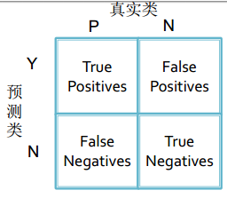

# 真正例率 True Positive Rate/TPR	
**真正率**（ TPR ）是正样本预测结果数相对于正样本实际数的比例。

### 二分类问题中的概念

对于二分类问题，可将样例根据其真实类别与学习器预测类别的组合划分为真正类（ true positive ）、假正类（ false positive ）、真负类（ true negative ）、假负类（ false negative ）四种情形。

分类结果的混淆矩阵如上：其中的 true、false 是指判断结果正确与否；positive、negative ：判断为正类还是负类。

显然 TP + FP + TN + FN = 样本总数

### TPR 的意义

TPR 的计算式为： TPR = TP /（ TP + FN ） 

它表示正类率在正确检测中所占的比例。将 TPR 和 FPR 做在一张图上，就得到了 ROC 曲线，而 ROC 曲线下的面积就是 AUC。而 ROC 和 AUC 在模型评估中常常作为性能度量被使用。

##### 相关词： 假正例率 FPR ，ROC 曲线，真正类，真负类。

### 参考来源

【1】 http://bealin.github.io/2017/02/27/机器学习系列—2-模型评估与选择/

【2】  https://tracholar.github.io/machine-learning/2018/01/26/auc.html 

