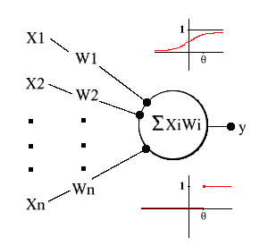

# 阈值逻辑单元 Threshold logic unit

**阈值逻辑单元**（ TLU ）是构成神经网络的基本单元。

阈值逻辑单元示意图：

对它的每个输入和输入对应的权值进行相乘并求和，所得的和如果大于这个 TLU 的阈值，则输出1，否则则输出 0 ；利用单个的 TLU 可以进行简单动作的计算，而要构成神经网络，则需要通过TLU这样的元件；

其实就是一个由两层神经元构成的网络结构，它在输入层接收外界的输入，通过激活函数（含阈值）的变换，把信号传送至输出层，因此称之为“阈值逻辑单元”。

### 参考来源

【1】  https://www.ibm.com/developerworks/cn/linux/other/l-neural/index.html

【2】  https://blog.csdn.net/qq_38740763/article/details/78974533