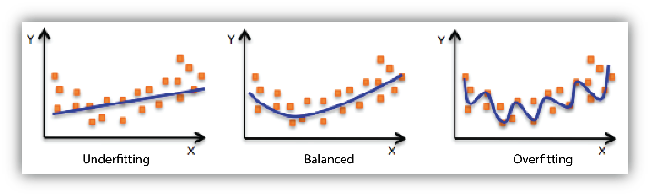

# 欠拟合／欠配 Underfitting

**欠拟合**是指在模型对训练数据拟合度差的情形。通常用在模型学习和泛化能力的评估上。

训练数据和评估模型的三种情况：

欠拟合，适合，过拟合

### 欠拟合的影响：

欠拟合的出现往往是模型太简单，无法体现出数据的关系。导致机器学习模型无法得到较低训练误差。

此外还可能的原因是，特征集过少、数据集过少、抽样数据不合理等因素。都会造成该模型拟合不够，在训练集上表现效果差。

### 解决欠拟合的方法

1） 寻找最优的权重初始化方案；

2） 使用合适的激活函数；

3） 选择适当的优化器和学习速率。

##### 相关词：拟合，过拟合，

### 参考来源

【1】  https://docs.aws.amazon.com/zh_cn/machine-learning/latest/dg/model-fit-underfitting-vs-overfitting.html

【2】  https://blog.ailemon.me/2018/04/09/deep-learning-the-ways-to-solve-underfitting/